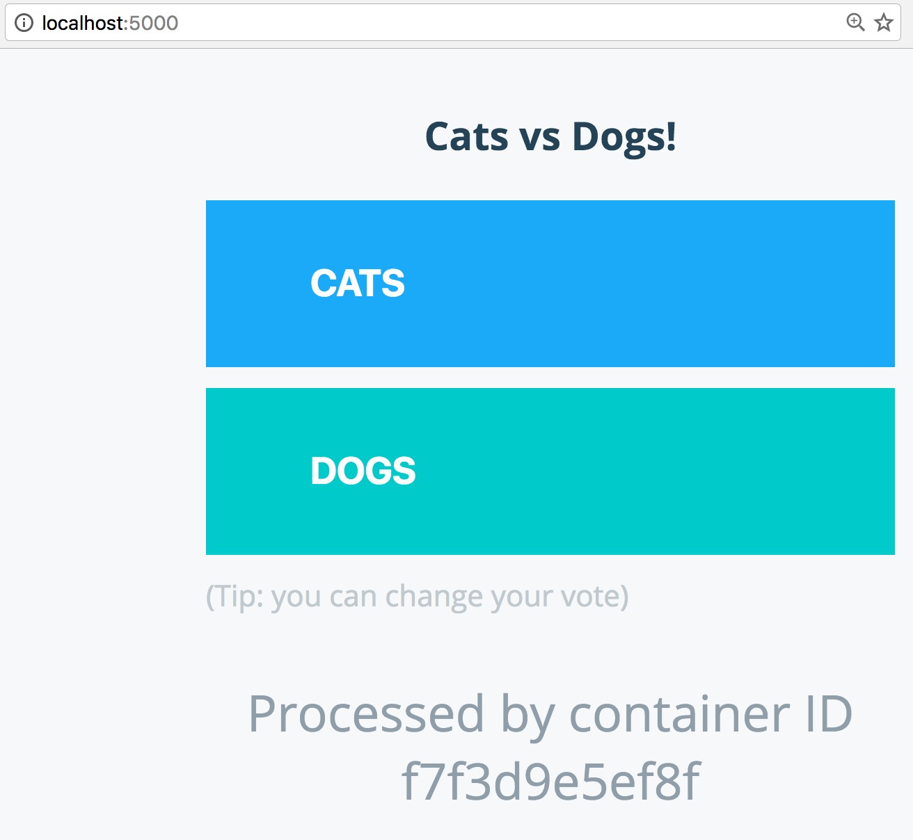

## 3.0 Deploying an app to a Swarm
This portion of the tutorial will guide you through the creation and customization of a voting app. It's important that you follow the steps in order, and make sure to customize the portions that are customizable.

**Important.**
To complete this section, you will need to have Docker installed on your machine as mentioned in the [Setup](./setup.md) section. You'll also need to have git installed. There are many options for installing it. For instance, you can get it from [GitHub](https://help.github.com/articles/set-up-git/).

### Voting app
For this application we will use the [Docker Example Voting App](https://github.com/docker/example-voting-app). This app consists of five components:

* Python webapp which lets you vote between two options
* Redis queue which collects new votes
* .NET worker which consumes votes and stores them in…
* Postgres database backed by a Docker volume
* Node.js webapp which shows the results of the voting in real time

Clone the repository onto your machine and `cd` into the directory:

```
git clone https://github.com/docker/example-voting-app.git
cd example-voting-app
```

### 3.1 Deploying the app
For this first stage, we will use existing images that are in Docker Store.

This app relies on [Docker Swarm mode](https://docs.docker.com/engine/swarm/). Swarm mode is the cluster management and orchestration features embedded in the Docker engine. You can easily deploy to a swarm using a file that declares your desired state for the app. Swarm allows you to run your containers on more than one machine. In this tutorial, you can run on just one machine, or you can use something like [Docker for AWS](https://beta.docker.com/) or [Docker for Azure](https://beta.docker.com/) to quickly create a multiple node machine. Alternately, you can use Docker Machine to create a number of local nodes on your development machine. See [the Swarm Mode lab](../../swarm-mode/beginner-tutorial/README.md#creating-the-nodes-and-swarm) for more information.

First, create a Swarm.

```
docker swarm init
```

Next, you will need a [Docker Compose](https://docs.docker.com/compose) file. You don't need Docker Compose installed, though if you are using Docker for Mac or Docker for Windows you have it installed. However, `docker stack deploy` accepts a file in the Docker Compose format. The file you need is in Docker Example Voting App at the root level. It's called docker-stack.yml. You can also just copy and paste it from here:

```
version: "3"
services:

  redis:
    image: redis:alpine
    ports:
      - "6379"
    networks:
      - frontend
    deploy:
      replicas: 2
      update_config:
        parallelism: 2
        delay: 10s
      restart_policy:
        condition: on-failure
  db:
    image: postgres:9.4
    volumes:
      - db-data:/var/lib/postgresql/data
    networks:
      - backend
    deploy:
      placement:
        constraints: [node.role == manager]
  vote:
    image: dockersamples/examplevotingapp_vote:before
    ports:
      - 5000:80
    networks:
      - frontend
    depends_on:
      - redis
    deploy:
      replicas: 2
      update_config:
        parallelism: 2
      restart_policy:
        condition: on-failure
  result:
    image: dockersamples/examplevotingapp_result:before
    ports:
      - 5001:80
    networks:
      - backend
    depends_on:
      - db
    deploy:
      replicas: 1
      update_config:
        parallelism: 2
        delay: 10s
      restart_policy:
        condition: on-failure

  worker:
    image: dockersamples/examplevotingapp_worker
    networks:
      - frontend
      - backend
    deploy:
      mode: replicated
      replicas: 1
      labels: [APP=VOTING]
      restart_policy:
        condition: on-failure
        delay: 10s
        max_attempts: 3
        window: 120s
      placement:
        constraints: [node.role == manager]

  visualizer:
    image: dockersamples/visualizer
    ports:
      - "8080:8080"
    stop_grace_period: 1m30s
    volumes:
      - /var/run/docker.sock:/var/run/docker.sock
    deploy:
      placement:
        constraints: [node.role == manager]

networks:
  frontend:
  backend:

volumes:
  db-data:
```

First deploy it, and then we will look more deeply into the details:

```
docker stack deploy --compose-file docker-stack.yml vote
Creating network vote_frontend
Creating network vote_backend
Creating network vote_default
Creating service vote_vote
Creating service vote_result
Creating service vote_worker
Creating service vote_redis
Creating service vote_db
```
to verify your stack has deployed, use `docker stack services vote`
```
docker stack services vote
ID            NAME         MODE        REPLICAS  IMAGE
25wo6p7fltyn  vote_db      replicated  1/1       postgres:9.4
2ot4sz0cgvw3  vote_worker  replicated  1/1       dockersamples/examplevotingapp_worker:latest
9faz4wbvxpck  vote_redis   replicated  2/2       redis:alpine
ocm8x2ijtt88  vote_vote    replicated  2/2       dockersamples/examplevotingapp_vote:before
p1dcwi0fkcbb  vote_result  replicated  2/2       dockersamples/examplevotingapp_result:before
```

If you take a look at `docker-stack.yml`, you will see that the file defines

* vote container based on a Python image
* result container based on a Node.js image
* redis container based on a redis image, to temporarily store the data.
* .NET based worker app based on a .NET image
* Postgres container based on a postgres image

The Compose file also defines two networks, front-tier and back-tier. Each container is placed on one or two networks. Once on those networks, they can access other services on that network in code just by using the name of the service. Services can be on any number of networks. Services are isolated on their network. Services are only able to discover each other by name if they are on the same network. To learn more about networking check out the [Networking Lab](https://github.com/docker/labs/tree/master/networking).

Take a look at the file again. You'll see it starts with

```
version: "3"
```
It's important that you use [version 3](https://docs.docker.com/compose/compose-file/) of compose files, as `docker stack deploy` won't support use of earlier versions. You will see there's also a `services` key, under which there is a separate key for each of the services. Such as:
```
  vote:
    image: dockersamples/examplevotingapp_vote:before
    ports:
      - 5000:80
    networks:
      - frontend
    depends_on:
      - redis
    deploy:
      replicas: 2
      update_config:
        parallelism: 2
      restart_policy:
        condition: on-failure
```

The `image` key there specifies which image you can use, in this case the image `dockersamples/examplevotingapp_vote:before`. If you're familiar with Compose, you may know that there's a `build` key, which builds based on a Dockerfile. However, `docker stack deploy` does not suppport `build`, so you need to use pre-built images.

Much like `docker run` you will see you can define `ports` and `networks`. There's also a `depends_on` key which allows you to specify that a service is only deployed after another service, in this case `vote` only deploys after `redis`.

The [`deploy`](https://docs.docker.com/compose/compose-file/#deploy) key is new in version 3. It allows you to specify various properties of the deployment to the Swarm. In this case, you are specifying that you want two replicas, that is two containers are deployed on the Swarm. You can specify other properties, like when to restart, what [healthcheck](https://docs.docker.com/engine/reference/builder/#healthcheck) to use, placement constraints, resources, etc.

#### Test run

Now that the app is running, you can go to `http://localhost:5000` to see:



Click on one to vote. You can check the results at `http://localhost:5001`.

**NOTE**: If you are running this tutorial in a cloud environment like AWS, Azure, Digital Ocean, or GCE you will not have direct access to localhost or 127.0.0.1 via a browser.  A work around for this is to leverage ssh port forwarding. Below is an example for Mac OS. Similarly this can be done for Windows and Putty users.

```
$ ssh -L 5000:localhost:5000 <ssh-user>@<CLOUD_INSTANCE_IP_ADDRESS>
```

### 3.2 Customize the app
In this step, you will customize the app and redeploy it. We've supplied the same images but with the votes changed from Cats and Dogs to Java and .NET using the `after` tag.

#### 3.2.1 Change the images used

Going back to `docker-stack.yml`, change the `vote` and `result` images to use the `after` tag, so they look like this:

```
  vote:
    image: dockersamples/examplevotingapp_vote:after
    ports:
      - 5000:80
    networks:
      - frontend
    depends_on:
      - redis
    deploy:
      replicas: 2
      update_config:
        parallelism: 2
      restart_policy:
        condition: on-failure
  result:
    image: dockersamples/examplevotingapp_result:after
    ports:
      - 5001:80
    networks:
      - backend
    depends_on:
      - db
    deploy:
      replicas: 2
      update_config:
        parallelism: 2
        delay: 10s
      restart_policy:
        condition: on-failure
```

#### 3.2.3 Redeploy
Redeployment is the same as deploying

```
docker stack deploy --compose-file docker-stack.yml vote
```
#### 3.2.4 Another test run

Now take it for a spin again. Go to the URLs you used in section [3.1](#31-deploying-the-app) and see the new votes.

#### 3.2.5 Remove the stack

Remove the stack from the swarm.

```
docker stack rm vote
```

### 3.3 Next steps
Now that you've built some images and pushed them to Docker Cloud, and learned the basics of Swarm mode, you can explore more of Docker by checking out [the documentation](https://docs.docker.com). And if you need any help, check out the [Docker Forums](https://forums.docker.com) or [StackOverflow](https://stackoverflow.com/tags/docker/).
