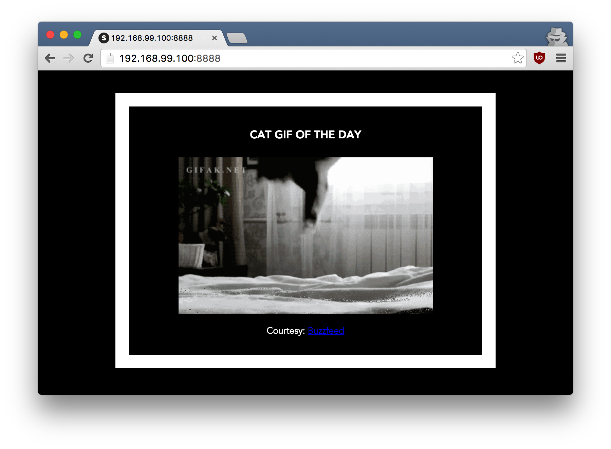

## 2.0 Webapps with Docker
Great! So you have now looked at `docker run`, played with a Docker container and also got the hang of some terminology. Armed with all this knowledge, you are now ready to get to the real stuff &#8212; deploying web applications with Docker.

### 2.1 Run a static website in a container
>**Note:** Code for this section is in this repo in the [static-site directory](https://github.com/docker/labs/tree/master/beginner/static-site).

Let's start by taking baby-steps. First, we'll use Docker to run a static website in a container. The website is based on an existing image. We'll pull a Docker image from Docker Store, run the container, and see how easy it is to set up a web server.

The image that you are going to use is a single-page website that was already created for this demo and is available on the Docker Store as [`dockersamples/static-site`](https://store.docker.com/community/images/dockersamples/static-site). You can download and run the image directly in one go using `docker run` as follows.

```bash
$ docker run -d dockersamples/static-site
```

>**Note:** The current version of this image doesn't run without the `-d` flag. The `-d` flag enables **detached mode**, which detaches the running container from the terminal/shell and returns your prompt after the container starts. We are debugging the problem with this image but for now, use `-d` even for this first example.

So, what happens when you run this command?

Since the image doesn't exist on your Docker host, the Docker daemon first fetches it from the registry and then runs it as a container.

Now that the server is running, do you see the website? What port is it running on? And more importantly, how do you access the container directly from our host machine?

Actually, you probably won't be able to answer any of these questions yet! &#9786; In this case, the client didn't tell the Docker Engine to publish any of the ports, so you need to re-run the `docker run` command to add this instruction.

Let's re-run the command with some new flags to publish ports and pass your name to the container to customize the message displayed. We'll use the *-d* option again to run the container in detached mode.

First, stop the container that you have just launched. In order to do this, we need the container ID.

Since we ran the container in detached mode, we don't have to launch another terminal to do this. Run `docker ps` to view the running containers.

```bash
$ docker ps
CONTAINER ID        IMAGE                  COMMAND                  CREATED             STATUS              PORTS               NAMES
a7a0e504ca3e        dockersamples/static-site   "/bin/sh -c 'cd /usr/"   28 seconds ago      Up 26 seconds       80/tcp, 443/tcp     stupefied_mahavira
```

Check out the `CONTAINER ID` column. You will need to use this `CONTAINER ID` value, a long sequence of characters, to identify the container you want to stop, and then to remove it. The example below provides the `CONTAINER ID` on our system; you should use the value that you see in your terminal.

```bash
$ docker stop a7a0e504ca3e
$ docker rm   a7a0e504ca3e
```

>**Note:** A cool feature is that you do not need to specify the entire `CONTAINER ID`. You can just specify a few starting characters and if it is unique among all the containers that you have launched, the Docker client will intelligently pick it up.

Now, let's launch a container in **detached** mode as shown below:

```bash
$ docker run --name static-site -e AUTHOR="Your Name" -d -P dockersamples/static-site
e61d12292d69556eabe2a44c16cbd54486b2527e2ce4f95438e504afb7b02810
```

In the above command:

*  `-d` will create a container with the process detached from our terminal
* `-P` will publish all the exposed container ports to random ports on the Docker host
* `-e` is how you pass environment variables to the container
* `--name` allows you to specify a container name
* `AUTHOR` is the environment variable name and `Your Name` is the value that you can pass

Now you can see the ports by running the `docker port` command.

```bash
$ docker port static-site
443/tcp -> 0.0.0.0:32772
80/tcp -> 0.0.0.0:32773
```

If you are running [Docker for Mac](https://docs.docker.com/docker-for-mac/), [Docker for Windows](https://docs.docker.com/docker-for-windows/), or Docker on Linux, you can open `http://localhost:[YOUR_PORT_FOR 80/tcp]`. For our example this is `http://localhost:32773`.

If you are using Docker Machine on Mac or Windows, you can find the hostname on the command line using `docker-machine` as follows (assuming you are using the `default` machine).

```bash
$ docker-machine ip default
192.168.99.100
```
You can now open `http://<YOUR_IPADDRESS>:[YOUR_PORT_FOR 80/tcp]` to see your site live! For our example, this is: `http://192.168.99.100:32773`.

You can also run a second webserver at the same time, specifying a custom host port mapping to the container's webserver.

```bash
$ docker run --name static-site-2 -e AUTHOR="Your Name" -d -p 8888:80 dockersamples/static-site
```


To deploy this on a real server you would just need to install Docker, and run the above `docker` command(as in this case you can see the `AUTHOR` is Docker which we passed as an environment variable).

Now that you've seen how to run a webserver inside a Docker container, how do you create your own Docker image? This is the question we'll explore in the next section.

But first, let's stop and remove the containers since you won't be using them anymore.

```bash
$ docker stop static-site
$ docker rm static-site
```

Let's use a shortcut to remove the second site:

```bash
$ docker rm -f static-site-2
```

Run `docker ps` to make sure the containers are gone.

```bash
$ docker ps
CONTAINER ID        IMAGE               COMMAND             CREATED             STATUS              PORTS               NAMES
```

### 2.2 Docker Images

In this section, let's dive deeper into what Docker images are. You will build your own image, use that image to run an application locally, and finally, push some of your own images to Docker Cloud.

Docker images are the basis of containers. In the previous example, you **pulled** the *dockersamples/static-site* image from the registry and asked the Docker client to run a container **based** on that image. To see the list of images that are available locally on your system, run the `docker images` command.

```bash
$ docker images
REPOSITORY             TAG                 IMAGE ID            CREATED             SIZE
dockersamples/static-site   latest              92a386b6e686        2 hours ago        190.5 MB
nginx                  latest              af4b3d7d5401        3 hours ago        190.5 MB
python                 2.7                 1c32174fd534        14 hours ago        676.8 MB
postgres               9.4                 88d845ac7a88        14 hours ago        263.6 MB
containous/traefik     latest              27b4e0c6b2fd        4 days ago          20.75 MB
node                   0.10                42426a5cba5f        6 days ago          633.7 MB
redis                  latest              4f5f397d4b7c        7 days ago          177.5 MB
mongo                  latest              467eb21035a8        7 days ago          309.7 MB
alpine                 3.3                 70c557e50ed6        8 days ago          4.794 MB
java                   7                   21f6ce84e43c        8 days ago          587.7 MB
```

Above is a list of images that I've pulled from the registry and those I've created myself (we'll shortly see how). You will have a different list of images on your machine. The `TAG` refers to a particular snapshot of the image and the `ID` is the corresponding unique identifier for that image.

For simplicity, you can think of an image akin to a git repository - images can be [committed](https://docs.docker.com/engine/reference/commandline/commit/) with changes and have multiple versions. When you do not provide a specific version number, the client defaults to `latest`.

For example you could pull a specific version of `ubuntu` image as follows:

```bash
$ docker pull ubuntu:12.04
```

If you do not specify the version number of the image then, as mentioned, the Docker client will default to a version named `latest`.

So for example, the `docker pull` command given below will pull an image named `ubuntu:latest`:

```bash
$ docker pull ubuntu
```

To get a new Docker image you can either get it from a registry (such as the Docker Store) or create your own. There are hundreds of thousands of images available on [Docker Store](https://store.docker.com). You can also search for images directly from the command line using `docker search`.

An important distinction with regard to images is between _base images_ and _child images_.

- **Base images** are images that have no parent images, usually images with an OS like ubuntu, alpine or debian.

- **Child images** are images that build on base images and add additional functionality.

Another key concept is the idea of _official images_ and _user images_. (Both of which can be base images or child images.)

- **Official images** are Docker sanctioned images. Docker, Inc. sponsors a dedicated team that is responsible for reviewing and publishing all Official Repositories content. This team works in collaboration with upstream software maintainers, security experts, and the broader Docker community. These are not prefixed by an organization or user name. In the list of images above, the `python`, `node`, `alpine` and `nginx` images are official (base) images. To find out more about them, check out the [Official Images Documentation](https://docs.docker.com/docker-hub/official_repos/).

- **User images** are images created and shared by users like you. They build on base images and add additional functionality. Typically these are formatted as `user/image-name`. The `user` value in the image name is your Docker Store user or organization name.

### 2.3 Create your first image

>**Note:** The code for this section is in this repository in the [flask-app](https://github.com/docker/labs/tree/master/beginner/flask-app) directory.

Now that you have a better understanding of images, it's time to create your own. Our goal here is to create an image that sandboxes a small [Flask](http://flask.pocoo.org) application.

**The goal of this exercise is to create a Docker image which will run a Flask app.**

We'll do this by first pulling together the components for a random cat picture generator built with Python Flask, then _dockerizing_ it by writing a _Dockerfile_. Finally, we'll build the image, and then run it.

- [Create a Python Flask app that displays random cat pix](#231-create-a-python-flask-app-that-displays-random-cat-pix)
- [Write a Dockerfile](#232-write-a-dockerfile)
- [Build the image](#233-build-the-image)
- [Run your image](#234-run-your-image)
- [Dockerfile commands summary](#235-dockerfile-commands-summary)

### 2.3.1 Create a Python Flask app that displays random cat pix

For the purposes of this workshop, we've created a fun little Python Flask app that displays a random cat `.gif` every time it is loaded - because, you know, who doesn't like cats?

Start by creating a directory called ```flask-app``` where we'll create the following files:

- [app.py](#apppy)
- [requirements.txt](#requirementstxt)
- [templates/index.html](#templatesindexhtml)
- [Dockerfile](#dockerfile)

Make sure to ```cd flask-app``` before you start creating the files, because you don't want to start adding a whole bunch of other random files to your image.

#### app.py

Create the **app.py** with the following content:

```python
from flask import Flask, render_template
import random

app = Flask(__name__)

# list of cat images
images = [
   "http://img.buzzfeed.com/buzzfeed-static/static/2013-10/enhanced/webdr05/15/9/anigif_enhanced-buzz-26388-1381844103-11.gif",
    "http://img.buzzfeed.com/buzzfeed-static/static/2013-10/enhanced/webdr01/15/9/anigif_enhanced-buzz-31540-1381844535-8.gif",
    "http://img.buzzfeed.com/buzzfeed-static/static/2013-10/enhanced/webdr05/15/9/anigif_enhanced-buzz-26390-1381844163-18.gif",
    "http://img.buzzfeed.com/buzzfeed-static/static/2013-10/enhanced/webdr06/15/10/anigif_enhanced-buzz-1376-1381846217-0.gif",
    "http://img.buzzfeed.com/buzzfeed-static/static/2013-10/enhanced/webdr03/15/9/anigif_enhanced-buzz-3391-1381844336-26.gif",
    "http://img.buzzfeed.com/buzzfeed-static/static/2013-10/enhanced/webdr06/15/10/anigif_enhanced-buzz-29111-1381845968-0.gif",
    "http://img.buzzfeed.com/buzzfeed-static/static/2013-10/enhanced/webdr03/15/9/anigif_enhanced-buzz-3409-1381844582-13.gif",
    "http://img.buzzfeed.com/buzzfeed-static/static/2013-10/enhanced/webdr02/15/9/anigif_enhanced-buzz-19667-1381844937-10.gif",
    "http://img.buzzfeed.com/buzzfeed-static/static/2013-10/enhanced/webdr05/15/9/anigif_enhanced-buzz-26358-1381845043-13.gif",
    "http://img.buzzfeed.com/buzzfeed-static/static/2013-10/enhanced/webdr06/15/9/anigif_enhanced-buzz-18774-1381844645-6.gif",
    "http://img.buzzfeed.com/buzzfeed-static/static/2013-10/enhanced/webdr06/15/9/anigif_enhanced-buzz-25158-1381844793-0.gif",
    "http://img.buzzfeed.com/buzzfeed-static/static/2013-10/enhanced/webdr03/15/10/anigif_enhanced-buzz-11980-1381846269-1.gif"
    ]

@app.route('/')
def index():
    url = random.choice(images)
    return render_template('index.html', url=url)

if __name__ == "__main__":
    app.run(host="0.0.0.0")
```

#### requirements.txt

In order to install the Python modules required for our app, we need to create a file called **requirements.txt** and add the following line to that file:

```
Flask==0.10.1
```

#### templates/index.html

Create a directory called `templates` and create an **index.html** file in that directory with the following content in it:

```html
<html>
  <head>
    <style type="text/css">
      body {
        background: black;
        color: white;
      }
      div.container {
        max-width: 500px;
        margin: 100px auto;
        border: 20px solid white;
        padding: 10px;
        text-align: center;
      }
      h4 {
        text-transform: uppercase;
      }
    </style>
  </head>
  <body>
    <div class="container">
      <h4>Cat Gif of the day</h4>
      
      <p><small>Courtesy: <a href="http://www.buzzfeed.com/copyranter/the-best-cat-gif-post-in-the-history-of-cat-gifs">Buzzfeed</a></small></p>
    </div>
  </body>
</html>
```

### 2.3.2 Write a Dockerfile

We want to create a Docker image with this web app. As mentioned above, all user images are based on a _base image_. Since our application is written in Python, we will build our own Python image based on [Alpine](https://store.docker.com/images/alpine). We'll do that using a **Dockerfile**.

A [Dockerfile](https://docs.docker.com/engine/reference/builder/) is a text file that contains a list of commands that the Docker daemon calls while creating an image. The Dockerfile contains all the information that Docker needs to know to run the app &#8212; a base Docker image to run from, location of your project code, any dependencies it has, and what commands to run at start-up. It is a simple way to automate the image creation process. The best part is that the [commands](https://docs.docker.com/engine/reference/builder/) you write in a Dockerfile are *almost* identical to their equivalent Linux commands. This means you don't really have to learn new syntax to create your own Dockerfiles.


1. Create a file called **Dockerfile**, and add content to it as described below.

  We'll start by specifying our base image, using the `FROM` keyword:

  ```
  FROM alpine:3.5
  ```

2. The next step usually is to write the commands of copying the files and installing the dependencies. But first we will install the Python pip package to the alpine linux distribution. This will not just install the pip package but any other dependencies too, which includes the python interpreter. Add the following [RUN](https://docs.docker.com/engine/reference/builder/#run) command next:

  ```
  RUN apk add --update py2-pip
  ```

3. Let's add the files that make up the Flask Application.

  Install all Python requirements for our app to run. This will be accomplished by adding the lines:

  ```
  COPY requirements.txt /usr/src/app/
  RUN pip install --no-cache-dir -r /usr/src/app/requirements.txt
  ```

  Copy the files you have created earlier into our image by using [COPY](https://docs.docker.com/engine/reference/builder/#copy)  command.

  ```
  COPY app.py /usr/src/app/
  COPY templates/index.html /usr/src/app/templates/
  ```

4. Specify the port number which needs to be exposed. Since our flask app is running on `5000` that's what we'll expose.

  ```
  EXPOSE 5000
  ```

5. The last step is the command for running the application which is simply - `python ./app.py`. Use the [CMD](https://docs.docker.com/engine/reference/builder/#cmd) command to do that:

  ```
  CMD ["python", "/usr/src/app/app.py"]
  ```

  The primary purpose of `CMD` is to tell the container which command it should run by default when it is started.

6. Verify your Dockerfile.

  Our `Dockerfile` is now ready. This is how it looks:

  ```
  # our base image
  FROM alpine:3.5

  # Install python and pip
  RUN apk add --update py2-pip

  # install Python modules needed by the Python app
  COPY requirements.txt /usr/src/app/
  RUN pip install --no-cache-dir -r /usr/src/app/requirements.txt

  # copy files required for the app to run
  COPY app.py /usr/src/app/
  COPY templates/index.html /usr/src/app/templates/

  # tell the port number the container should expose
  EXPOSE 5000

  # run the application
  CMD ["python", "/usr/src/app/app.py"]
  ```

### 2.3.3 Build the image

Now that you have your `Dockerfile`, you can build your image. The `docker build` command does the heavy-lifting of creating a docker image from a `Dockerfile`.

When you run the `docker build` command given below, make sure to replace `<YOUR_USERNAME>` with your username. This username should be the same one you created when registering on [Docker Cloud](https://cloud.docker.com). If you haven't done that yet, please go ahead and create an account.

The `docker build` command is quite simple - it takes an optional tag name with the `-t` flag, and the location of the directory containing the `Dockerfile` - the `.` indicates the current directory:

```
$ docker build -t <YOUR_USERNAME>/myfirstapp .
Sending build context to Docker daemon 9.728 kB
Step 1 : FROM alpine:latest
 ---> 0d81fc72e790
Step 2 : RUN apk add --update py-pip
 ---> Running in 8abd4091b5f5
fetch http://dl-4.alpinelinux.org/alpine/v3.3/main/x86_64/APKINDEX.tar.gz
fetch http://dl-4.alpinelinux.org/alpine/v3.3/community/x86_64/APKINDEX.tar.gz
(1/12) Installing libbz2 (1.0.6-r4)
(2/12) Installing expat (2.1.0-r2)
(3/12) Installing libffi (3.2.1-r2)
(4/12) Installing gdbm (1.11-r1)
(5/12) Installing ncurses-terminfo-base (6.0-r6)
(6/12) Installing ncurses-terminfo (6.0-r6)
(7/12) Installing ncurses-libs (6.0-r6)
(8/12) Installing readline (6.3.008-r4)
(9/12) Installing sqlite-libs (3.9.2-r0)
(10/12) Installing python (2.7.11-r3)
(11/12) Installing py-setuptools (18.8-r0)
(12/12) Installing py-pip (7.1.2-r0)
Executing busybox-1.24.1-r7.trigger
OK: 59 MiB in 23 packages
 ---> 976a232ac4ad
Removing intermediate container 8abd4091b5f5
Step 3 : COPY requirements.txt /usr/src/app/
 ---> 65b4be05340c
Removing intermediate container 29ef53b58e0f
Step 4 : RUN pip install --no-cache-dir -r /usr/src/app/requirements.txt
 ---> Running in a1f26ded28e7
Collecting Flask==0.10.1 (from -r /usr/src/app/requirements.txt (line 1))
  Downloading Flask-0.10.1.tar.gz (544kB)
Collecting Werkzeug>=0.7 (from Flask==0.10.1->-r /usr/src/app/requirements.txt (line 1))
  Downloading Werkzeug-0.11.4-py2.py3-none-any.whl (305kB)
Collecting Jinja2>=2.4 (from Flask==0.10.1->-r /usr/src/app/requirements.txt (line 1))
  Downloading Jinja2-2.8-py2.py3-none-any.whl (263kB)
Collecting itsdangerous>=0.21 (from Flask==0.10.1->-r /usr/src/app/requirements.txt (line 1))
  Downloading itsdangerous-0.24.tar.gz (46kB)
Collecting MarkupSafe (from Jinja2>=2.4->Flask==0.10.1->-r /usr/src/app/requirements.txt (line 1))
  Downloading MarkupSafe-0.23.tar.gz
Installing collected packages: Werkzeug, MarkupSafe, Jinja2, itsdangerous, Flask
  Running setup.py install for MarkupSafe
  Running setup.py install for itsdangerous
  Running setup.py install for Flask
Successfully installed Flask-0.10.1 Jinja2-2.8 MarkupSafe-0.23 Werkzeug-0.11.4 itsdangerous-0.24
You are using pip version 7.1.2, however version 8.1.1 is available.
You should consider upgrading via the 'pip install --upgrade pip' command.
 ---> 8de73b0730c2
Removing intermediate container a1f26ded28e7
Step 5 : COPY app.py /usr/src/app/
 ---> 6a3436fca83e
Removing intermediate container d51b81a8b698
Step 6 : COPY templates/index.html /usr/src/app/templates/
 ---> 8098386bee99
Removing intermediate container b783d7646f83
Step 7 : EXPOSE 5000
 ---> Running in 31401b7dea40
 ---> 5e9988d87da7
Removing intermediate container 31401b7dea40
Step 8 : CMD python /usr/src/app/app.py
 ---> Running in 78e324d26576
 ---> 2f7357a0805d
Removing intermediate container 78e324d26576
Successfully built 2f7357a0805d
```

If you don't have the `alpine:3.5` image, the client will first pull the image and then create your image. Therefore, your output on running the command will look different from mine. If everything went well, your image should be ready! Run `docker images` and see if your image (`<YOUR_USERNAME>/myfirstapp`) shows.

### 2.3.4 Run your image
The next step in this section is to run the image and see if it actually works.

```bash
$ docker run -p 8888:5000 --name myfirstapp YOUR_USERNAME/myfirstapp
 * Running on http://0.0.0.0:5000/ (Press CTRL+C to quit)
```

Head over to `http://localhost:8888` and your app should be live. **Note** If you are using Docker Machine, you may need to open up another terminal and determine the container ip address using `docker-machine ip default`.



Hit the Refresh button in the web browser to see a few more cat images.

### 2.3.4 Push your image
Now that you've created and tested your image, you can push it to [Docker Cloud](https://cloud.docker.com).

First you have to login to your Docker Cloud account, to do that:

```bash
docker login
```

Enter `YOUR_USERNAME` and `password` when prompted. 

Now all you have to do is:

```bash
docker push YOUR_USERNAME/myfirstapp
```

Now that you are done with this container, stop and remove it since you won't be using it again.

Open another terminal window and execute the following commands:

```bash
$ docker stop myfirstapp
$ docker rm myfirstapp
```

or

```bash
$ docker rm -f myfirstapp
```

### 2.3.5 Dockerfile commands summary

Here's a quick summary of the few basic commands we used in our Dockerfile.

* `FROM` starts the Dockerfile. It is a requirement that the Dockerfile must start with the `FROM` command. Images are created in layers, which means you can use another image as the base image for your own. The `FROM` command defines your base layer. As arguments, it takes the name of the image. Optionally, you can add the Docker Cloud username of the maintainer and image version, in the format `username/imagename:version`.

* `RUN` is used to build up the Image you're creating. For each `RUN` command, Docker will run the command then create a new layer of the image. This way you can roll back your image to previous states easily. The syntax for a `RUN` instruction is to place the full text of the shell command after the `RUN` (e.g., `RUN mkdir /user/local/foo`). This will automatically run in a `/bin/sh` shell. You can define a different shell like this: `RUN /bin/bash -c 'mkdir /user/local/foo'`

* `COPY` copies local files into the container.

* `CMD` defines the commands that will run on the Image at start-up. Unlike a `RUN`, this does not create a new layer for the Image, but simply runs the command. There can only be one `CMD` per a Dockerfile/Image. If you need to run multiple commands, the best way to do that is to have the `CMD` run a script. `CMD` requires that you tell it where to run the command, unlike `RUN`. So example `CMD` commands would be:

```
  CMD ["python", "./app.py"]

  CMD ["/bin/bash", "echo", "Hello World"]
```

* `EXPOSE` creates a hint for users of an image which ports provide services. It is included in the information which
 can be retrieved via `$ docker inspect <container-id>`.     

>**Note:** The `EXPOSE` command does not actually make any ports accessible to the host! Instead, this requires 
publishing ports by means of the `-p` flag when using `$ docker run`.  

* `PUSH` pushes your image to Docker Cloud, or alternately to a [private registry](https://docs.docker.com/registry/)

>**Note:** If you want to learn more about Dockerfiles, check out [Best practices for writing Dockerfiles](https://docs.docker.com/engine/userguide/eng-image/dockerfile_best-practices/).

## Next Steps
For the next step in the tutorial head over to [3.0 Deploying an app to a Swarm](./votingapp.md)
