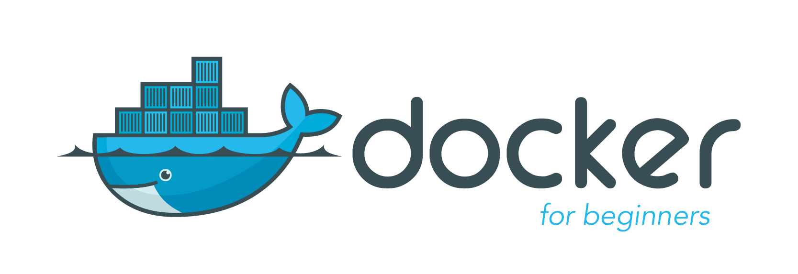

Special thanks and shout out to [Prakhar Srivastav](http://prakhar.me) for his contribution to this tutorial.

## Getting Started: FAQs

### What is Docker Engine?

Docker Engine is a tool that allows developers, sys-admins etc. to easily deploy their applications in a sandbox (called *containers*) to run on the host operating system i.e. Linux. The key benefit of Docker Engine is that it allows users to **package an application with all of its dependencies into a standardized unit** for software development. Unlike virtual machines, containers do not have the overhead of a full operating system and hence enable more efficient usage of the underlying system and resources.

### What are containers?

The industry standard today is to use Virtual Machines (VMs) to run software applications. VMs run applications inside a guest Operating System, which runs on virtual hardware powered by the server’s host OS.

VMs are great at providing full operating system isolation for applications: there are very few ways a problem in the host operating system can affect the software running in the guest operating system, and vice-versa. But this isolation comes at great cost — the computational overhead spent virtualizing hardware for a guest OS to use is substantial.

Containers take a different approach: by leveraging the low-level mechanics of the host operating system, containers provide most of the isolation of virtual machines at a fraction of the computing power.

### What will this tutorial teach me?
This tutorial aims to be the one-stop shop for getting your hands dirty with Docker. Apart from demystifying the Docker landscape, it'll give you hands-on experience with building and deploying your own webapps. You'll quickly build a multi-container voting app using multiple languages. Even if you have no prior experience with deployments, this tutorial should be all you need to get started.

## Using this Document
This document contains a series of several sections, each of which explains a particular aspect of Docker. In each section, you will be typing commands (or writing code). All the code used in the tutorial is available in the [Github repo](https://github.com/docker/labs).

## Table of Contents

- [Setup](chapters/setup.md)
- [1.0 Running your first container](chapters/alpine.md)
- [2.0 Basic Web Apps with Docker](chapters/webapps.md)
- [3.0 Run a multi-container app with Docker Compose](chapters/votingapp.md)
