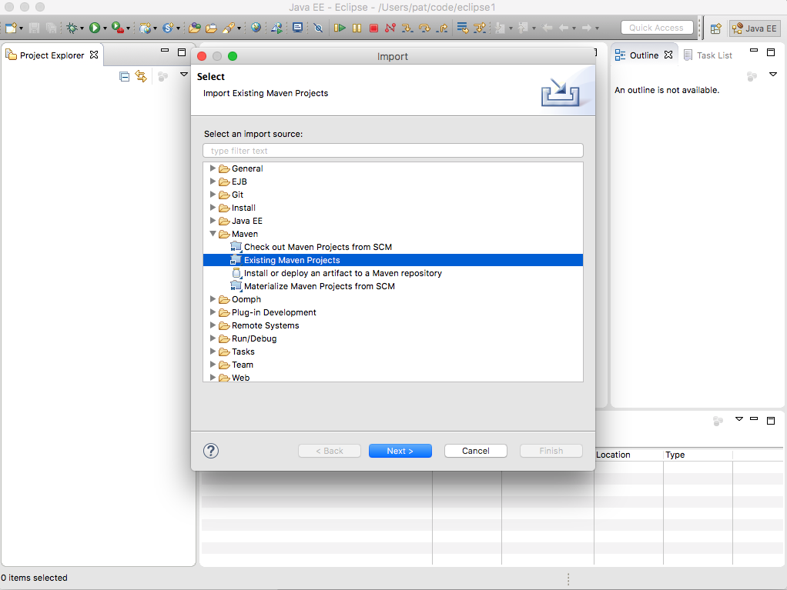
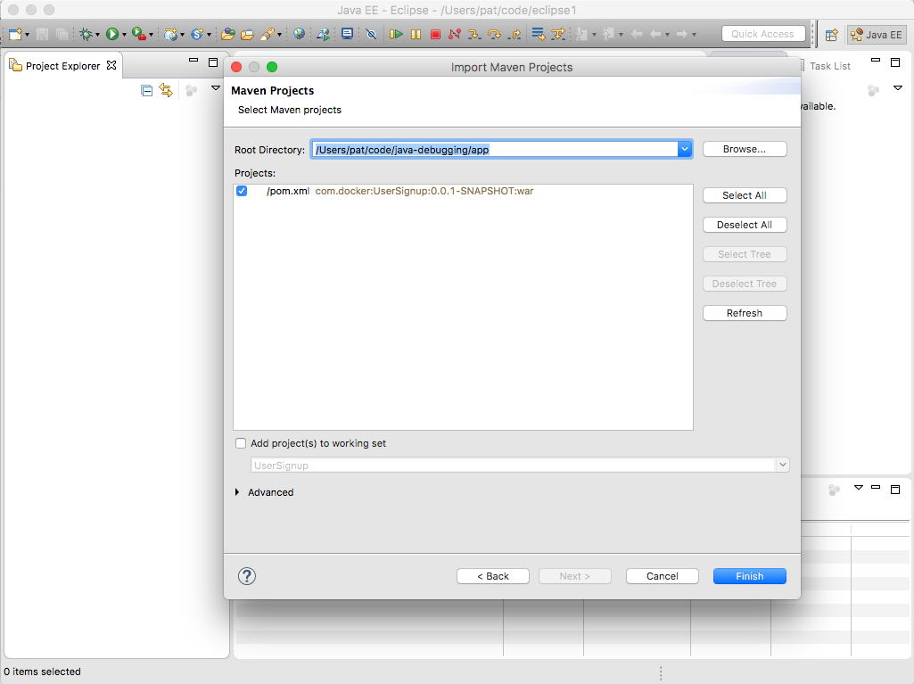
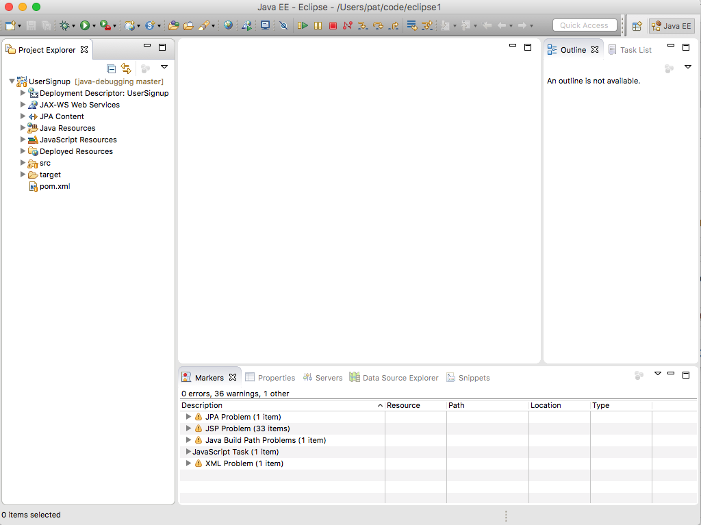

## In-container Java Development: Eclipse

### Pre-requisites

* [Docker for OSX or Docker for Windows](https://www.docker.com/products/docker)
* [Eclipse](http://www.eclipse.org/downloads/) (install Eclipse IDE for Java EE Developers)
* [Java Development Kit](http://www.oracle.com/technetwork/java/javase/downloads/jdk8-downloads-2133151.html)
* [Maven for Eclipse](http://www.eclipse.org/m2e/) (see instructions for adding the Maven plug-in to Eclipse)

### Getting Started

On the command line clone the [registration-docker](https://github.com/docker/labs) repository

```
git clone https://github.com/docker/labs
cd labs/developer-tools/java-debugging
```

In Eclipse, import the app directory of that project as an existing maven project

`File`> `Import` Select `Maven`> `Existing Maven Projects`> `Next`


 
 
Select the app subdirectory of the directory where you cloned the project.
 

 
 
Select the pom.xml from the app directory, click `Finish`. 
 



### Building the application

The application is a basic Spring MVC application that receives user input from a form, writes the data to a database, and queries the database.

The application is built using Maven. To build the application click on `Run` > `Run configurations`


Select `Maven build` > `New`


Enter a `Name` for the configuration.

Set the base direct of the application `<path>/registration-docker/app`.

Set the `Goals` to `clean install`.

Click `Apply`

Click `Run`


The results of the build will be displayed in the console.


### Running the application

Open a terminal and go to the application directory. Start the application with docker-compose

<pre>&gt; docker-compose up </pre>

Docker will build the images for Apache Tomcat and MySQL and start the containers. It will also mount the application directory (`./app/target/UserSignup`) as a data volume on the host system to the Tomcat webapps directory in the web server container.

Open a browser window and go to:
'localhost:8080'; you should see the Tomcat home page


When the Tomcat image was built, the user roles were also configured. Click on the `Manager App` button to see the deployed applications. When prompted for username and password, enter `system` and `manager` respectively to log into the Tomcat Web Application Manager page.


You can use the Manager page to `Start`, `Stop`, `Reload` or `Undeploy` web applications.

To go to the application, Click on `/UserSignup` link.


### Debugging the Application

In the application, click on `Signup` to create a new user. Fill out the registration form and click `Submit`


Click `Yes` to confirm.


Test out the login.


Oh no!


#### Configure Remote Debugging

Tomcat supports remote debugging the Java Platform Debugger Architecture (JPDA). Remote debugging was enabled when the tomcat image (registration-webserver) was built.

To configure remote debugging in Eclipse, click on `Run` > `Debug Configurations ...`


Select `Remote Java Application` and click on `Launch New Configuration` icon


Enter a `Name` for the configuration. Select the project using the `browse` button. Click on `Apply` to save the configuration and click on `Debug` to start the debugging connection between Tomcat and Eclipse.


#### Finding the Error

Since the problem is with the password, lets see how the password is set in the User class. In the User class, the setter for password is scrambled using [rot13](https://en.wikipedia.org/wiki/ROT13) before it is saved to the database.


Try registering a new user using the debugger. In Eclipse, change the view or Perspective to the debugger by clicking on `Window` > `Perspective` > `Open Perspective` > `Debug`


Eclipse will switch to the debug perspective. Since we enable remote debugging earlier, you should see the Daemon Threads for Tomcat in the debug window. Set a breakpoint for in the User class where the password is set.


Register a new user with the username of 'Moby' and with 'm0by' as the password, click `Submit`, click `yes`


Eclipse will display the code at the breakpoint and the value of password in the variables window. Note that the value is `m0by`


Click on `resume` or press `F8` to let the code run.


Next, set a breakpoint on the getPassword in the User class to see the value returned for password. You can also toggle off the breakpoint for setPassword.


Try to log into the application. Look at the value for password in the Eclipse variables window, note that it is `z0ol` which is `m0by` using ROT13.


In this MVC application the UserController uses the findByLogin method in the UserServiceImpl class which uses the findByUsername method to retrieve the information from the database. It then checks to see if the password from the form matches the user password. Since the password from the login form is not scrambled using ROT13, it does not match the user password and you cannot log into the application.

To fix this, apply ROT13 to the password by adding an import near the top of the file

```
import com.docker.UserSignup.util.Rot13
```

and replace the contents of `findByLogin` with

```
public boolean findByLogin(String userName, String password) {  
    User usr = userRepository.findByUserName(userName);

    String passwd = Rot13.rot13(password);

    if(usr != null && usr.getPassword().equals(passwd)) {
        return true;
    }

    return false;
}
```


Set a breakpoint in UserServiceImpl on the findByLogin method. Log in again and look at the values for the breakpoint. The 'passwd' variable is `z0ol` which matches the password for the user moby.


Continue (`F8`) and you should successfully log in.


