## Desarrollo Java: Eclipse

### Pre-requisitos

* [Docker for OSX or Docker for Windows](https://www.docker.com/products/docker)
* [Eclipse](http://www.eclipse.org/downloads/) (instalar Eclipse IDE para desaroolladores Java EE)
* [Java Development Kit](http://www.oracle.com/technetwork/java/javase/downloads/jdk8-downloads-2133151.html)
* [Maven for Eclipse](http://www.eclipse.org/m2e/) (ver instrucciones para agregar Maven plug-in en Eclipse)

### Empezando

En Eclipse, clonar el repositorio [registration-docker](https://github.com/spara/registration-docker.git)

`File`> `Import`
Seleccionar `Git`> `Projects`> `Next`

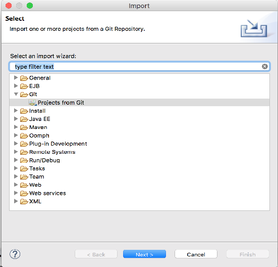

Seleccionar `Clone URI`> `Next`

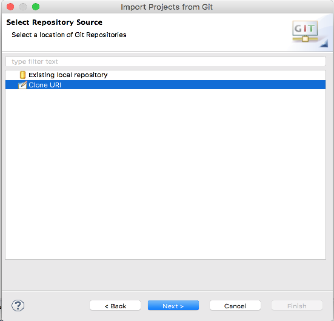

Ingresar la [`url del repositorio`](https://github.com/spara/registration-docker.git)> `Next`

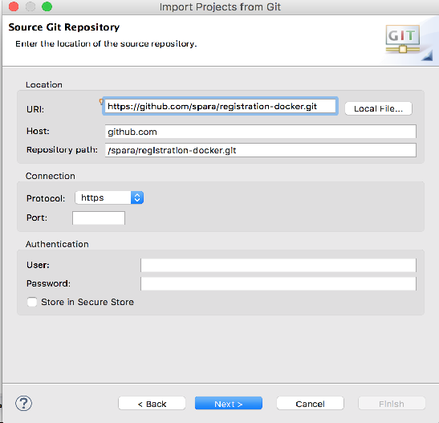

`Seleccionar el branch master`> `Next`

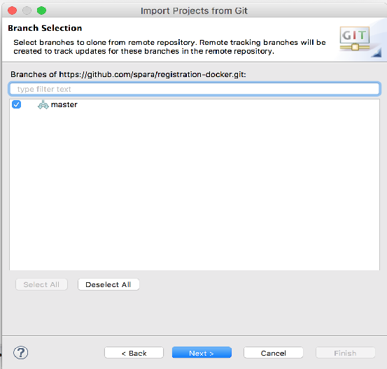

`Ingresar destination directory`> `Next`

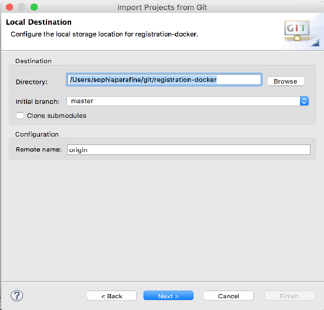

Seleccionar el asistente de importación, `Import existing Eclipse project`> `Next`

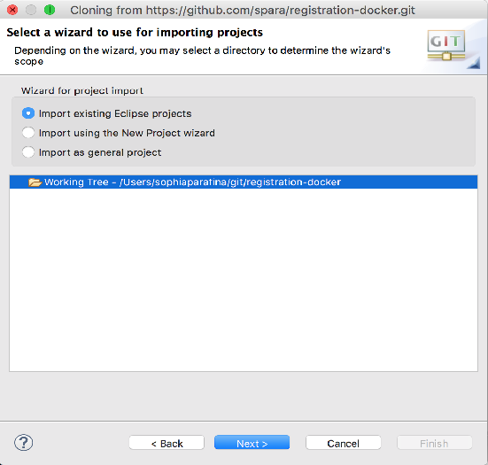

Seleccionar `registration-docker`> `Finish`

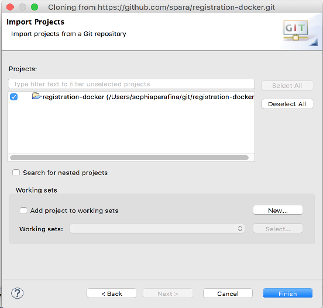

### Construyendo la aplicación

La aplicación es una aplicación Spring MVC básica que recibe datos del usuario de un formulario, escribe los datos en la base de datos, y consulta la base de datos.

La aplicación se construye usando Maven. Para construir la aplicación clic en `Run` > `Run configurations`

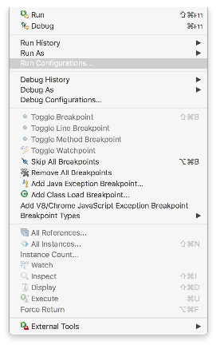

Seleccionar `Maven build` > `New`

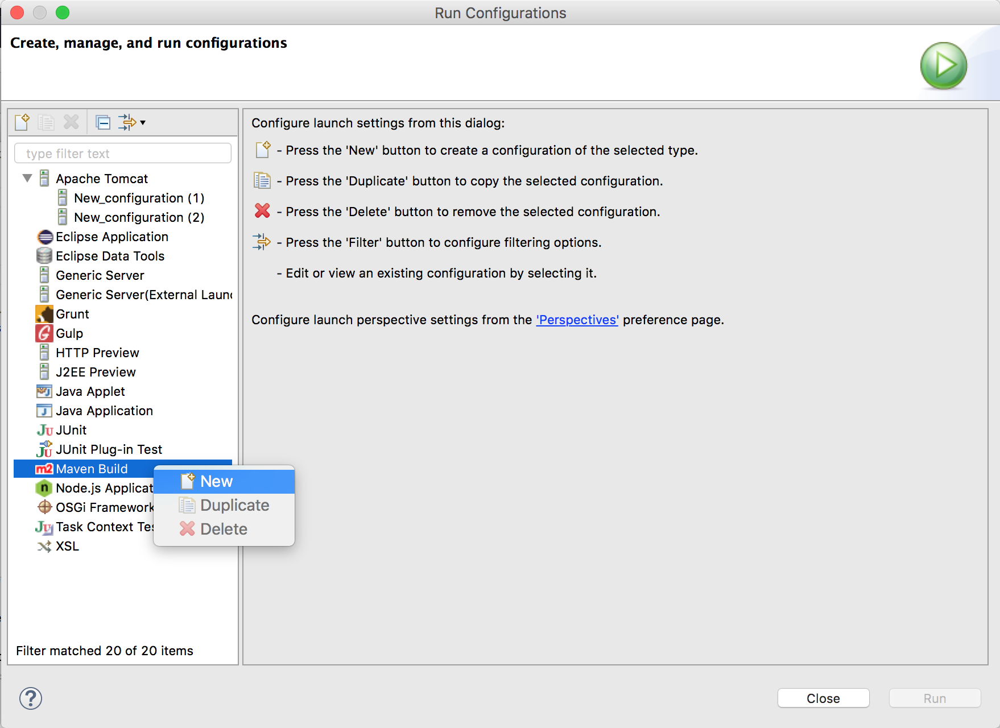

Ingresar `Name` para la configuración.

Establecer el directorio base de la aplicación `<path>/registration-docker/app`.

Establecer `Goals` a `clean install`.

Clic `Apply`

Clic `Run`


Los resultados del build serán mostrados en la consola.

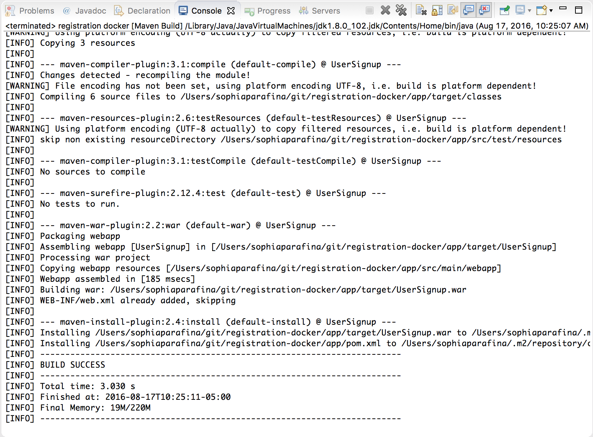

### Ejecutando la aplicación

Abrir un terminal e ir al directorio de la aplicación. Iniciar la aplicación con docker-compose

<pre>&gt; docker-compose up </pre>

Docker construirá las imágenes para Apache Tomcat y MySQL e iniciará los contenedores. También, montará el directorio de la aplicación (`./app/target/UserSignup`) como volumen de datos en el host del sistema al directorio webapps Tomcat en el contenedor del servidor web.

Abrir una ventana en el explorador e ir a:
'localhost:8080'; debes ver la página de inicio de Tomcat


Cuando la imagen de Tomcat fue construida, los roles de los usuarios fueron configurados. Clic en el botón `Manager App` para visualizar las aplicaciones desplegadas. Cuando se solicite por usuario y contraseña, ingresa `system` y `manager` respectivamente para entrar a la página de Tomcat Web Application Manager.


Puedes usar la página Manager para `Start`, `Stop`, `Reload` o `Undeploy` aplicaciones web.

Para ir a la aplicación, clic en el link `/UserSignup`.


### Depurando la Aplicación

En la aplicación, clic en `Signup` para crear un nuevo usuario. Completar el formulario de registro y clic en `Submit`


Clic `Yes` para confirmar.


Probar el inicio de sesión.


Oh no!


#### Configurar Depuración Remota

Tomcat soporta depuración remota usando Java Platform Debugger Architecture (JPDA). Debug Remoto fue habilitado cuando la imagen tomcat (registration-webserver) fue construida.

Para configurar la depuración remota en Eclipse, clic en `Run` > `Debug Configurations ...`

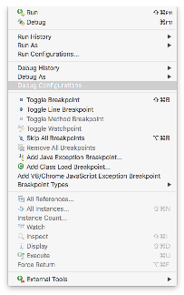

Seleccionar `Remote Java Application` y clic en el icono `Launch New Configuration`

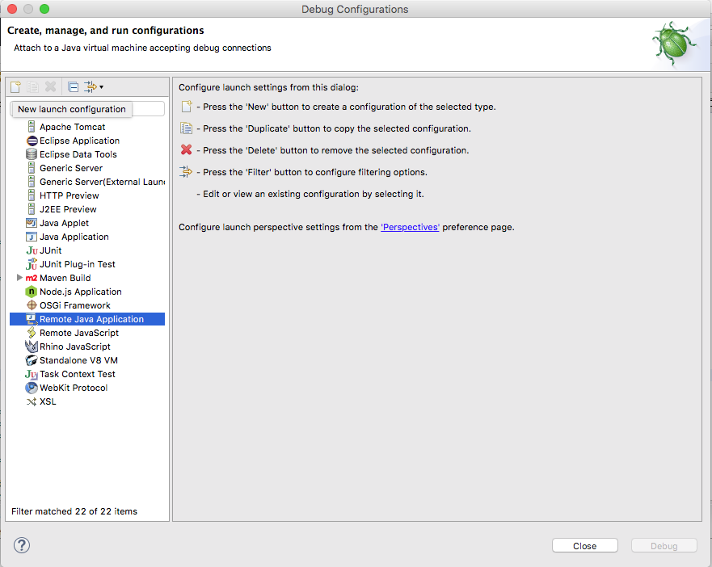

Ingresa `Name` para la configuración. Selecciona el proyecto usando el botón `browse`. Clic en `Apply` para guardar la configuración y clic en `Debug` para iniciar la conexión de debug entre Tomcat y Eclipse.

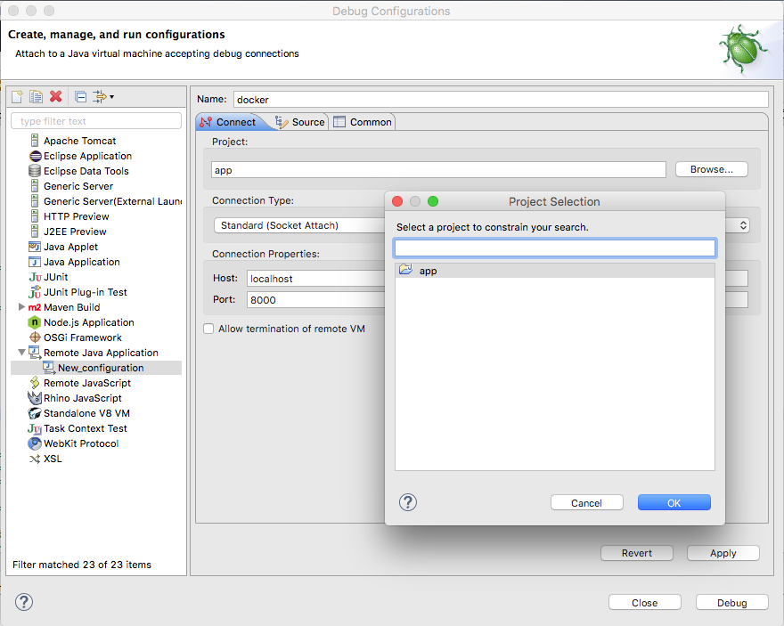

#### Buscando el Error

Dado que el problema es la contraseña, veamos como la contraseña se establece en la clase User. En la clase User, el setter para la contraseña es mezclado usando [rot13](https://en.wikipedia.org/wiki/ROT13) antes de ser salvado en la base de datos.


Tratar registrando un nuevo usuario usando el depurador. En Eclipse,  cambiar la vista o perspectiva del depurador haciendo clic en `Window` > `Perspective` > `Open Perspective` > `Debug`

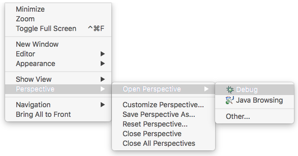

Eclipse cambiará a la perspectiva debug. Dado que habilitamos el depurador remoto previamente, debes ver los Daemon Threads para Tomcat en la ventana de debug. Establece un punto de interrupción para la clase User donde el password es establecido.

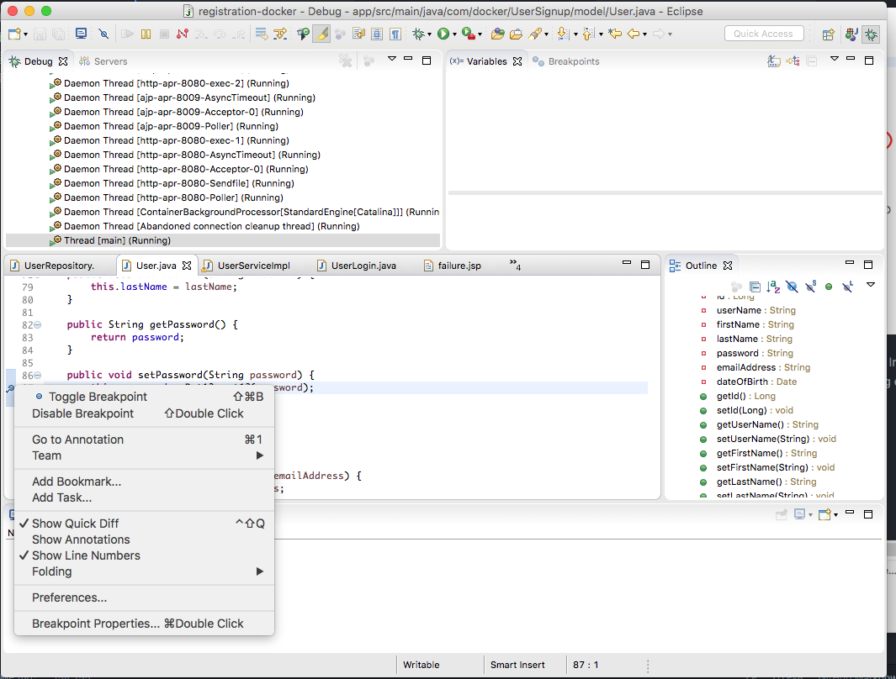

Registrar un nuevo usuario con el usuario de 'Moby' y con 'm0by' como contraseña, clic `Submit`, clic `yes`


Eclipse mostrará el código en el punto de interrupción y el valor de la contraseña en la ventana variables. Observar que el valor es `m0by`

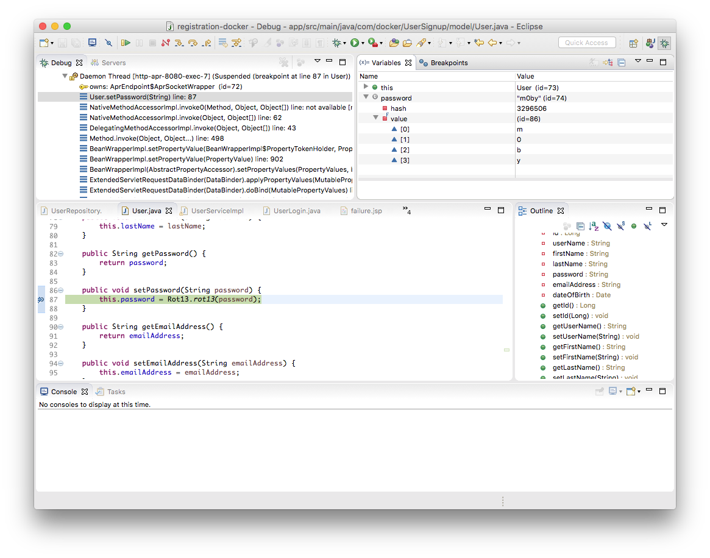

Clic en `resume` o presiona `F8` para permitir ejecutar el código.

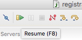

A continuación, establecer el punto de interrupción en getPassword en la clase User para ver los valores retornados para la contraseña. También puede cambiar el punto de interrupción para setPassword.

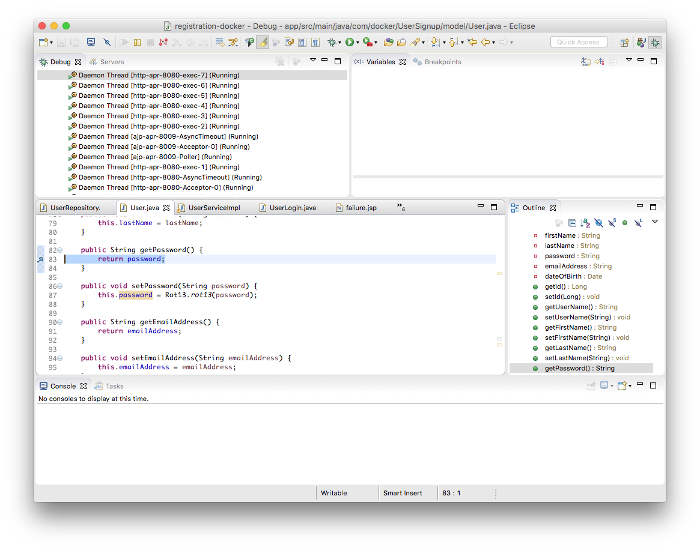

Tratar de acceder a la aplicación. Ver el valor de la contraseña en la ventana variables de Eclipse, observar que es `z0ol` el cual es `m0by` usando ROT13.

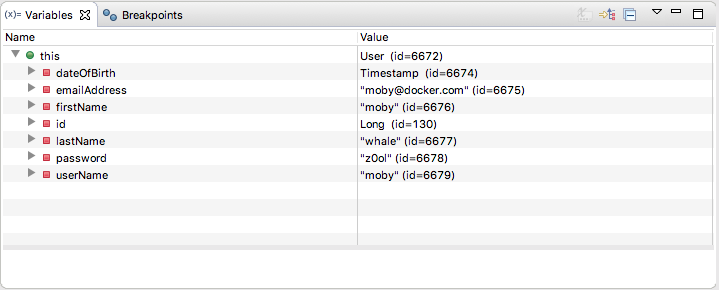

En esta aplicación MVC el UserController usa el método findByLogin en la clase UserServiceImpl la cual usa el método findByUsername para recuperar la información de la base de datos. A continuación, verifica que la contrasenña del formulario conincide con la contraseña del usuario. Dado que la contraseña del formulario de inicio de sesión no es mezclado usando ROT13, este no coincide con la contraseña del usuario y no puedes acceder a la aplicación.

Para solucionar esto, aplicar ROT13 a la contraseña agregando

```
import com.docker.UserSignup.utit.Rot13

String passwd = Rot13.rot13(password);
```
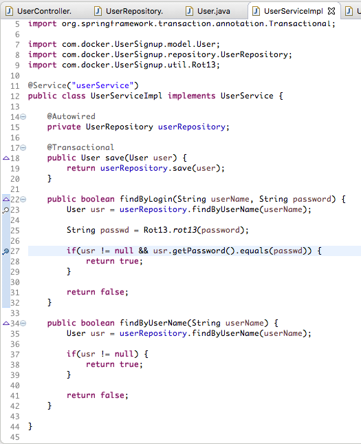

Establecer un punto de interrupción en UserServiceImpl en el método findByLogin. Iniciar sesión otra vez y mirar los valores para el punto de interrupción. La variable 'passwd' es 'z0ol' la cual coincide con la contraseña para el usuario moby.

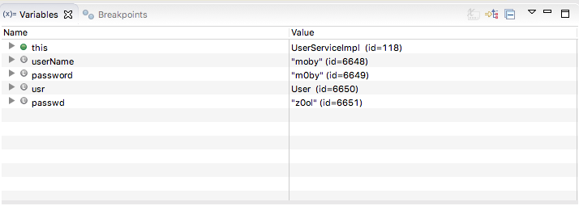

Continuar (`F8`) y debes acceder exitosamente.


