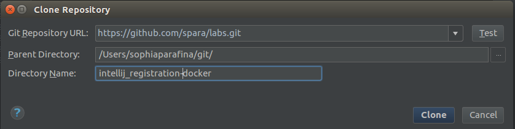

## In-container Java Development: IntelliJ Community Edition

### Pre-requisites

* [Docker for OSX or Docker for Windows](https://www.docker.com/products/docker)
* [IntelliJ Community Edition](https://www.jetbrains.com/idea/download/)
* [Java Development Kit](http://www.oracle.com/technetwork/java/javase/downloads/jdk8-downloads-2133151.html)


### Getting Started

In IntelliJ, clone the repository. Click on `Check out from Version Control` > `Github`


If this the first time to use IntelliJ with Github, log into your Github account.


On the command line clone the [docker/labs](https://github.com/docker/labs) repository
 

Click on `Import project from external model`, select `Maven`. Click `Next`


Check `Search for projects recursively`. Click `Next`


Select the project and click `Next`


Select the JDK(set the `JDK home path`) and click `Next`


Click `Finish`


Click on `Project View` to open the project.


### Building the application

The application is a basic Spring MVC application that receives user input from a form, writes the data to a database, and queries the database.

The application is built using Maven. To build the application click on icon on the bottom left of the IntelliJ window and select `Maven Projects`.


The `Maven Projects` window will open on the right side. Maven goals of `clean` and `install` need to be set to build the application.

To set the `clean` goal, click on `Lifecycle` to display the tree of goals. Right click on `clean` and select `Create 'UserSignup [clean]'...`


Click `OK` in the `Create Run/Debug Configuration` window.


Configure the `install` goal similarly. Click on `install` in the Lifecycle tree. Select `Create 'UserSignup[install]'...`


Click `OK` in the `Create Run/Debug Configuration` window.


To build the application run `clean`


Then run `install`


When the application builds, you will see a success message in the log window.


### Running the application

Open a terminal and go to the application directory. Start the application with docker-compose

<pre>&gt; docker-compose up </pre>

Docker will build the images for Apache Tomcat and MySQL then start the containers. It will also mount the application directory (`./app/target/UserSignup`) as a data volume on the host system to the Tomcat webapps directory in the web server container.

Open a browser window and go to:
'localhost:8080'; you should see the Tomcat home page


When the Tomcat image was built, the user roles were also configured. Click on the `Manager App` button to see the deployed applications. When prompted for username and password, enter `system` and `manager` respectively to log into the Tomcat Web Application Manager page.


You can use the Manager page to `Start`, `Stop`, `Reload` or `Undeploy` web applications.

To go to the application, Click on `/UserSignup` link.


### Debugging the Application

In the application, click on `Signup` to create a new user. Fill out the registration form and click `Submit`


Click `Yes` to confirm.


Test out the login.


Oh no!


#### Configure Remote Debugging

Tomcat supports remote debugging the Java Platform Debugger Architecture (JPDA). Remote debugging was enabled when the tomcat image (registration-webserver) was built.

To configure remote debugging in IntelliJ, click on `Run` > `Edit Configuration ...`


Add a new remote configuration.


In the `Run\Debug Configurations` window, set the `Name` of the configuration as `docker tomcat` and in `Settings` set the port to '8000' as the default Tomcat JPDA debuging port. Click on `OK` to save the configuration.


#### Finding the Error

Since the problem is with the password, let's see how the password is set in the User class. In the User class, the setter for password is scrambled using [rot13](https://en.wikipedia.org/wiki/ROT13) before it is saved to the database.


Try registering a new user using the debugger. In the menu click on `Run` > `Debug...`


Choose the remote Tomcat debug configuration. The Debugger console will be displayed at the bottom of the IntelliJ window.


Set a breakpoint in the User class where the password is set.


Register a new user with the username of 'Moby' and with 'm0by' as the password, click `Submit`, click `yes`


IntelliJ will display the code at the breakpoint and the value of password in the variables window. Note that the value is `m0by`


Click on `Resume Program` to let the code run or press `F8` to step over the breakpoint.


Next, set a breakpoint on the getPassword in the User class to see the value returned for password. You can also toggle off the breakpoint for setPassword.


Try to log into the application. Look at the value for password in the debugging console, note that it is `z0ol` which is `m0by` using ROT13.


In this MVC application the UserController uses the findByLogin method in the UserServiceImpl class which uses the findByUsername method to retrieve the information from the database. It then checks to see if the password from the form matches the user password. Since the password from the login form is not scrambled using ROT13, it does not match the user password and you cannot log into the application.

To fix this, apply ROT13 to the password by adding

```
import com.docker.UserSignup.utit.Rot13

String passwd = Rot13.rot13(password);
```


Set a breakpoint in UserServiceImpl on the findByLogin method. Log in again and look at the values for the breakpoint. The 'passwd' variable is `z0ol` which matches the password for the user moby.


Continue (`F8`) and you should successfully log in.


