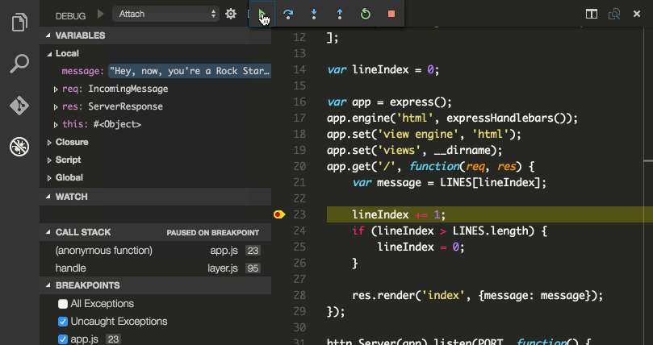

## In-container Node Development: Visual Studio Code

### Pre-requisites

* [Docker for OSX, Docker for Windows, or Docker for Linux](https://www.docker.com/products/docker)
* [Visual Studio Code](https://code.visualstudio.com/)

### Getting Started

The first thing to notice is that you don't actually need to have Node.js installed on your machine. You can just use Docker and your IDE. In this case we're going to show you how to use Visual Studio Code.

We've created a simple application which includes an error. You can see the app in the [app/ directory](https://github.com/docker/labs/tree/master/developer-tools/nodejs-debugging/app) of this repository. You can either clone this repository, or create the files yourself. Make sure they're all in the same directory. You will need the following files:

- app.js
- package.json
- index.html
- Dockerfile
- docker-compose.yml

`app.js` defines a simple node app. It serves up `index.html`, refreshing every 2 seconds with quote from an array. Here's what it looks like:


Let's take a look at the `Dockerfile`:

```
FROM node:8.2.1-alpine

WORKDIR /code

RUN npm install -g nodemon@1.11.0

COPY package.json /code/package.json
RUN npm install && npm ls
RUN mv /code/node_modules /node_modules

COPY . /code

CMD ["npm", "start"]
```

As you can see it installs [nodemon](http://nodemon.io/), a utility that will monitor for any changes in your source and automatically restart your server.

You'll start the app with the `docker-compose.yml`

```
version: "3"

services:
  web:
    build: .
    command: nodemon -L --inspect=0.0.0.0:5858
    volumes:
      - .:/code
    ports:
      - "8000:8000"
      - "5858:5858"
```

A few things are going on here:

* It defines a service called “web”, which uses the image built from the Dockerfile in the current directory.
* It overrides the command specified in the Dockerfile to enable the remote debugging feature built into Node.js. We do that here because when you ship this application’s container image to production, you don’t want the debugger enabled – it’s a development-only override.
* It overwrites the application code in the container by mounting the current directory as a volume. This means that the code inside the running container will update whenever you update the local files on your hard drive. This is very useful, as it means you don’t have to rebuild the image every time you make a change to the application.
* It maps port 8000 inside the container to port 8000 on localhost, so you can actually visit the application.
* Finally, it maps port 5858 inside the container to the same port on localhost, so you can connect to the remote debugger.


### Run the app

Using your terminal, navigate to the *app* directory (where the docker-compose.yml file is located) and start up the application:

```
$ docker-compose up
```

Docker Compose will build the image and start a container for the app. You should see this output:
```
Creating network "nodeexample_default" with the default driver
Creating nodeexample_web_1
Attaching to nodeexample_web_1
web_1  | [nodemon] 1.11.0
web_1  | [nodemon] to restart at any time, enter `rs`
web_1  | [nodemon] watching: *.*
web_1  | [nodemon] starting `node --inspect=0.0.0.0:5858 app.js`
web_1  | Debugger listening on port 5858
web_1  | HTTP server listening on port 80
```

The app is now running. Open up [http://localhost:8000/](http://localhost:8000) to see it in action, and take a moment to appreciate the poetry.


It’s undoubtedly beautiful, but the problem is obvious: we’re outputting a blank message at the end before cycling back to the first line. It’s time to debug.

### Start debugging
Open up the app directory in VSCode. Head over to the debugger by clicking the bug icon in the left-hand sidebar.


Create a boilerplate debugger config by clicking the gear icon and selecting “Node.js” in the dropdown.


A JSON file will be created and displayed (on the filesystem this file is located at *app/.vscode/launch.json*). Replace its contents with the following 

```
{
    "version": "0.2.0",
    "configurations": [
        {
            "name": "Attach",
            "type": "node",
            "request": "attach",
            "port": 5858,
            "address": "localhost",
            "restart": true,
            "sourceMaps": false,
            "outFiles": [],
            "localRoot": "${workspaceRoot}/",
            "remoteRoot": "/code"
        }
    ]
}
```
There are three important changes here:

* The whole “Launch” config has been deleted – you’re using Compose to launch the app, not VSCode, so it’s unnecessary.
* `restart` is set to true, so that the debugger re-attaches when the app restarts.
* `remoteRoot` is set to the path of the code directory inside the container, because it’s almost certainly different than the path to the code on your machine.

With the “Attach” config selected, click the “play” button to start the debugger.


Now go back to app.js and find the line that reads `lineIndex += 1` line, just after we initialize the `message` variable. Set a breakpoint by clicking in the gutter, just to the left of the line number.


If your browser window is still open and refreshing, in a second or two you should see it hit the breakpoint. If not, go back and refresh it – VSCode will pop back to the front as soon as the debugger hits it.

Hit the Play button at the top to resume code execution. It’ll hit the breakpoint every time the browser refreshes, which is every 2 seconds. You can see it cycling through the lines, and then the bug shows up – right after the last line, message gets set to undefined.


The reason becomes clear if you open up the “Closure” section under “VARIABLES”: `lineIndex` has incremented to 4 – the length of the `LINES` array – when it should have been reset after getting to 3. We’ve got an off-by-one error.


### Fix the bug
Replace the `> ` with `>=` in the conditional on the next line:


Now save the file. A second or two later, you should see the debugger detach and then reattach (the yellow line highlighting the breakpoint will disappear and reappear). This is because several things have just happened:

* Upon saving the file, Docker detected the filesystem change event and proxied it through to the container.
* nodemon detected the event and restarted the application. You can confirm this by looking at your terminal: there should be a line that reads “restarting due to changes…”
* Finally, VSCode detected that the remote debugger had gone away and reattached.

The debugger is now attached again. However, your browser tab might have errored out – go refresh it if so.

You can now step through the debugger once again and see that the lines cycle properly – no more `undefined`.


Remove the breakpoint and detach the debugger by clicking the stop button. Go back to the browser window and enjoy the updated experience.


And that's it, you're done!
