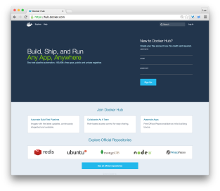
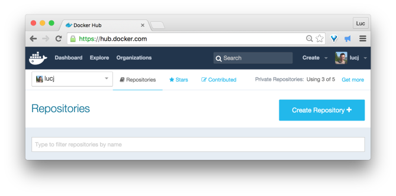
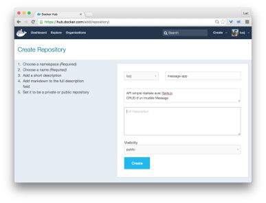
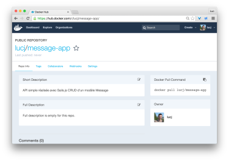

# Publish image

The following procedure describes how to create a repository on Docker Hub and publish an image.

## Create repository on Docker Public Registry

* Docker Hub



* List of user’s repositories



* Repository details



* Repository created



**the newly created repository will contain all the version of the application’s image**

## Create image

* Image needs to be created using username of the Docker Cloud account 
```docker build -t lucj/message-app .```

## Push image to Docker Cloud

Before publishing an image, authentication must be performed with the following command:
```docker login```

Image can then be published to the user repository
```docker push lucj/message-app```

## Instantiate the image

The image can then be used from any Docker host (the image is public in this example)
  * ```docker pull lucj/message-app```
  * ```docker run -dP lucj/message-app``` (will start with an error as no database information is provided)

