# Lab 1: Docker for Developers

> **Difficulty**: Beginner

> **Time**:  30 minutes

> **Tasks**:
> 
> + [Introduction to Docker for Mac/Windows](#what-is-docker-for-mac/windows)
> + [Docker for Mac](#docker-for-mac)
> + [Docker for Windows](#docker-for-windows)

##What is Docker for Mac/Windows ?

Docker for Mac and Docker for Windows are faster, more reliable alternatives to Docker Toolbox for running Docker locally on your Windows or Mac. It features the following:

**Faster and more reliable**- No more VirtualBox! On Mac, the Docker Engine runs in an xhyve Virtual Machine (VM) on top of an Alpine Linux distribution. The VM is managed by the native Docker application. On Windows, the Docker Engine is running in a Hyper-V VM. You do not need Docker Machine (`docker-machine`) to run Docker for Mac and Docker for Windows.

**Native apps for better tools integration** - Docker for Mac and Docker for Windows are native applications, including native user interfaces and the ability to stay updated automatically. The Docker tools are bundled with these apps, including the Docker command line interface (CLI), Docker Compose, and Docker Machine.

**Use with Docker Toolbox and Docker Machine** - Docker for Mac and Docker for Windows can be used at the same time as Docker Toolbox on the same machine. Docker for Mac and Docker for Windows do not include Kitematic yet. So, for now, the only reason you would still need both Toolbox and Docker for Mac or Windows is to run Kitematic. (See Docker for Mac vs. Docker Toolbox in the Mac documentation. A Windows-specific version is coming soon.)

**Volume mounting for your code and data** - Volume data access is fast and works correctly.

**Support for multiple architectures out-of-the-box** - Docker for Mac and Windows lets you build and run Docker images for Linux x86 and ARM. (See Leveraging Multi-Architecture Support in the Mac documentation. A Windows-specific version is coming soon.)

Please go through the tutorial based on the platform you're using (Mac or Windows)

##Docker for Mac

Docker for Mac is packaged as `Docker.app`, a bundle of Docker client, and Docker Engine. Docker.app uses the OSX Hypervisor.framework (part of MacOS X 10.10 Yosemite and higher) to run containers, meaning that no separate VirtualBox is required

### What to know before you install

* **README FIRST for Docker Toolbox and Docker Machine users**: If you are already running Docker on your machine, first read [Docker for Mac vs. Docker Toolbox](https://docs.docker.com/docker-for-mac/docker-toolbox/) to understand the impact of this installation on your existing setup, how to set your environment for Docker for Mac, and how the two products can coexist.

* **Relationship to Docker Machine**: Installing Docker for Mac does not affect machines you created with Docker Machine. You'll get the option to copy containers and images from your local `default` machine (if one exists) to the new Docker for Mac [xhyve](https://github.com/mist64/xhyve/).

* **System Requirements**: Docker for Mac will launch only if all these requirements are met.

	- Mac must be a 2010 or newer model, with Intel's hardware support for memory management unit (MMU) virtualization; i.e., Extended Page Tables (EPT)

	- OS X 10.10.3 Yosemite or newer

	- At least 4GB of RAM

	- VirtualBox prior to version 4.3.30 must NOT be installed (it is incompatible with Docker for Mac)

* **What the install includes**: The installation provides [Docker Engine](https://docs.docker.com/engine/userguide/intro/), Docker CLI client, [Docker Compose](https://docs.docker.com/compose/overview/), and [Docker Machine](https://docs.docker.com/machine/overview/).


## 1. Download, Install and Run Docker for Mac

**Step 1:** If you have not done so already, please download Docker for Mac [**here**](https://download.docker.com/mac/beta/Docker.dmg)

**Step 2:** Double-click `Docker.dmg` to open the installer, then drag Moby the whale to the Applications folder.

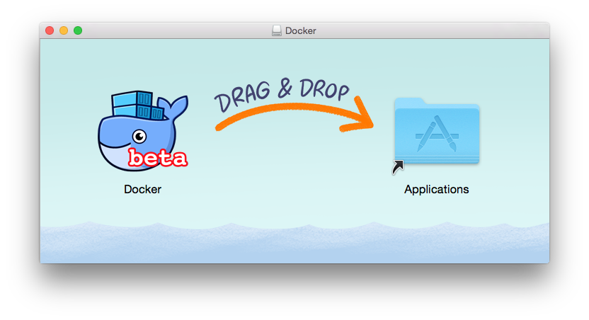

You will be asked to authorize `Docker.app` with your system password during the install process. Privileged access is needed to install  networking components and links to the Docker apps.

**Step 3:** Double-click `Docker.app` to start Docker.

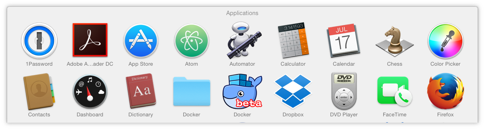

The whale in the top status bar indicates that Docker is running, and accessible from a terminal.


If you just installed the app, you also get a success message with suggested next steps and a link to this documentation. Click the whale () in the status bar to dismiss this popup.

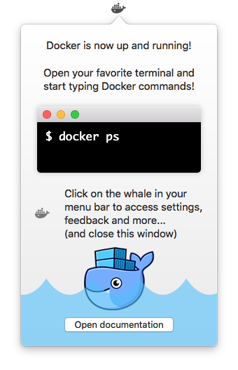

**Step 4:** Click the whale () to get Docker app Preference settings, and other options.

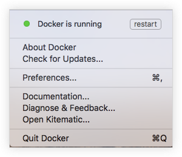

Select **About Docker** to verify that you have the latest version.

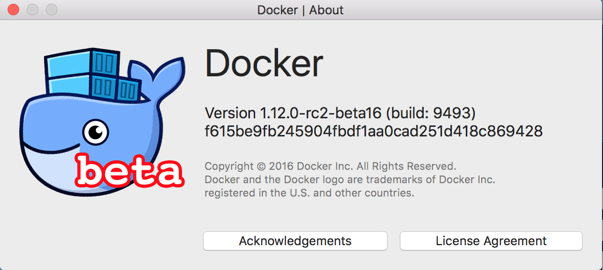

**Step 5:** Check versions of Docker Engine, Compose, and Machine

Run these commands to test if your versions of `docker`, `docker-compose`, and `docker-machine` are up-to-date and compatible with `Docker.app`.

```shell
	$ docker --version
	Docker version 1.12.0-rc2, build 906eacd, experimental

	$ docker-compose --version
	docker-compose version 1.8.0-rc1, build 9bf6bc6

	$ docker-machine --version
	docker-machine version 0.8.0-rc1, build fffa6c9
```

**Congratulations! You're up and running with Docker for Mac!**


## 2. General Preferences (Informational)

* Docker for Mac is set to **automatically start** when you log in. Uncheck the login autostart option if you don't want Docker to start when you open your session.

* Docker for Mac is set to **check for updates** automatically and notify you when an update is available. If an update is found, click **OK** to accept and install it (or cancel to keep the current version). If you disable the check for updates, you can still find out about updates manually by choosing  -> **Check for Updates**

* Check **Exclude VM from Time Machine backups** to prevent Time Machine from backing up the Docker for Mac virtual machine.

### Advanced Settings (Informational)

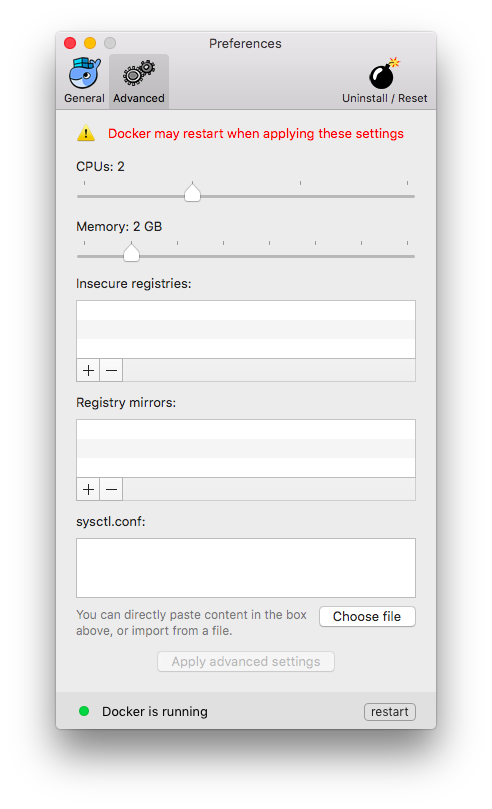

* **CPUs** - By default, Docker for Mac is set to use 2 processors. You can increase processing power for the app by setting this to a higher number, or lower it to have Docker for Mac use fewer computing resources.

* **Memory** - By default, Docker for Mac is set to use `2` GB runtime memory, allocated from the total available memory on your Mac. You can increase the RAM on the app to get faster performance by setting this number higher (for example to `3`) or lower (to `1`) if you want Docker for Mac to use less memory.

* **Insecure registries** - Configure insecure registries on the Docker daemon as described in the daemon reference on [insecure registries] (https://docs.docker.com/engine/reference/commandline/daemon/#insecure-registries)

* **Registry mirrors** - Add registry mirrors, as on option on the Docker daemon as described in the Docker [daemon reference] (https://docs.docker.com/engine/reference/commandline/daemon/).

* **sysctl.conf** - You can configure tuning parameters for the Linux kernel on which the Docker daemon runs by editing the `sysctl.conf` file.

	Reference information for the `sysctl` configuration file is available with Linux distributions. See [Kernel tuning with sysctl](https://www.linux.com/news/kernel-tuning-sysctl) to start learning more about these options. Proceed with caution, as modifying `sysctl.conf` incorrectly can prevent Docker from starting.

	For more about options on the Docker daemon, see the [daemon reference] (https://docs.docker.com/engine/reference/commandline/daemon/).

## 3. Build and Deploy an App 

In this step, we will show the power of file syncing when it comes to developing your application locally with Docker for Mac. You can easily sync any file from your local machine into the container running on Docker for Mac. As you're changing your code, you'll see the changes take effect right away. 

**Step 1:** Let's start by cloning the imfamous voting app into your local directory. 

**Note:** If you do not have `git` insalled on your Mac. Please download it [here](https://git-scm.com/download/mac).

```
$git clone https://github.com/docker/example-voting-app.git
```

**Step 2:** Examine the `docker-compose` file to understand how the application is deployed:

```
$cat example-voting-app/docker-compose.yml
version: "2"

services:
  voting-app:
    build: ./voting-app/.
    volumes:
     - ./voting-app:/app
    ports:
      - "5100:80"
    links:
      - redis
    networks:
      - front-tier
      - back-tier

  result-app:
    build: ./result-app/.
    volumes:
      - ./result-app:/app
    ports:
      - "5101:80"
    links:
      - db
    networks:
      - front-tier
      - back-tier

  worker:
    build: ./worker
    links:
      - db
      - redis
    networks:
      - back-tier

  redis:
    image: redis:alpine
    ports: ["6379"]
    networks:
      - back-tier

  db:
    image: postgres:9.4
    volumes:
      - "db-data:/var/lib/postgresql/data"
    networks:
      - back-tier

volumes:
  db-data:

networks:
  front-tier:
  back-tier:
```

You can see that for both the `voting-app` and `result-app` services, a host directory is mounted into the container. For example, the directory called `voting-app` is mounted into the container at `/app`. You can examine the `./voting-app/app.py` Python file as follows:


```
$ cat ./voting-app/app.py
from flask import Flask, render_template, request, make_response, g
from redis import Redis
import os
import socket
import random
import json

option_a = os.getenv('OPTION_A', "Cats")
option_b = os.getenv('OPTION_B', "Dogs")
hostname = socket.gethostname()

app = Flask(__name__)

def get_redis():
    if not hasattr(g, 'redis'):
        g.redis = Redis(host="redis", db=0)
    return g.redis

@app.route("/", methods=['POST','GET'])
def hello():
    voter_id = request.cookies.get('voter_id')
    if not voter_id:
        voter_id = hex(random.getrandbits(64))[2:-1]

    vote = None

    if request.method == 'POST':
        redis = get_redis()
        vote = request.form['vote']
        data = json.dumps({'voter_id': voter_id, 'vote': vote})
        redis.rpush('votes', data)

    resp = make_response(render_template(
        'index.html',
        option_a=option_a,
        option_b=option_b,
        hostname=hostname,
        vote=vote,
    ))
    resp.set_cookie('voter_id', voter_id)
    return resp


if __name__ == "__main__":
    app.run(host='0.0.0.0', port=80, debug=True)

 
```

You can see that the voting used two voting options **a** and **b** that default to **Cats** and **Dogs** respectively. Let's deploy the app and see how it looks!

**Step 3:** Build and Deploy the voting app using docker-compose

```
$cd example-voting-app
example-voting-app$ docker-compose up -d
```

The app will take some time to build but once it's done you can check the status as follows:

```
example-voting-app$ docker-compose ps
            Name                           Command               State            Ports
------------------------------------------------------------------------------------------------
examplevotingapp_db_1           /docker-entrypoint.sh postgres   Up      5432/tcp
examplevotingapp_redis_1        docker-entrypoint.sh redis ...   Up      0.0.0.0:32768->6379/tcp
examplevotingapp_result-app_1   node server.js                   Up      0.0.0.0:5001->80/tcp
examplevotingapp_voting-app_1   python app.py                    Up      0.0.0.0:5000->80/tcp
examplevotingapp_worker_1       java -jar target/worker-ja ...   Up

```

To access the app, you can go to your favorite browser and hit `localhost:5000`


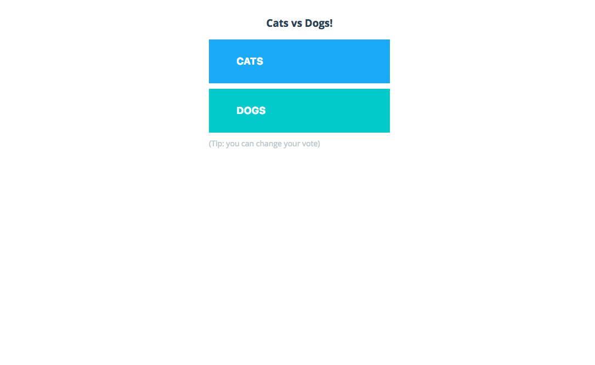


**Step 4:** Now let's tweak the voting options on the go and see the effect take place right away!

Using your favorite text editor, edit `app.py` and changes the voting options. Here we're changing them to Windows and Mac :)

 
 ```
 # cat voting-app/app.py
from flask import Flask, render_template, request, make_response, g
from redis import Redis
import os
import socket
import random
import json

option_a = os.getenv('OPTION_A', "Windows")
option_b = os.getenv('OPTION_B', "Mac")
 ```
 
Save your edits, and refresh the page. No need to rebuild the image or restart/redeploy the voting app containers!

Feel free to explore other features of Docker for Mac, deploy your favorite application, or just Tweet how awesome Docker for Mac is :)


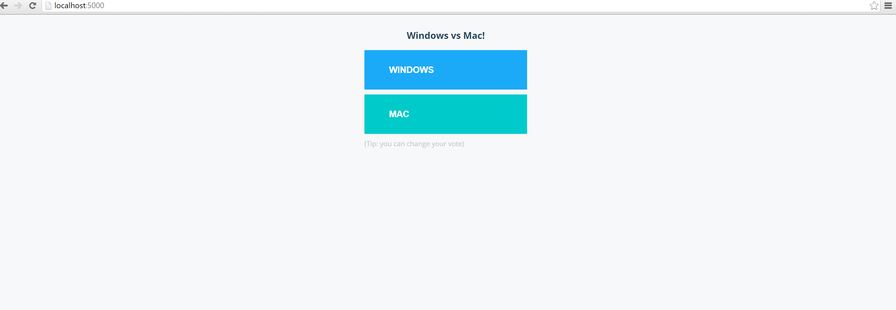

**Summary**

Docker for Mac is the fastest, most reliable, and native way to use Docker on your Mac. Throughout this tutorial, we learned how to install and run Docker for Mac. We also deployed an application and used the robust file-syncing to see changes in the application code right away without restarting or de-deploying the application containers!


##Docker for Windows

Docker for Windows is an integrated, easy-to-deploy environment for building, assembling, and shipping applications from a Windows PC. Docker for Windows is a native Windows application with a native user interface and auto-update capability, deeply integrated with Windows native virtualization, Hyper-V, networking and file system, making it faster and more reliable than previous ways of getting Docker on a Windows PC


##  What to know before you install

* **README FIRST for Docker Toolbox and Docker Machine users**: Docker for Windows requires Microsoft Hyper-V to run. After Hyper-V is enabled, VirtualBox will no longer work, but any VirtualBox VM images will remain. VirtualBox VMs created with `docker-machine` (including the `default` one typically created during Toolbox install) will no longer start. These VMs cannot be used side-by-side with Docker for Windows. However, you can still use `docker-machine` to manage remote VMs.

* You can import a `default` VirtualBox VM after installing Docker for Windows by using the **Settings** menu in the System Tray.

* The current version of Docker for Windows runs on 64bit Windows 10 Pro, Enterprise and Education (1511 November update, Build 10586 or later). In the future we will support more versions of Windows 10.

* Containers and images created with Docker for Windows are shared between all user accounts on machines where it is installed. This is because all Windows accounts will use the same VM to build and run containers. In the future, Docker for Windows will better isolate user content.

* The Hyper-V package must be enabled for Docker for Windows to work. The Docker for Windows installer will enable it for you, if needed. (This requires a reboot).

## 1. Download,Install, and Run Docker for Windows

**Step 1:** Download Docker for Windows

If you have not done so already, please download Docker for Windows [**here**](https://download.docker.com/win/beta/InstallDocker.msi).

**Step 2:** Double-click `InstallDocker.msi` to run the installer.

It typically downloads to your `Downloads folder`, or you can run it from the recent downloads bar at the bottom of your web browser.

**Step 3:** Follow the install wizard to accept the license, authorize the installer, and proceed with the install.

  You will be asked to authorize `Docker.app` with your system password during the install process. Privileged access is needed to install  networking components and links to the Docker apps.
  
**Step 4:** Click **Finish** on the setup complete dialog to launch Docker.

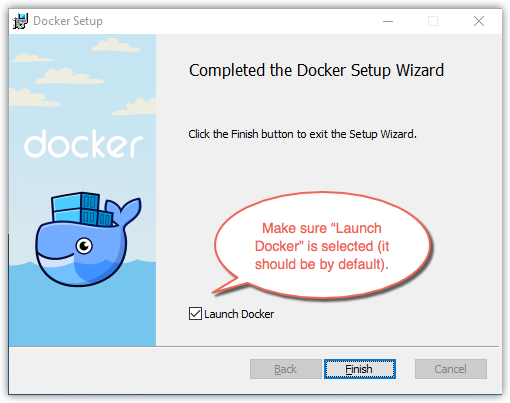

**Step 5:** Start Docker for Windows

When the installation finishes, Docker starts automatically.

The whale in the status bar indicates that Docker is running, and accessible from a terminal.

If you just installed the app, you also get a popup success message with suggested next steps, and a link to this documentation.

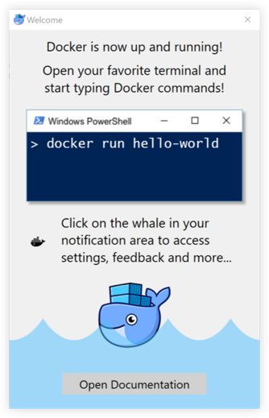

On every start of Docker, you will be prompted by Windows for privileged access. This allows Docker to manage Hyper-V VMs. When initialization is complete, select **About Docker** from the notification area icon to verify that you have the latest version.

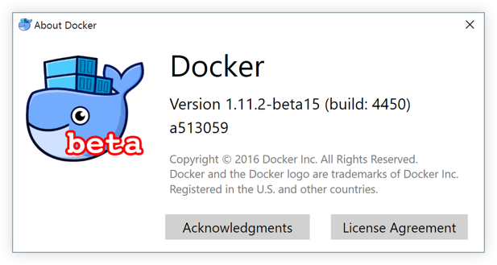

**Step 6:** Check versions of Docker Engine, Compose, and Machine

Start your favorite shell (`cmd.exe` or PowerShell) and check your versions of `docker` and `docker-compose`, and verify the installation.

      PS C:\Users\samstevens> docker --version
      Docker version 1.12.0-rc2, build 906eacd, experimental

      PS C:\Users\samstevens> docker-compose --version
      docker-compose version 1.8.0-rc1, build 9bf6bc6

      PS C:\Users\samstevens> docker-machine --version
      docker-machine.exe version 0.8.0-rc1, build fffa6c9
      

**Congratulations!** You're up and running with Docker for Windows.


## 2. General Preferences 

When Docker is running, the Docker whale is displayed in the system tray. If it is hidden, click the up arrow in the tray to show it.

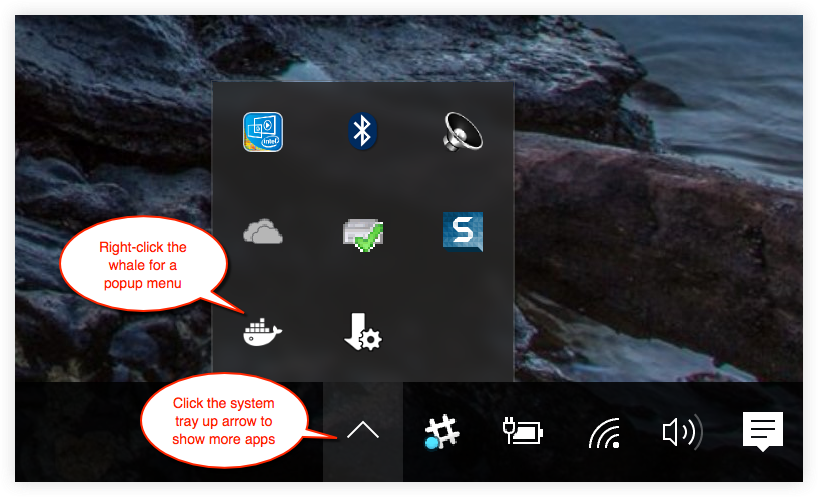

To get a popup menu with application options, right-click the whale:

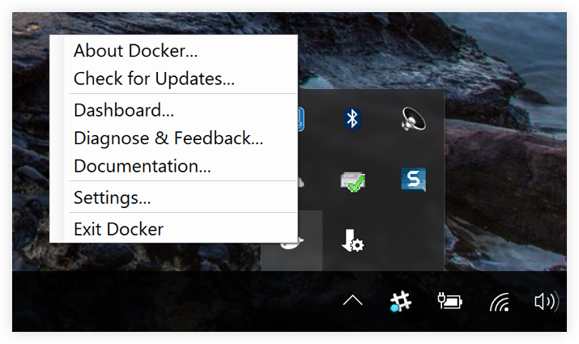

The **Settings** dialogs provide options to allow Docker auto-start, automatically check for updates, share local drives with Docker containers, enable VPN compatibility, manage CPUs and memory Docker uses, restart Docker, or perform a factory reset.


### General(Informational)

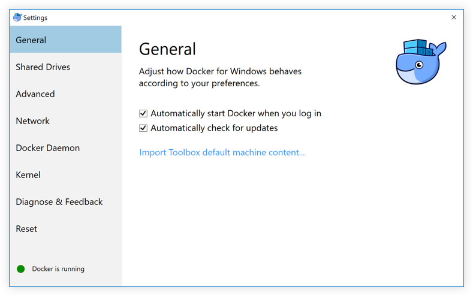

* **Automatically check for updates** - Docker for Windows is set to automatically check for updates and notify you when an update is available. If an update is found, click **OK** to accept and install it (or cancel to keep the current version). Uncheck this option if you do not want notifications of version upgrades. You can still find out about updates manually by choosing **Check for Updates** from the menu.

* **Automatically start Docker when you login** - Automatically start the Docker for Windows application upon Windows system login.

### Shared Drives(Required)

Share your local drives with Docker for Windows, so that they are available to your containers.

**Step 1:** Please select the `C` drive to be shared with the Docker VM. Feel free to select whichever drive you prefer but you need to ensure it's the same one that you'll be using in the following app deployment exercise. 

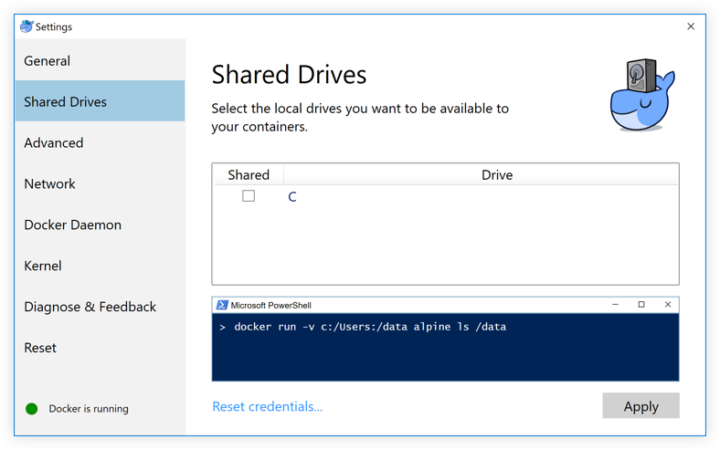

You will be asked to provide your Windows system username and password to apply shared drives. You can select an option to have Docker store the credentials so that you don't have to re-enter them every time.

### Advanced (Optional)

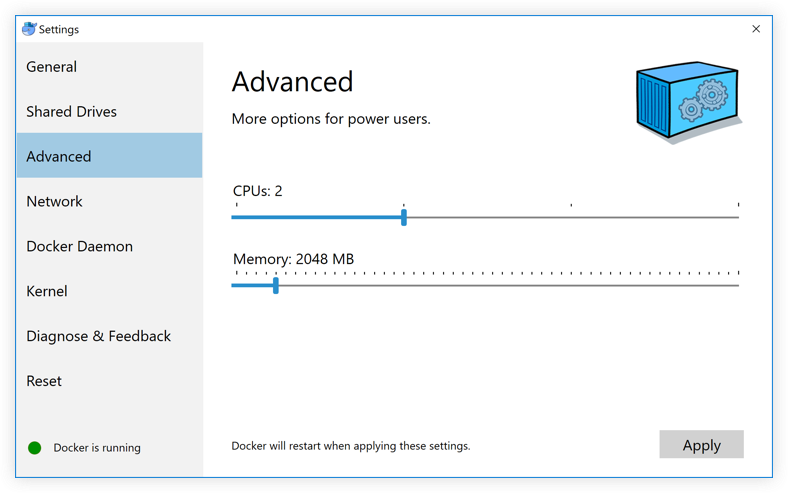

* **CPUs** - Change the number of processors assigned to the Linux VM.

* **Memory** - Change the amount of memory the Docker for Windows Linux VM uses.

Please note, updating these settings requires a reconfiguration and reboot of the Linux VM. This will take a few seconds.

### Network (Required)

You can enable **VPN compatibility mode** to allow Docker for Windows networking to work on a VPN.

* **(Not Required) NAT Virtual Switch** - You can specify a NAT prefix and subnet mask.

* **(Not Required) DNS Server** - You can configure a static IP address for the DNS server.

* **(Required) Experimental** - **Check the box** to expose a container's ports on your `localhost`.

After you enable the experimental please press **Apply**.

**Note** that updating these settings requires a reconfiguration and reboot of the Linux VM.


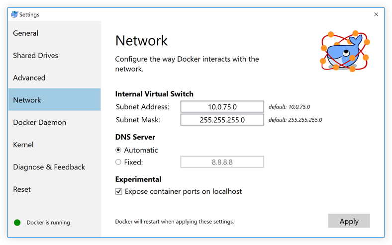

### Docker daemon(Informational)
You can configure options on the Docker daemon in the given JSON configuration file, and determine how your containers will run.

For a full list of options on the Docker daemon, see [daemon](https://docs.docker.com/engine/reference/commandline/daemon/) in the Docker Engine command line reference.

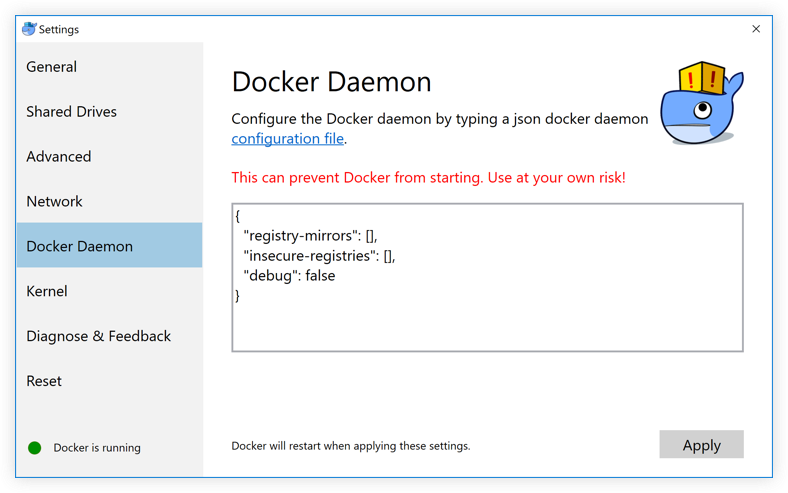

Note that updating these settings requires a reconfiguration and reboot of the Linux VM.

### Kernel(Informational)

You can configure tuning parameters for the Linux kernel on which the Docker daemon runs by editing the `sysctl.conf` file from the **Kernel** dialog.

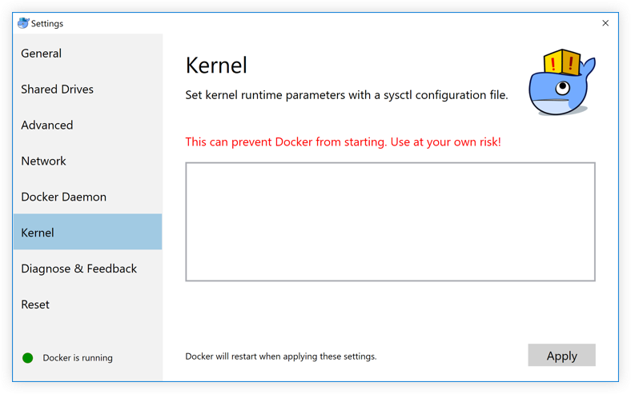

Reference information for the `sysctl` configuration file is available with Linux distributions. See [Kernel tuning with sysctl](https://www.linux.com/news/kernel-tuning-sysctl) to start learning more about these options. Proceed with caution, as modifying `sysctl.conf` incorrectly can prevent Docker from starting.

For more about options on the Docker daemon, see the [daemon reference] (https://docs.docker.com/engine/reference/commandline/daemon/).

Note that updating these settings requires a reconfiguration and reboot of the Linux VM.


## 3. Build and Deploy an App 

In this step, we will show the power of file syncing when it comes to developing your application locally with Docker for Windows. You can easily sync any file from your local machine into the container running on Docker for Windows. As you're changing your code, you'll see the changes take effect right away. 

**Step 1:** Let's start by cloning the imfamous voting app into your local directory. Please ensure that youre local directory is in the same drive that you shared in Step#2 above. In the case below, we chose the `docker` directory under `C` drive. 

**Note:** If you do not have `git` installed on your Mac. Please download it [here](https://git-scm.com/download/windows).

```
C:\Users\docker> git clone https://github.com/docker/example-voting-app.git
```

**Step 2:** Examine the docker-compose file to understand how the application is deployed:

```
PS C:\Users\docker\example-voting-app> cat .\docker-compose.yml
version: "2"

services:
  voting-app:
    build: ./voting-app/.
    volumes:
     - ./voting-app:/app
    ports:
      - "5100:80"
    links:
      - redis
    networks:
      - front-tier
      - back-tier

  result-app:
    build: ./result-app/.
    volumes:
      - ./result-app:/app
    ports:
      - "5101:80"
    links:
      - db
    networks:
      - front-tier
      - back-tier

  worker:
    build: ./worker
    links:
      - db
      - redis
    networks:
      - back-tier

  redis:
    image: redis:alpine
    ports: ["6379"]
    networks:
      - back-tier

  db:
    image: postgres:9.4
    volumes:
      - "db-data:/var/lib/postgresql/data"
    networks:
      - back-tier

volumes:
  db-data:

networks:
  front-tier:
  back-tier:
```

You can see that for both the `voting-app` and `result-app` services, a host directory is mounted into the container. For example, the directory called `voting-app` is mounted into the container at `/app`. You can examine the `./voting-app/app.py` Python file as follows:


```
PS C:\Users\docker\example-voting-app> cat .\voting-app\app.py
from flask import Flask, render_template, request, make_response, g
from redis import Redis
import os
import socket
import random
import json

option_a = os.getenv('OPTION_A', "Cats")
option_b = os.getenv('OPTION_B', "Dogs")
hostname = socket.gethostname()

app = Flask(__name__)

def get_redis():
    if not hasattr(g, 'redis'):
        g.redis = Redis(host="redis", db=0)
    return g.redis

@app.route("/", methods=['POST','GET'])
def hello():
    voter_id = request.cookies.get('voter_id')
    if not voter_id:
        voter_id = hex(random.getrandbits(64))[2:-1]

    vote = None

    if request.method == 'POST':
        redis = get_redis()
        vote = request.form['vote']
        data = json.dumps({'voter_id': voter_id, 'vote': vote})
        redis.rpush('votes', data)

    resp = make_response(render_template(
        'index.html',
        option_a=option_a,
        option_b=option_b,
        hostname=hostname,
        vote=vote,
    ))
    resp.set_cookie('voter_id', voter_id)
    return resp


if __name__ == "__main__":
    app.run(host='0.0.0.0', port=80, debug=True)

 
```

You can see that the voting used two voting options **a** and **b** that default to **Cats** and **Dogs** respectively. Let's deploy the app and see how it looks!

**Step 3:** Build and Deploy the voting app using docker-compose

```
PS C:\Users\docker> cd example-voting-app
PS C:\Users\docker\example-voting-app> docker-compose up -d
Creating network "examplevotingapp_front-tier" with the default driver
Creating network "examplevotingapp_back-tier" with the default driver
Creating examplevotingapp_redis_1
Creating examplevotingapp_db_1
Creating examplevotingapp_result-app_1
Creating examplevotingapp_voting-app_1
Creating examplevotingapp_worker_1
```

The app will take some time to build but once it's done you can check the status as follows:

```
PS C:\Users\docker\example-voting-app> docker-compose ps
            Name                           Command               State            Ports
------------------------------------------------------------------------------------------------
examplevotingapp_db_1           /docker-entrypoint.sh postgres   Up      5432/tcp
examplevotingapp_redis_1        docker-entrypoint.sh redis ...   Up      0.0.0.0:32768->6379/tcp
examplevotingapp_result-app_1   node server.js                   Up      0.0.0.0:5001->80/tcp
examplevotingapp_voting-app_1   python app.py                    Up      0.0.0.0:5000->80/tcp
examplevotingapp_worker_1       java -jar target/worker-ja ...   Up

```

To access the app, you can go to yoru favorite browser and hit `localhost:5000`


**Step 4:** Now let's tweak the voting options on the go and see the effect take place right away!

Using your favorite text editor, edit `app.py` and changes the voting options:

 
 ```
 # cat voting-app/app.py
from flask import Flask, render_template, request, make_response, g
from redis import Redis
import os
import socket
import random
import json

option_a = os.getenv('OPTION_A', "Windows")
option_b = os.getenv('OPTION_B', "Mac")
 ```

Save your edits, and refresh the page !


Feel free to explore other features of Docker for Windows, deploy your favorite application, or just Tweet how awesome Docker for Windows is :)


**Summary**

Docker for Windows is the fastest, most reliable, and native way to use Docker on your Windows 10 machine. Throughout this tutorial, we learned how to install and run Docker for Windows. We also deployed an application and used the robust file-syncing to see changes in the application code right away without restarting or de-deploying the application containers!


