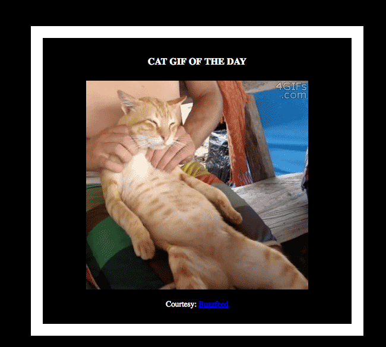
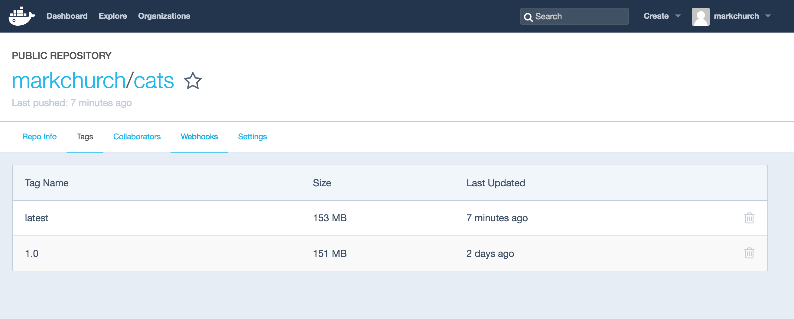

# Orchestration with Docker Engine swarm mode

> **Difficulty**: Beginner

> **Time**: Approximately 40 minutes

In this lab you will deploy a Dockerized application to a single host and test the application. You will then configure Docker swarm mode and deploy the same app across multiple hosts. You will then see how to scale the application and move the workload across different hosts

You will complete the following steps in this lab:

- [Deploy a single host application](#deploy-application)
- [Configure Docker with swarm mode](#start-cluster)
- [Deploy the application across multiple hosts](#multi-application)
- [Scale the application](#scale-application)
- [Drain a node and reschedule the containers](#recover-application)

## Pre-requisites

You will need all of the following in order to complete this lab:

- Three nodes running Docker v1.12.x. Each VM will be referenced as **v112node0**, **v112node1**, and **v112node2**.
	-  You can install the latest stable version of Docker 1.12 from <a href="http://test.docker.com">http://test.docker.com</a>
	 
- A Docker ID. Creating a Docker ID is free, and allows you to push and pull images from Docker Hub. [This link](https://docs.docker.com/mac/step_five/) describes how to create a Docker ID (you only need to complete the procedure up to step 2.3).


## <a name="deploy-application"></a>Step 1: Deploy a single host application

If you would like to skip using a Dockerfile and jump straight deploying on a cluster then go straight to Step 2.0.

In this step you will deploy a simple application that runs on a single Docker host. In order to do that, you will complete the following:

- Clone the app's GitHub repo
- Dockerize the app
- Run the app
- Push the image to Docker Hub


The application you will deploy is the `cats` application. It is a simple 1-container application that displays random pictures of cats, because why not!! It is a flask application written in Python that pulls the images from public URLs.

### Step 1.1 - Log into VMs and verify that Docker is running

1. SSH to __v112node0__ 

   ```bash
   ssh labuser@<public-dns-of-v112node0>
   ```

2. Verify that Docker is running. This lab is based on a pre-release version of Docker Engine 1.12 so that we can show you the latest orchestration features. We are running version `1.12.0-rc1` on these VMs.

	```bash
	labuser@v112node0:~$ docker version
	Client:
 	Version:      1.12.0-rc1
 	API version:  1.24
 	Go version:   go1.6.2
 	Git commit:   1f136c1
 	Built:        Wed Jun 15 05:16:17 2016
 	OS/Arch:      linux/amd64

	Server:
 	Version:      1.12.0-rc1
 	API version:  1.24
 	Go version:   go1.6.2
 	Git commit:   1f136c1
 	Built:        Wed Jun 15 05:16:17 2016
 	OS/Arch:      linux/amd64
 	```
 

3. We are going to copy the contents of the application code to **v112node0**. Use `git` to clone the `cats` application from `https://github.com/mark-church/cats.git`

   	```bash
   	labuser@v112node0:~$ git clone https://github.com/mark-church/cats.git
	Cloning into 'cats'...
	remote: Counting objects: 10, done.
	remote: Compressing objects: 100% (6/6), done.
	remote: Total 10 (delta 0), reused 7 (delta 0), pack-reused 0
	Unpacking objects: 100% (10/10), done.
	Checking connectivity... done.
   	```
   	
   	The repo contains all of the files and code that is required to create a container image of the application. The command above copies (clones) the repo into a new directory on your machine called `cats`.

3. Change directory to `cats` and examine the list of files with 'tree'.
	```bash
	labuser@v112node0:~/$ cd cats

	labuser@v112node0:~/cats$ tree
	.
	├── app.py
	├── Dockerfile
	├── images
	│   ├── browser.png
	│   ├── cat.png
	│   └── food.png
	├── README.md
	└── templates
    	└── index.html

	2 directories, 7 files
 	```


Some of the files worth knowing include the following:

- __Dockerfile__: This file contains the recipe for the `cats` app image.

- __app.py__: This is the main Python module that is our Flask application.
  	
- **/app/templates**: This folder includes the HTML web page that is called by the Python web server.

   Let's focus on the **Dockerfile** for a second. A **Dockerfile** is a text file that contains all the **instructions** required to build an application or service into a Docker image. This includes instructions to install packages, copy data, insert metadata, and anything else that should be included as part of the image. The Docker Engine uses Dockerfiles to create new images.

### Step 1.2 -  Dockerize the app

You **Dockerize** an application by describing it in a **Dockerfile** and using that **Dockerfile** to create a Docker image.

The following procedure will guide you through Dockerizing the the `cats` app. 

Make sure you're logged in to **v112node0** and in the `~/cats/` directory.


1. Inspect the contents of the Dockerfile.

	```bash

	ubuntu@v112node0:~/cats$ cat Dockerfile
	FROM ubuntu:14.04

	RUN sudo apt-get update && apt-get -y install python-pip

	RUN sudo pip install flask==0.10.1

	COPY . /usr/bin

	WORKDIR /usr/bin

	EXPOSE 5000

	CMD ["python", "./app.py"]
	```

   Let's have a quick look at the contents of the Dockerfile.

   __FROM__: The FROM instruction sets the base image that all subsequent instructions will build on top of. The base image can be any valid Docker image including other peoples' images. In this exercise you are starting with the `ubuntu:14.04` image as your base image.

   __RUN__: The RUN instruction executes commands while the image is being built. Each RUN instruction creates a new image layer. The RUN instructions in this **Dockerfile** are updating the local `apt` package lists from source, and installing some packages that the Flask framework requires.

   __ADD__: The ADD instruction copies files or directories from the Docker host and adds them to the filesystem of the container. In this particular **Dockerfile** the `app` directory that was just cloned to **v112node0** form GitHub is copied to the image at `/usr/bin`.

   __EXPOSE__: The EXPOSE instruction lists the ports that the container will expose at runtime. This image will expose port 5000.

   __CMD__: The main purpose of CMD instruction is to provide defaults for an executing container. This CMD instruction will run `python` specifying `./app.py` as the argument.

2. If you have not already signed up for a Docker Hub account please do so. Instructions are detailed in the preqresuites for this lab. Use the following `docker build` command to build an image from the Dockerfile.

   Be sure to substitute your own Docker ID in this example

   ```
   labuser@v112node0:~/cats$ docker build -t <your Docker ID>/cats .
   ```

   It will take between one and three minutes to build the image. This is because the `ubuntu:14.04` image has to be pulled locally and several packages have to be installed into the image.

   The `-t` flag lets you **tag** the image. The `<your-docker-id>/cats` will be the image tag - **Be sure to substitute your Docker ID**. Tagging the image lets you easily identify it as well as push to Docker Hub or other Docker Registries.

   The trailing period `.` tells the command to send your current working directory to the Docker daemon as the build context.  The **build context** is a fancy way of saying the Dockerfile and other files required to build the image.

   The output of the `docker build` command will look similar to the following (many lines have been removed for brevity).

   >**Warning**: You will see text roll up the screen as packages are installed. 

   	```
   	labuser@v112node0:~/cats$ docker build -t markchurch/cats .
	Sending build context to Docker daemon 65.54 kB
	Step 1 : FROM ubuntu:14.04
	---> 8f1bd21bd25c
	Step 2 : RUN sudo apt-get update && apt-get -y install 	python-pip
 	---> Using cache
 	---> 50e52804ad74
	Step 3 : RUN sudo pip install flask==0.10.1
 	---> Using cache
 	---> 19103663e62b
	Step 4 : COPY . /usr/bin
 	---> Using cache
 	---> 3988eef3f4aa
	Step 5 : WORKDIR /usr/bin
 	---> Using cache
 	---> ed799e437260
	Step 6 : EXPOSE 5000
 	---> Using cache
 	---> 7121e0e1317d
	Step 7 : CMD python ./app.py
 	---> Using cache
 	---> 0968ec22c14f
	Successfully built 0968ec22c14f
   ```

   Your output will be a lot more verbose than this as it includes output from `apt-get` and `pip`. Each line in the Dockerfile is creating a new container, installing the packages inside that container, and then commiting that container to a new image. The final step gives us the final image for this application.

3. Run a `docker images` command to confirm that the image is listed.

   ```
  	labuser@v112node0:~/cats$ docker images
	REPOSITORY          TAG                 IMAGE ID            CREATED             SIZE
	markchurch/cats     latest              6991f312ee28        7 seconds ago       363.5 MB
	ubuntu              14.04               8f1bd21bd25c        3 weeks ago         188 MB
   ```

   The output of your command will show your Docker ID and not *markchurch*. Since we doewnloaded the `ubuntu:14.04` image as an intermediary step we can see that that image has been downloaded too.
   
   
### Step 1.3 - Run the App

Now that you've Dockerized the the `cats` app let's go ahead and run it.
docker 

Perform all of these steps from **v112node0**.

1. Execute a `docker run` command to deploy a container with the `<your Docker ID>/cats` image.

   ```
   labuser@v112node0:~/cats$ docker run -d --name cats-app -p 8000:5000 markchurch/cats
   0374e0c107b4e84d4201415d1ad5dd036787ea317c8baa2062615f1f9e0b334e
   ```

   This will create a container with the `cats` image. It will run in the background because of the `-d` flag. We are exposing the container on port `8000` of the host and mapping this to port `5000` inside the container. The container ID of the container is given as a message confirming that the container has been created from our image.
   
   


2. Check that the container is running with `docker ps`.

   	```
   	labuser@v112node0:~/cats$ docker ps
	CONTAINER ID        IMAGE                 COMMAND             CREATED             STATUS              PORTS                    NAMES
	0374e0c107b4        markchurch/cats   "python ./app.py"   5 minutes ago       Up 5 minutes        0.0.0.0:8000->5000/tcp   cats-app
   	```
	This output shows us the container ID, the image used to build the container, the status of the container, and also the port-mapping between the container interface and the host interface. This confirms that our container is running.
  	

3. Point your web browser to the app.

   Paste the public DNS or public IP of **v112node0** into your web browser with port `8000`.
   <p align="center">
   
   </p>
   

   You should see the following ...
   <p align="center">
   
   </p>

	Note that the container ID on the `cats-app` web page should match the container ID of the `docker ps` command. Try refreshing the browser a couple times. You will cycle through some fantastics cats!


### Step 1.4 - Push the image to Docker Hub

Now that we have verified that our application works we will push the newly created image to Docker Hub so that you can pull it form other nodes.  

Perform the following steps from **v112node0**.

1. Login to Docker Hub with your Docker ID.

   ```bash
   labuser@v112node0:~/cats$ docker login
   Login with your Docker ID to push and pull images from Docker Hub. If you don't have a Docker ID, head over to https://hub.docker.com to create one.
   Username: <your-docker-id>
   Password:
   Login Succeeded
   ```

2. Push your image to Docker Hub. Later in the lab you will be pulling this image to different hosts.

   Remember to substitute your Docker ID.

   	```bash
   	labuser@v112node0:~/cats$ docker push markchurch/cats
	The push refers to a repository [docker.io/markchurch/cats]
	eeba1e237f53: Pushed
	faf8ac200bcd: Pushed
	2c00ae9664da: Pushed
	5f70bf18a086: Mounted from library/ubuntu
	6f8be37bd578: Mounted from library/ubuntu
	9f7ab087e6e6: Mounted from library/ubuntu
	dc109d4b4ccf: Mounted from library/ubuntu
	a7e1c363defb: Mounted from library/ubuntu
	latest: digest: sha256:5fdee62784552531475c02afff4cdcc12f95a050dbdd4bce53da7ee3d589d582 size: 1992
   	```

   This will push your newly built image to your own public repository on Docker Hub called `<your-docker-id>/cats`. The Docker Hub is the default Docker Registry and is hosted on the public internet. You can also push images to Docker Trusted Registry as well as third party registries.
   
   If you go to `hub.docker.com` and login then you will be able to see the repository and image tag that you just created.
   
   <p align="center">
   
   </p>

Before proceeding to the next task, clear all of the containers on __v112node0__ by running the following command.

	
	labuser@v112node0:~/cats$ docker rm -f $(docker ps -q)
	385f1c7a587c
	

Verify that the command worked and there are no running or stopped containers on the host.


	labuser@v112node0:~/cats$ docker ps
	CONTAINER ID        IMAGE               COMMAND             CREATED             STATUS              PORTS               NAMES
	labuser@v112node0:~/cats$
	
	
Now if you refresh your web browser with your application you will see that it is no longer running. 

## <a name="start-cluster"></a>Step 2: Configure Swarm Mode

So far you have deployed an application to a single Docker host (node). However, real-world applications are typically deployed across multiple hosts. This improves application performance and availability, as well as allowing individual application components to scale independently. Docker has powerful native tools to help you do this.

In this step you will configure *Swarm Mode*. This is a new optional mode in which multiple Docker Engines form into a self-orchestrating group of engines called a *swarm*. Swarm mode enables new features such as *services* and *bundles* that help you deploy and manage multi-container apps across multiple Docker hosts.

You will complete the following:

- Configure *Swarm mode*
- Run the app
- Scale the app
- Drain nodes for maintenance and reschedule containers

For the remainder of this lab we will refer to *Docker native clustering* as ***Swarm mode***. The collection of Docker engines configured for Swarm mode will be referred to as the *swarm*.

A swarm comprises one or more *Manager Nodes* and one or more *Worker Nodes*. The manager nodes maintain the state of swarm and schedule appication containers. The worker nodes run the application containers. As of Docker 1.12, no external backend, or 3rd party components, are required for a fully functioning swarm - everything is built-in!

In this part of the demo you will use all three of the nodes in your lab. __v112node0__ will be the Swarm manager, while __v112node1__ and __v112node2__ will be worker nodes. Swarm mode supports a highly available redundant manager nodes, but for the purposes of this lab you will only deploy a single manager node.

*If you are just joining us on this step then feel free to use the `markchurch/cats` image from the Docker Hub for the rest of the lab*

#### Step 2.1 - Create a Manager node

1. If you haven't already done so, SSH in to **v112node0**.


   ```
   $ ssh labuser@v112node0-9a7b5b024cf247fb8d851bf173c72619-4.cloudapp.net
   ```

2. Get the internal/private IP address of __v112node0__.

   ```bash
   labuser@v112node0:~/$ ip a ls dev eth0 | sed -n "s,.*inet  *\([^/]*\)/.*,\1,p"
   10.0.0.11
   ```

   Make a note of this IP address as you will use it later when adding worker nodes to the swarm.

3. Create a Manager node on __v112node0__ using its internal IP address and `docker swarm init --listen-addr <IP address>:<port>. This is the address the the swarm manager is advertising itself on to other nodes wishing to joing the swarm.

   Remember to substitute the IP address for the private IP of your **v112node0**.

   ```
   labuser@v112node0:~/$ docker swarm init --listen-addr 10.0.0.11:2377
   Swarm initialized: current node (0gohc21qtm7sp) is now a manager.
   ```

   `docker swarm init` is a new command in Docker 1.12. It is entirely optional, but is all that is needed to initialize a new *swarm* (native Docker cluster).

   Port `2377` is recommended but not mandatory. You can use a different port of your choosing.

4. Run a `docker info` command to verify that **v112node0** was successfully configured as a swarm manager node.

   ```
   ubuntu@v112node0:~/FoodTrucks/$ docker info
   Containers: 0
   Running: 0
   <Snip>
	Swarm:
	 NodeID: 3vatl908ksmjk
 	IsManager: YES
	<Snip>
   ```

The swarm is now initialized with **v112node0** as the only Manager node. In the next section you will add **v112node1** and **v112node2** as *Worker nodes*.

####  Step 2.2 - Join Worker nodes to the Swarm

You will perform the following procedure on **v112node1** and **v112node2**. Towards the end of the procedure you will switch back to **v112node0**.

1. Open a new SSH session to __v112node1__ (Keep your SSH session to **v112node0** open in another tab or window).


   ```bash
   $ ssh labuser@v112node1-9128f1906df54acda5044f56a1a86b07-2.cloudapp.net
   ```

2. Join the swarm using the *internal* IP of **v112node0** and the port specified when you created the Swarm.

   The format of the command is as follows:

   ```
   docker swarm join <internal-ip-of-manager-node>:<port>
   ```

   The example below joins a new worker node to an existing swarm with a manager node with IP address of `10.0.0.11` on port `2377`.

   Be sure to substitute the internal IP address of your **v112node0** that you made a note of earlier.

   ```bash
   labuser@v112node1:~/$ docker swarm join 10.0.0.11:2377
   This node joined a Swarm as a worker.
   ```

3. Repeat steps 1 and 2 for __v112node2__.

4. Switch to **v112node0** and verify that the Swarm is up and running with **v112node0** as the Manager node and **v112node1** and **v112node2** both as Worker nodes.

   Run this command on **v112node0** (the Manager node).

   ```bash
   labuser@v112node0:~/$ docker node ls
	ID                           NAME                                          MEMBERSHIP  STATUS  AVAILABILITY  MANAGER    STATUS  LEADER
	5zkcnyq6uqxv4sfpzsyvs8x3s    v112node1-9128f1906df54acda5044f56a1a86b07-2  Accepted    Ready   Active
	acu262y2ight8uyn6fg8yvust *  v112node0-9128f1906df54acda5044f56a1a86b07-2  Accepted    Ready   Active        Reachable       Yes
	brr8ri58aa1ed9051drszoyh0    v112node2-9128f1906df54acda5044f56a1a86b07-2  Accepted    Ready   Active
   ```

   The `docker node ls` command shows you all of the nodes that are in the swarm as well as their roles in the swarm. The `*` identifies the node that you are issuing the command from.

Congratulations. You have configured a swarm with one manager node and two worker nodes.

## <a name="multi-application"></a>Step 3: Deploy a Multi-Host Application

Now that you have a swarm up and running, it is time to deploy the app to it.  To do this you will complete the following actions:

- Create a new overlay network for the application
- Deploy the application components as Docker *services*

You will perform the following procedure from **v112node0**.

### Step 3.1 - Create a new overlay network for the application

1. Create a new overlay network called `catnet`. `catnet` will be the overlay network that our application containers live on.

   ```
   labuser@v112node0:~/$ docker network create -d overlay catnet
   81pjggkd57fbbl7zmheasc6m8
   ```

   The network ID will be output to signal the succesful creation of a Docker network. The `-d` flag let's you specify which network driver to use. In this example you are telling Docker to create a new network using the **overlay** driver. In *Swarm Mode* the overlay network does not require an external key-value store. It is integrated into the engine. The overlay provides reachability between the hosts across the underlay network. Out of the box containers on the same overlay network will be able to ping eachother without any other special configuration.

2. Confirm that the network was created. We can see that there are several other default networks that already exist in a Docker host.

   ```
   labuser@v112node0:~/$ docker network ls
	NETWORK ID          NAME                DRIVER              SCOPE
	09b78531f1d5        bridge              bridge              local
	e7cf5b545252        docker_gwbridge     bridge              local
	9311e4b9e4e1        host                host                local
	bhpf10k7w3gt        ingress             overlay             swarm
	26b729bf0d65        none                null                local

	```

Now that the container network is created you are ready to deploy the application to the swarm.

#### Step 3.2 - Deploy the application components as Docker services

Your `cats` application is becoming very popular on the internet. People just love pictures of cats. You are going to have to scale your application to meet peak demand. You will have to do this across multiple hosts for high availability. We will use the concept of *Services* to scale our application easily and manage many containers as a single entity.

*Services* are a new concept in Docker 1.12. They work with swarms and are intended for long-running containers.


You will perform this procedure from **v112node0**.

1. Deploy `cats` as a *Service*. Remember to use your `<Docker ID>` instead of `markchurch`. However, if you did not complete Part 1 of this lab you are welcome to use `markchurch/cats` as the application image as that will work as well.

   ```bash
   labuser@v112node0:~/$ docker service create --name cat-app --network catnet -p 8000:5000 markchurch/cats
5qwkfpdpsm72opbxvzgzk9s5q
   ```


2. Verify that the `service create` has been received by the Swarm manager.

   ```
   labuser@v112node0:~/$ docker service ls
	ID            NAME     SCALE  IMAGE            COMMAND
	5qwkfpdpsm72  cat-app  1      markchurch/cats
   ```

3. We can insepct the progress of our individual service containers by using the `docker service tasks` command. It may take a minute or two until the `LAST STATE` column is in the `Running` status.

	```
	labuser@v112node0:~/$ docker service tasks cat-app
	ID                         NAME       SERVICE  IMAGE            LAST STATE         DESIRED STATE  NODE
	ehfg9vq9m8bgyrxyv0abrex8c  cat-app.1  cat-app  markchurch/cats  Running 5 minutes  Running        v112node0-9128f1906df54acda5044f56a1a86b07-2
	```
	
	The state of the service may change a couple times until it is running. The image is being downloaded from your Docker Hub repository directly to the other engines in the Swarm. Once the image is downloaded the container goes into a running state on one of the three nodes.

	At this point it may not seem that we have done anything very differently than in part 1. We have again deployed a single container on a host and mapped it to port `8000`. The difference here is that the container has been scheduled on a swarm cluster.  The application is available on port `8000` on any of the hosts in the cluster even though the `cat-app` container is just running on a single host. The Swarm intelligently routes routes requests to the `cat-app`.

4. Check that the app is running in your browser. You can use any of the node URLs. The Swarm will advertise the published port on every host in the cluster.

   Point your web browser to `http://<v112node0-public-ip>:8000`. Now try pointing it to `http://<v112node1-public-ip>:8000`. You should see the same `cat-app` being served by the same container ID in both cases. Your request is being routed by the Docker engine from any Swarm node to the correct node. (The picture will change but the container ID confirms to us that the same container is being hit every time.)

Well done. You have deployed the cat-app to your new Swarm using Docker services. 

#### Step 3.3 - Scale the app

Demand is crazy! Everybody loves your `cats` app! It's time to scale out.

One of the great things about *services* is that you can scale them up and down to meet demand. In this step you'll scale the web front-end service up and then back down.

You will perform the following procedure from **v112node0**.

1. Scale the number of containers in the **web** service to 7 with the `docker service update --replicas` command. `replicas` is the term we use to describe identical containers providing the same service.

   ```bash
   labuser@v112node0:~/$ docker service update --replicas 7 cat-app
   cat-app
   ```
	The Swarm manager schedules so that there are 7 `cat-app` containers in the cluster. These will be scheduled evenly across the Swarm members.

2. We are going to use the `docker service tasks` command again but pair it with the `watch` command so we can see the containers come up in real time

   ```bash
   labuser@v112node0:~/$ watch docker service tasks cat-app
   Every 2.0s: docker service tasks cat-app                                                                                                                                            Sat Jun 18 21:28:01 2016

	ID                         NAME       SERVICE  IMAGE            LAST STATE          DESIRED STATE  NODE
	ehfg9vq9m8bgyrxyv0abrex8c  cat-app.1  cat-app  markchurch/cats  Running 17 minutes  Running        v112node0-9128f1906df54acda5044f56a1a86b07-2
	868i4miwqutkla8oih3tvrifi  cat-app.2  cat-app  markchurch/cats  Running 2 minutes   Running        v112node1-9128f1906df54acda5044f56a1a86b07-2
	1dahwhg1ma3oy2wgchlfof4ad  cat-app.3  cat-app  markchurch/cats  Running 2 minutes   Running        v112node2-9128f1906df54acda5044f56a1a86b07-2
	3hiymz9dbna33gyzevmrcqq6s  cat-app.4  cat-app  markchurch/cats  Running 2 minutes   Running        v112node2-9128f1906df54acda5044f56a1a86b07-2
	01s73ggiaub4om2d4u4wkl1cb  cat-app.5  cat-app  markchurch/cats  Running 2 minutes   Running        v112node0-9128f1906df54acda5044f56a1a86b07-2
	4bx4v9t7c9ujifusj3vd6nq10  cat-app.6  cat-app  markchurch/cats  Running About a minute  Running        v112node1-9128f1906df54acda5044f56a1a86b07-2
	7s57r3capvz77rp5ejhalbov5  cat-app.7  cat-app  markchurch/cats  Running About a minute  Running        v112node2-9128f1906df54acda5044f56a1a86b07-2   

	```

   Notice that there are now 7 containers listed. It may take a few seconds for the new containers in the service to all show as **RUNNING**.  The `NODE` column tells us on which node a container is running. After all the containers are in `RUNNING` state press `CTRL-C` and it will take you out of the `watch` screen.

3. Confirm the scaling operation and container load-balancing from a web browser.

   Point your web browser to `http://<any-node-ip>:8000` and hit the refresh button a few times. You will see the container ID changing. This is because the swarm is automatically load balancing across all seven containers. You can send a request to any Swarm member and you will hit any container in the service.

4. Scale the service back down just five containers again with the `docker service update --replicas` command. 

   ```bash
   labuser@v112node0:~/$ docker service update --replicas 5 cat-app
   web
   ```

5. Verify that the number of containers has been reduced to 5 using the `docker service tasks cat-app` command and your web browser.

You have successfully scaled a swarm service up and down.

#### Step 3.4 - Bring a node down for maintenance.

Your cat-app has been doing amazing. It's number 1 on the Apple Store! You have scaled up during the holidays and down during the slow season. Now you are doing maintenance on one of your servers so you will need to gracefully take a server out of the swarm without interrupting service to your customers.


1. Take a look at the status of your nodes again so you can get the node names for step 2.  

   ```bash
   labuser@v112node0:~/$ docker node ls
	ID                           NAME                                          MEMBERSHIP  STATUS  AVAILABILITY  MANAGER 	STATUS  LEADER
	5zkcnyq6uqxv4sfpzsyvs8x3s    v112node1-9128f1906df54acda5044f56a1a86b07-2  Accepted    Ready   Active
	acu262y2ight8uyn6fg8yvust *  v112node0-9128f1906df54acda5044f56a1a86b07-2  Accepted    Ready   Active        Reachable       Yes
	brr8ri58aa1ed9051drszoyh0    v112node2-9128f1906df54acda5044f56a1a86b07-2  Accepted    Ready   Active
   ```

   You will be taking node 2 out of service for maintenance

2. SSH in to node 2 to see the containers that you have running there.

   ```bash
   labuser@v112node2:~/$ docker ps
	CONTAINER ID        IMAGE                    COMMAND             CREATED             STATUS              PORTS               	NAMES
	c90e11f21515        markchurch/cats:latest   "python ./app.py"   4 minutes ago       Up 4 minutes        5000/tcp            cat-app.7.7s57r3capvz77rp5ejhalbov5
	475bcb6ced7c        markchurch/cats:latest   "python ./app.py"   13 minutes ago      Up 13 minutes       5000/tcp            cat-app.3.1dahwhg1ma3oy2wgchlfof4ad
   ```

   You can see that we have two of the cat-app containers running here.

3. Now let's SSH back in to node0 (the Swarm manager) and take node2 out of service. You will insert your node ID of node 2 that you got in step 1.

   ```
   labuser@v112node0:~/$ docker node update --availability drain v112node2-9128f1906df54acda5044f56a1a86b07-2
	v112node2-9128f1906df54acda5044f56a1a86b07-2

   ```
4. Check the status of the nodes

	```bash
	labuser@v112node0:~/$ docker node ls
	ID                           NAME                                          MEMBERSHIP  STATUS  AVAILABILITY  MANAGER 	STATUS  LEADER
	5zkcnyq6uqxv4sfpzsyvs8x3s    v112node1-9128f1906df54acda5044f56a1a86b07-2  Accepted    Ready   Active
	acu262y2ight8uyn6fg8yvust *  v112node0-9128f1906df54acda5044f56a1a86b07-2  Accepted    Ready   Active        Reachable       Yes
	brr8ri58aa1ed9051drszoyh0    v112node2-9128f1906df54acda5044f56a1a86b07-2  Accepted    Ready   Drain
	```
	Node 2 is now in the `Drain` state. 


5. Switch back to node2 and see what is running there.

	```bash
	labuser@v112node2:~/$ docker ps
	CONTAINER ID        IMAGE               COMMAND             CREATED             STATUS              PORTS               NAMES
	labuser@v112node2:~/$
	```

   **node-2** does not have any containers running on it.

6. Lastly, check the service again on node 0 to make sure that the container were rescheduled. You should see all five containers running on the remaining two nodes.

	```bash
   labuser@v112node0:~/$ docker service tasks cat-app
ID                         NAME       SERVICE  IMAGE            LAST STATE          DESIRED STATE  NODE
2g4z7c7ykbdgbrbpt3kgekdrc  cat-app.2  cat-app  markchurch/cats  Running 10 minutes  Running        v112node0-9128f1906df54acda5044f56a1a86b07-2
79cil3duim38z68troik84bwn  cat-app.3  cat-app  markchurch/cats  Running 4 minutes   Running        v112node1-9128f1906df54acda5044f56a1a86b07-2
30t4w3do776zfybq1ffwkx3g6  cat-app.4  cat-app  markchurch/cats  Running 10 minutes  Running        v112node0-9128f1906df54acda5044f56a1a86b07-2
01s73ggiaub4om2d4u4wkl1cb  cat-app.5  cat-app  markchurch/cats  Running 19 minutes  Running        v112node0-9128f1906df54acda5044f56a1a86b07-2
4bx4v9t7c9ujifusj3vd6nq10  cat-app.6  cat-app  markchurch/cats  Running 10 minutes  Running        v112node1-9128f1906df54acda5044f56a1a86b07-2
```

7. Lastly, go back to your browser and verify after that everything is running fine after our maintenance operation.

Congratulations! You've completed this lab. You now know how to build a swarm, deploy applications as collections of services, and scale individual services up and down.
