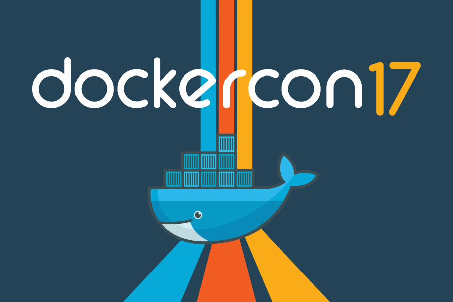

# DockerCon US 2017 Hands-On Labs (HOL)

This repo contains the series of hands-on labs presented at DockerCon 2017 in Austin. They are designed to help you gain experience in various Docker features, products, and solutions. Depending on your experience, each lab requires between 30-45 minutes to complete. They range in difficulty from easy to advanced.

At the Hands-on Labs at DockerCon 2017 in Austin, we issued [Microsoft Azure](https://azure.microsoft.com/) credentials and hostnames. Many of these labs assumes you have Azure VMs and Docker Datacenter licenses. You can sign up for Azure resources through the Azure site. Each lab will identify prerequists at the begining of the lab. For Linux base nodes you 

You can get a trial license for Docker Datacenter through [Docker Store](https://store.docker.com/search?offering=enterprise&type=edition).

---

## [Continuous Integration With Docker Cloud](./docker-cloud)

In this lab, you will learn how to configure a continuous integration (CI) pipeline for a web application using Docker Cloud's automated build features. You will complete the following tasks as part of the lab:

> **Difficulty**: Beginner
>
> **Time**: Approximately 20 minutes
>
> **Tasks / Concepts**
> 
> - Configure Docker Cloud to Automatically Build Docker Images
> - Configure Docker Cloud Autobuilds
> - Trigger an Autobuild

## [Docker Swarm Orchestration Beginner](./docker-orchestration)

In this lab you will play around with the container orchestration features of Docker. You will deploy a simple application to a single host and learn how that works. Then, you will configure Docker Swarm Mode, and learn to deploy the same simple application across multiple hosts. You will then see how to scale the application and move the workload across different hosts easily.

> **Difficulty**: Beginner
>
> **Time**: Approximately 30 minutes
>
> **Tasks / Concepts**
>
> * What is Orchestration
> * Configure Swarm Mode
> * Deploy applications across multiple hosts
> * Scale the application
> * Drain a node and reschedule the containers

## [Docker Swarm Orchestration Advanced](./docker-enterprise)

> **Difficulty**: Intermediate to Advanced
>
> **Time**: Approximately 45 minutes
>
> **Tasks / Concepts**
> 
> * Deploy a full 3-node Swarm & UCP cluster
> * Use the Swarm UI
> * Deploy a multi-service, multi-node application
> * Simulate a node failure
> * Use application load balancing
> * Overlay networking
> * Application secrets
> * Application health checks and self-healing apps

## [Securing Apps with Docker EE Advanced / Docker Trusted Registry](./securing-apps-docker-enterprise)

In this lab you will integrate Docker EE Advanced in to your development pipeline. You will build your application from a Dockerfile and push your image to the Docker Trusted Registry (DTR). DTR will scan your image for vulnerabilities so they can be fixed before your application is deployed. This helps you build more secure apps!

> **Difficulty**: Beginner
>
> **Time**: Approximately 30 minutes
>
> **Tasks / Concepts**:
>
> * Build a Docker Application
> * Pushing and Scanning Docker Images
> * Remediating Application Vulnerabilities

## [Docker Networking](./docker-networking)

In this lab you will learn about key Docker Networking concepts. You will get your hands dirty by going through examples of a few basic networking concepts, learn about Bridge and Overlay networking, and finally learning about the Swarm Routing Mesh.

> **Difficulty**: Beginner to Intermediate
>
> **Time**: Approximately 45 minutes
>
> **Tasks / Concepts**
>
> * Networking Basics
> * Bridge Networking
> * Overlay Networking

## [Windows Docker Containers 101](./windows-101)

Docker runs natively on Windows 10 and Windows Server 2016. In this lab you'll learn how to package Windows applications as Docker images and run them as Docker containers. You'll learn how to create a cluster of Docker servers in swarm mode, and deploy an application as a highly-available service.

> **Difficulty**: Beginner 
>
> **Time**: Approximately 30 minutes
>
> **Tasks / Concepts**:
>
> * Run some simple Windows Docker containers
> * Package and run a custom app using Docker
> * Run your app in a highly-available cluster

## [Modernize .NET Apps - for Devs](./windows-modernize-aspnet-dev)

You can run full .NET Framework apps in Docker using the [Windows Server Core](https://store.docker.com/images/windowsservercore) base image from Microsoft. That image is a headless version of Windows Server 2016, so it has no UI but it has all the other roles and features available. Building on top of that there are also Microsoft images for [IIS](https://store.docker.com/images/iis) and [ASP.NET](https://store.docker.com/images/aspnet), which are already configured to run ASP.NET and ASP.NET 3.5 apps in IIS.

This lab steps through porting an ASP.NET WebForms app to run in a Docker container on Windows Server 2016. With the app running in Docker, you can easily modernize it - and in the lab you'll add new features quickly and safely by making use of the Docker platform.

> **Difficulty**: Beginner 
>
> **Time**: Approximately 35 minutes
>
>**Tasks / Concepts**
>
> - Package an existing ASP.NET application so it runs in Docker, without any application changes.
> - Run SQL Server Express in a Docker container, and use it for the application database.
> - Use a feature-driven approach to address problems in the existing application, without an extensive re-write.
> - Use the Dockerfile and Docker Compose syntax to replace manual deployment documents.

## [Modernize .NET Apps - for Ops](./windows-modernize-aspnet-ops)

You'll already have a process for deploying ASP.NET apps, but it probably involves a lot of manual steps. Work like copying application content between servers, running interactive setup programs, modifying configuration items and manual smoke tests all add time and risk to deployments. 

In Docker, the process of packaging applications is completely automated, and the platform supports automatic update and rollback for application deployments. You can build Docker images from your existing application artifacts, and run ASP.NET apps in containers without going back to source code.

This lab is aimed at ops and system admins. It steps through packaging an ASP.NET WebForms app to run in a Docker container on Windows 10 or Windows Server 2016. It starts with an MSI and ends by showing you how to run and update the application as a highly-available service on Docker swam.

>**Difficulty**: Beginner 
>
>**Time**: Approximately 30 minutes
>
>**Tasks / Concepts**
>
> - Package an existing ASP.NET MSI so the app runs in Docker, without any application changes.
> - Create an upgraded package with application updates and Windows patches.
> - Update and rollback the running application in a production environment with zero downtime.

## [DockerCon 2017 Austin Workshops](workshop-slides/README.md)

At DockerCon 2017 in Austin, we had [10 workshops](https://2017.dockercon.com/workshops/), each lasting about 3 hours.