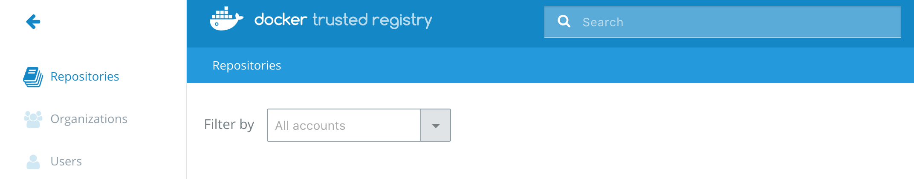
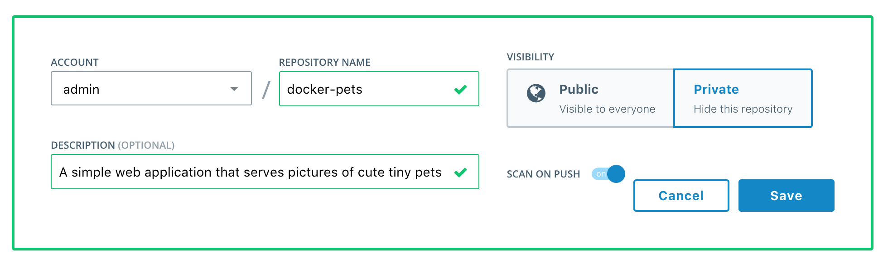
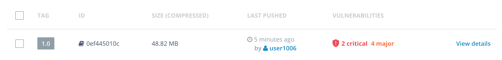
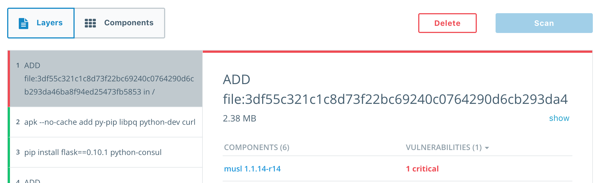
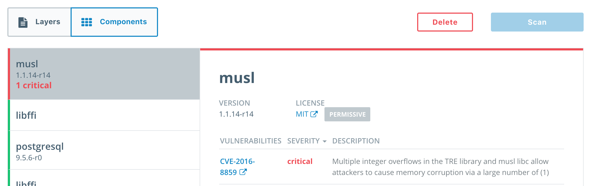
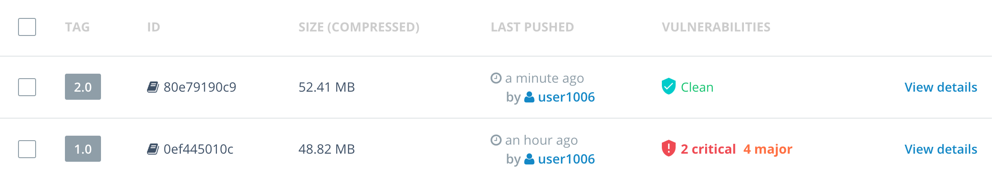

# Securing Applications with Docker EE Advanced 

In this lab you will integrate Docker EE Advanced in to your development pipeline. You will build your application from a Dockerfile and push your image to the Docker Trusted Registry (DTR). DTR will scan your image for vulnerabilities so they can be fixed before your application is deployed. This helps you build more secure apps!


> **Difficulty**: Beginner

> **Time**: Approximately 30 minutes


> **Tasks**:
>
> * [Prerequisites](#prerequisites)
> * [Task 1: Build a Docker Application](#task1)
>   * [Task 1.1: Inspect the Application Source](#task1.1)
>   * [Task 1.2: Build the Application Image](#task1.2)
>   * [Task 1.3: Deploy the Application Locally](#task1.3)
> * [Task 2: Pushing and Scanning Docker Images](#task2)
>   * [Task 2.1: Creating a Repo](#task2.1)
>   * [Task 2.2: Pushing to the Docker Trusted Registry](#task2.2)
> * [Task 3: Remediating Application Vulnerabilities](#task3)
>   * [Task 3.1: Rebuild the Image](#task3.1)
>   * [Task 3.2: Rescan the Remediated Application](#task3.2)


## Document conventions

When you encounter a phrase in between `<` and `>`  you are meant to substitute in a different value. 

Your nodes may be using private IP addresses along with mapped public IP addresses or the lab environment may be entirely private. We will be referring to these IPs as `node0-private-ip`, `node0-public-ip`, or `node0-public-dns`. If you are using only private IPs then you will replace the `public` IP/DNS with the private equivalent.


## <a name="prerequisites"></a>Prerequisites

This lab requires an instance of Docker Trusted Registry. This lab provides DTR for you. If you are creating this lab yourself then you can see how to install DTR [here.](https://docs.docker.com/datacenter/dtr/2.2/guides/admin/install/)

In addition to DTR, this lab requires a single node with Docker Enterprise Edition installed on it. Docker EE installation instructions can be found here. The nodes can be in a cloud provider environment or on locally hosted VMs. For the remainer of the lab we will refer to this node as `node0`


1. Log in to `node0` 

```
$ ssh ubuntu@node-smwqii1akqh.southcentralus.cloudapp.azure.com

The authenticity of host 'node-smwqii1akqh.southcentralus.cloudapp.azure.com (13.65.212.221)' can't be established.
ECDSA key fingerprint is SHA256:BKHHGwzrRx/zIuO7zwvyq5boa/5o2cZD9OTlOlOWJvY.
Are you sure you want to continue connecting (yes/no)? yes
Warning: Permanently added 'node-smwqii1akqh.southcentralus.cloudapp.azure.com,13.65.212.221' (ECDSA) to the list of known hosts.
ubuntu@node-smwqii1akqh.southcentralus.cloudapp.azure.com's password:

Welcome to Ubuntu 16.04.2 LTS (GNU/Linux 4.4.0-72-generic x86_64)
```

2. Check to make sure you are running the correct Docker version. At a minimum you should be running `17.03 EE`

```
$ docker version
Client:
 Version:      17.03.0-ee-1
 API version:  1.26
 Go version:   go1.7.5
 Git commit:   9094a76
 Built:        Wed Mar  1 01:20:54 2017
 OS/Arch:      linux/amd64

Server:
 Version:      17.03.0-ee-1
 API version:  1.26 (minimum version 1.12)
 Go version:   go1.7.5
 Git commit:   9094a76
 Built:        Wed Mar  1 01:20:54 2017
 OS/Arch:      linux/amd64
 Experimental: false
 
```


## <a name="task1"></a>Task 1: Build and Running a Docker Application
The following task will guide you through how to build your application from a Dockerfile.

### <a name="task1.1"></a>Task 1.1: Inspect the App Source


1. Clone your application from the [GitHub repo](https://github.com/mark-church/docker-pets) with `git`. Go to the `/web` directory. This is the directory that holds the source for our application.

```
~$ git clone https://github.com/mark-church/docker-pets
~$ cd docker-pets/web
```

Inspect the directory.

```
~/docker-pets/web $ ls
admin.py  app.py  Dockerfile  static  templates
```

- `admin.py` & `app.py` are the source code files for our Python application.
- `/static` & `/templates` hold the static content, such as pictures and HTML, for our app.
- `Dockerfile` is the configuration file we will use to build our app.


2. Inspect contents of the `Dockerfile` for the web frontend image.

```
~/docker-pets/web $ cat Dockerfile
FROM alpine:3.3

RUN apk --no-cache add py-pip libpq python-dev curl

RUN pip install flask==0.10.1 python-consul

ADD / /app

WORKDIR /app

HEALTHCHECK CMD curl --fail http://localhost:5000/health || exit 1

CMD python app.py & python admin.py
```

Our Dockerfile includes a couple notable lines:

- `FROM alpine:3.3` indicates that our Application is based off of an Alpine OS base image.
- `RUN apk` & `RUN pip` lines install software packages on top of the base OS that our applications needs.
- `ADD / /app` adds the application code into the image.

### <a name="task1.2"></a>Task 1.2: Build the Application Image

1. Build the image from the Dockerfile. You are going to specify an image tag `docker-pets` that you will reference this image by later. The `.` in the command indicates that you are building from the current directory. Docker will automatically build off of any file in the directory named `Dockerfile`.

```
~/docker-pets/web $ docker build -t docker-pets .
Sending build context to Docker daemon 26.55 MB
Step 1/7 : FROM alpine:3.3
 ---> baa5d63471ea
Step 2/7 : RUN apk --no-cache add py-pip libpq python-dev curl
 ---> Running in 382419b97267
fetch http://dl-cdn.alpinelinux.org/alpine/v3.3/main/x86_64/APKINDEX.tar.gz
...
...
...
```

It should not take more than a minute to build the image.

2. You should now see that the image exists locally on your Docker engine by running `docker images`.

```
~/docker-pets/web $ docker images
REPOSITORY          TAG                 IMAGE ID            CREATED             SIZE
docker-pets         latest              f0b92696c13f        3 minutes ago       94.9 MB
```

### <a name="task1.2"></a>Task 1.3: Deploy the App Locally

You will now deploy the image locally to ensure that it works. Before you do this you need to turn Swarm mode on in your engine so that we can take advantage of Docker Services.

1. Return to the `docker-pets` directory and establish a Swarm.

```
~/docker-pets/web $ cd ..
~/docker-pets $ docker swarm init
```

Confirm that you now have a Swarm cluster of a single node.

```
~/docker-pets $ docker node ls
ID                           HOSTNAME  STATUS  AVAILABILITY  MANAGER STATUS
fd3ovikiq7tzmdr70zukbsgbs *  moby      Ready   Active        Leader
```

2. Deploy your application from the compose file. In the `/docker-pets` directory there is a compose file that you will use to deploy this application. You will deploy your application stack as `pets`.

```
~/docker-pets $ docker stack deploy -c pets-container-compose.yml pets
Creating network pets_backend
Creating service pets_web
```

You have now deployed your application as a stack on this single node swarm cluster.

3. Verify that your application has been deployed.

```
~/docker-pets $ docker ps
CONTAINER ID        IMAGE                COMMAND                  CREATED             STATUS                    
a73f87ba147a        docker-pets:latest   "/bin/sh -c 'pytho..."   16 minutes ago      Up 16 minutes (healthy)
```

4. Go to your browser and in the address bar type in `<node0-public-DNS>`. (The app is serving on port 80 so you don't have to specify the port). This is the address where your local app is being served. If you see something similar to the following then it is working correctly. It may take up to a minute for the app to start up, so try to refresh until it works.

 

5. Now remove this service.

```
~/docker-pets $ docker stack rm pets
Removing service pets_web
Removing network pets_default
```

## <a name="task2"></a>Task 2: Pushing and Scanning Docker Images

### <a name="Task 2.1"></a>Task 2.1: Creating a Repo

Docker Trusted Registry (DTR) is the enterprise-grade image storage solution from Docker. You install it behind your firewall so that you can securely store and manage the Docker images you use in your applications.

In this lab, DTR has already been set up for you so you will log in to it and use it.

1. Log in to DTR. Before the lab you should have been assigned a cluster and a username. Use these when logging in.

Go to `https://<dtr-cluster>.dockerdemos.com` and login with your given username and password from your lab welcome email. You should see the DTR home screen.

 

2. Before you can push an image to DTR you must create a repository. Click on Repositories / New repository. Fill it with the following values:

- Account: select your username
- Repository Name: `docker-pets`
- Description: Write any description
- Visibility: Private
- Scan on Push: On

 

3. Click Save. If you click on the `<account>/docker-pets` repo you'll see that it is empty as we have not pushed any images to it yet.


### <a name="Task 2.1"></a>Task 2.2: Pushing to the Docker Trusted Registry

Next we will push our local image to DTR. First we will need to authenticate with DTR so that our local engine trusts it. We will use a simple tool that pulls certificates from DTR to our development node.

1. Run the following command. Insert the name of your assigned cluster in the command.

```
~/docker-pets $ docker run -it --rm -v /etc/docker:/etc/docker \
  mbentley/trustdtr <dtr-cluster>.dockerdemos.com
  
  
Using the root CA certificate for trusting DTR
Adding certificate to '/etc/docker/certs.d/dtr.church.dckr.org/ca.crt'...done
Verifying format of certificate...done
```

For instance if `dtr3.dockerdemos.com` was your cluster then you would issue the command:

```
docker run -it --rm -v /etc/docker:/etc/docker mbentley/trustdtr dtr3.dockerdemos.com
```

2. Log in to DTR with your username and password.

```
~/docker-pets $ docker login <dtr-cluster>.dockerdemos.com
Username: <username>
Password: <password>
Login Succeeded
```

3. Tag the image with the URL of your DTR cluster and with the image tag `1.0` since this is the first version of your app.

```
~/docker-pets $ docker tag docker-pets <cluster-name>.dockerdemos.com/<username>/docker-pets:1.0
```

4. Now push your image to DTR.

```
~/docker-pets $ docker push <dtr-cluster>.docker-pets/<username>/docker-pets:1.0
The push refers to a repository [dtr2.dockerdemos.com/mark/docker-pets]
273eb8eab1c9: Pushed
7d68ed329d0d: Pushed
02c1439e0fdc: Pushed
9f8566ee5135: Pushed
1.0: digest: sha256:809c6f80331b9d03cb099b43364b7801826f78ab36b26f00ea83988fbefb6cac size: 1163
```

5. Go to the DTR GUI, click on your `docker-pets` repo, and click Images. The image vulnerability scan should have started already and DTR will display the status of the scan. Once the scan is complete, DTR will display the number of vulnerabilities found. For the `docker-pets` image a critical vulnerability was found.

 

> You may need to refresh the page to show the status of a scan

6. Click on View details. The Layers tab shows the results of the scan. The scan is able to identify the libraries that are installed as a part of each layer.

 

7. Click on Components. The Components tab lists out all of the libraries in the image, arranged from highest to least severity. The CVE is shown in addition to the usage license of the component. If you click on the CVE link it will take you to the official description of the vulnerability.

 

## <a name="task3"></a>Task 3: Remediating Application Vulnerabilities

We have built and pushed our application to DTR. DTR image scanning identified a vulnerability and now we are going to remediate the vulnerability and push the image again.

### <a name="Task 3.1"></a>Task 3.1: Rebuild the Image

We identified that our application has the known vulnerability `CVE-2016-8859`. We can see in the Layers tab that the affected package `musl 1.1.14-r14` is located in the top layer of our image. This is the base layer that was specified in the Dockerfile as `FROM alpine:3.3`. To remediate this we are going to use a more recent version of the `alpine` image, one that has this vulnerability fixed.

1. Go to the `~/docker-pets/web` directory and edit the Dockerfile.

```
~/docker-pets $ cd web
~/docker-pets/web $ vi Dockerfile
```

2. Change the top line `FROM alpine:3.3` to `FROM alpine:3.5`. `alpine:3.5` is  newer version of the base OS that has this vulnerability fixed.

3. Rebuild the image as version `2.0`

```
~/docker-pets/web $ docker build -t docker-pets .

```

4. Tag the image as the `2.0` and also with the DTR URL.

```
~/docker-pets/web $ docker tag docker-pets <dtr-cluster>.dockerdemos.com/<username>/docker-pets:2.0
```

5. Move back to the `docker-pets` directory and deploy the image locally again to ensure that the change did not break the app.

```
~/docker-pets/web $ cd ..

~/docker-pets $ docker stack deploy -c pets-container-compose.yml pets
Creating network pets_backend
Creating service pets_web
```

6. Go to your browser and in the address pane type in `<node0-public-ip>`. You should see that the app has succesfully deployed with the new change.

### <a name="Task 3.2"></a>Task 3.2: Rescan the Remediated Application

We have now remediated the fix and verified that the new version works when deployed locally. Next we will push the image to DTR again so that it can be scanned and pulled by other services for additional testing.

1. Push the new image to DTR.

```
~/docker-pets $ docker push <dtr-cluster>.dockerdemos.com/<username>/docker-pets:2.0
```

2. Go to the DTR UI and wait for the scan to complete. Once the scan has completed DTR will report that the vulnerability no longer exists in this image. The image is now ready for use by the rest of your team!

> You may need to refresh the page to show the status of a scan

 

Congratulations! You just built an application, discovered a security vulnerability, and patched it in just a few easy steps. Pat yourself on the back for helping create safer apps!!


### <a name="cleanup"></a>Lab Clean Up

If you plan to do other labs with these lab nodes then make sure to clean up after yourself! Run the following command and make sure that you remove any running containers.

```
~/docker-pets $ docker swarm leave --force
Node left the swarm.
```


