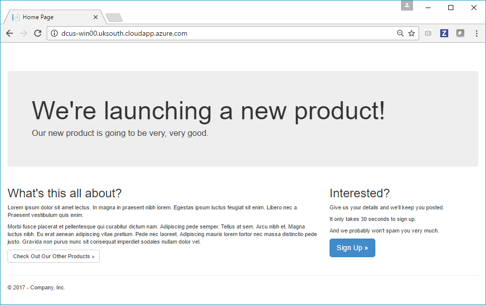
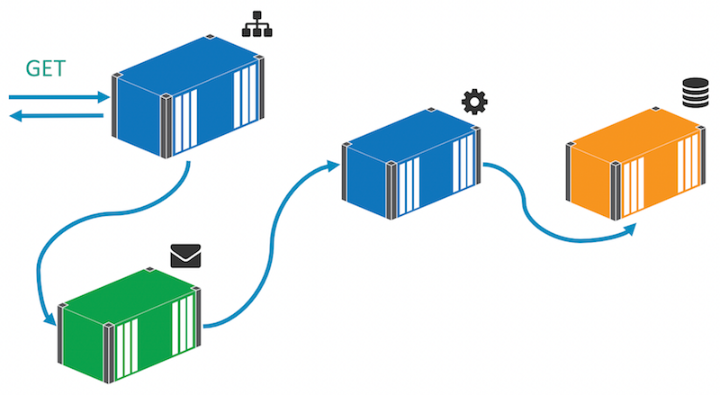

# Modernize .NET Apps - for Devs

You can run full .NET Framework apps in Docker using the [Windows Server Core](https://store.docker.com/images/windowsservercore) base image from Microsoft. That image is a headless version of Windows Server 2016, so it has no UI but it has all the other roles and features available. Building on top of that there are also Microsoft images for [IIS](https://store.docker.com/images/iis) and [ASP.NET](https://store.docker.com/images/aspnet), which are already configured to run ASP.NET and ASP.NET 3.5 apps in IIS.

This lab steps through porting an ASP.NET WebForms app to run in a Docker container on Windows Server 2016. With the app running in Docker, you can easily modernize it - and in the lab you'll add new features quickly and safely by making use of the Docker platform.

## What You Will Learn

You'll learn how to:

- Package an existing ASP.NET application so it runs in Docker, without any application changes.

- Run SQL Server Express in a Docker container, and use it for the application database.

- Use a feature-driven approach to address problems in the existing application, without an extensive re-write.

- Use the Dockerfile and Docker Compose syntax to replace manual deployment documents.


> **Difficulty**: Beginner 

> **Time**: Approximately 35 minutes

> **Tasks**:
>
> * [Prerequisites](#prerequisites)
> * [Task 1: Building ASP.NET applications with Docker](#task1)
>   * [Task 1.1: Setting up an ASP.NET build agent in Docker](#task1.1) 
>   * [Task 1.2: Packaging the build agent as a Docker image](#task1.2)
>   * [Task 1.3: Build the ASP.NET app with the Docker build agent](#task1.3)
> * [Task 2: Running ASP.NET applications as Docker containers](#task2)
>   * [Task 2.1: Packaging ASP.NET apps as Docker images](#task2.1)
>   * [Task 2.2: Connecting to SQL Server in a Docker container](#task2.2)
>   * [Task 2.3: Running the database and web app in containers](#task2.3)
> * [Task 3: Breaking up the ASP.NET monolith](#task3)
>   * [Task 3.1: Breaking the save feature out of the web app](#task3.1)
>   * [Task 3.2: Implementing the save in a console app](#task3.2)
>   * [Task 3.3: Running the distributed solution with Docker Compose](#task3.3)

## Document conventions

When you encounter a phrase in between `<` and `>`  you are meant to substitute in a different value. 

For instance if you see `$ip = <ip-address>` you would actually type something like `$ip = '10.0.0.4'`

You will be asked to RDP into various servers.

## <a name="prerequisites"></a>Prerequisites

You need a set of Windows Server 2016 virtual machines running in Azure, which are already configured with Docker and the Windows base images. You do not need Docker running on your laptop, but you will need a Remote Desktop client to connect to the VMs. 

- Windows - use the built-in Remote Desktop Connection app.
- Mac - install [Microsoft Remote Desktop](https://itunes.apple.com/us/app/microsoft-remote-desktop/id715768417?mt=12) from the app store.
- Linux - install [Remmina](http://www.remmina.org/wp/), or any RDP client you prefer.

> When you connect to the VM, if you are prompted to run Windows Update, you should cancel out. The labs have been tested with the existing VM state and any changes may cause problems.

You will build images and push them to Docker Cloud, so you can pull them on different Docker hosts. You will need a Docker ID.

- Sign up for a free Docker ID on [Docker Cloud](https://cloud.docker.com)

## Prerequisite Task: Prepare your lab environment

Start by ensuring you have the latest lab source code. RDP into one of your Azure VMs, and open a PowerShell prompt with the "Run as Administator" option.

If you're using a VM provided for a Docker lab, you will find the source code is already cloned, just run these commands to update it:

```
cd C:\scm\github\docker\labs
git pull
```

If you're using your own VM, clone the lab repo from GitHub:

```
mkdir -p C:\scm\github\docker
cd C:\scm\github\docker
git clone https://github.com/docker/labs.git
```

Now set set some variables for your source path and Docker ID, so you can copy and paste commands from the lab:

```
$labRoot='C:\scm\github\docker\labs\dockercon-us-2017\windows-modernize-aspnet-dev'
$dockerId='<Your Docker ID>'
```

Now clear up anything left from a previous lab. You only need to do this if you have used this VM for one of the other Windows labs, but you can run it safely to restore Docker to a clean state. 

This stops and removes all running containers, and then leaves the swarm - ignore any error messages you see:

```
docker container rm -f $(docker container ls -a -q)
docker swarm leave -f
```

## <a name="task1"></a>Task 1: Building ASP.NET applications with Docker

The application for this lab is an ASP.NET WebForms app, which showcases a product launch website and lets users sign up to receive more details, storing data in SQL Server. In a dev environment it would normally be deployed with IIS Express and SQL Server LocalDB:


The source code is in a [Visual Studio 2015 solution file](v1-src/ProductLaunch/ProductLaunch.sln), but you don't need Visual Studio to build the application. You'll start by building a build agent in Docker, so anyone can build and run the app from source, just using Docker.


## <a name="task1.1"></a> Task 1.1: Setting up an ASP.NET build agent in Docker

All the parts of MSBuild which you need for different project types are available as NuGet packages, so it's easy to put together a Docker image which can build ASP.NET apps from source.

Have a look at the [Dockerfile](v1-src/docker/builder/Dockerfile) for the build agent. It's a simple example with a few things to note:

- `FROM` specifies Windows Server Core as the base image. You need the .NET Framework, so you can't use Nano Server as the base
- first `RUN` installs Chocolatey as a NuGet package provider, and then installs all the MSBuild tools - including the .NET 4.5 targeting pack, and WebDeploy for publishing the ASP.NET app 
- second `RUN` installs the the Visual Studio web targets, for actually building the `.csproj`.

Explicit versions are specified for all the installs, so this is a repeatable Dockerfile - it will always produce the same build agent with the same set of components.

The [ENTRYPOINT](https://docs.docker.com/engine/reference/builder/#entrypoint) is just `powershell`. To build the application, you'll run a container from this image, using [Docker Volumes](https://docs.docker.com/engine/tutorials/dockervolumes/#/mount-a-host-directory-as-a-data-volume) to give the container access to the source files stored on the host. The source contains a PowerShell build script which the container will run. The output from MSBuild will be written to the host, so the actual container running the build agent is disposable.

## <a name="task1.2"></a> Task 1.2: Packaging the build agent as a Docker image

The build agent is generic, it can be used to compile any .NET 4.5 web projects. You could add more targeting packs from NuGet in the Dockerfile if you want to support different .NET versions. 

To build the image, change to the builder directory and build the Dockerfile:

```
cd $labRoot\v1-src\docker\builder
docker image build -t $dockerId/modernize-aspnet-builder .
```

The output from `docker image build` shows you the Docker engine executing all the steps in the Dockerfile. On your lab VM the base images have already been pulled, but the installations from Chocolatey will take a couple of minutes.

Now you have a Docker image for building the app, which you can share on a public or private registry. Anyone who joins the team can use that image to build the app - and the same image can be used in the CI build, so you don't need to install Visual Studio on the build server.

## <a name="task1.3"></a> Task 1.3: Build the ASP.NET app with the Docker build agent

With the builder image you can build any ASP.NET application, you just need to prepare a `docker run` command which mounts the host directories into the container and specifies the MSBuild script to run. 

The [build.ps1](v1-src/ProductLaunch/build.ps1) script for version 1 of the app is very simple, it just builds the web project from the expected source location, and publishes to the expected output location. On your lab VM, change to the `v1-src` directory and run a container to build the web app:

```
cd $labRoot\v1-src

docker container run --rm `
 -v $pwd\ProductLaunch:c:\src `
 -v $pwd\docker:c:\out `
 <DockerID>/modernize-aspnet-builder `
 C:\src\build.ps1 
```

That command runs a container from the generic ASP.NET builder image with the following configuration:

- the project source folder on the host is mounted as `C:\src` inside the container
- the `docker` folder on the host is mounted as `C:\out` inside the container
- the `build.ps1` script is executed, which publishes the web project to the output folder.

You'll see all the familiar output from MSBuild while the container is running. When it finishes, check that the output is there in the `docker` folder:

```
ls .\docker\web
```

You should see a new folder called `ProductLaunchWeb`, which contains the published website. 

## <a name="task2"></a>Task 2: Running ASP.NET applications as Docker containers

Now you have a repeatable way to publish the ASP.NET application, you can build a Docker image which packages the compiled app with all its dependencies. Just by running the app in the Docker platform you get increased compute utilization, improved security, and centralized management. But it's also an enabler for modernizing the app, making use of the great software that runs on Docker to add new features.

To package the ASP.NET application to run in Docker you'll use a Dockerfile that does the following:

- starts with a clean, up-to-date installation of Windows Server Core
- installs IIS as the application host and ASP.NET as the app framework
- copies the application content from the published build
- configures the application as an IIS website

You should package your applications individually, with a single ASP.NET app in each image. That lets you deploy, scale and upgrade your applications separately. If you have many ASP.NET apps with similar configurations, all your Dockerfiles will be broadly the same. The content for each app will change, and some may need additional setup, but there will be a lot of commonality. 

## <a name="task2.1"></a>Task 2.1: Packaging ASP.NET apps as Docker images

Check out the [Dockerfile](v1-src/docker/web/Dockerfile) for the ASP.NET app. It starts from `microsoft/aspnet`, a Microsoft-owned image based on Windows Server Core which comes with IIS and ASP.NET already installed. Then it uses PowerShell to configure a new website in IIS:

```
RUN Remove-Website -Name 'Default Web Site'; `
    New-Item -Path 'C:\web-app' -Type Directory; `
    New-Website -Name 'web-app' -PhysicalPath 'C:\web-app' -Port 80 -Force
```

There's one more `RUN` instruction which you need for multi-container apps, and that turns off the DNS cache in Windows by setting a Registry value:

```
RUN Set-ItemProperty -path 'HKLM:\SYSTEM\CurrentControlSet\Services\Dnscache\Parameters' `
     -Name ServerPriorityTimeLimit -Value 0 -Type DWord
```

Docker has its own DNS server which is how containers can find each other by name. In Windows the DNS cache is too aggressive, and you want every lookup to come back to Docker so when containers are replaced you get the latest IP address.

Lastly the Dockerfile copies in the published website from the builder. Build the image to package up the app:

```
cd $labRoot\v1-src\docker\web
docker image build -t $dockerId/modernize-aspnet-web:v1 .
```

> Be sure to tag the image with your own Docker ID so you can push it to Docker Cloud.

## <a name="task2.2"></a>Task 2.2: Connecting to SQL Server in a Docker container

For version 1 you're going to package the application as-is, without any code changes, to run it in Docker. But you will need some configuration changes. The connection string in the project is set to use [SQL Server Express LocalDB](https://blogs.msdn.microsoft.com/sqlexpress/2011/07/12/introducing-localdb-an-improved-sql-express/):

```
... connectionString="Server=(localdb)\MSSQLLocalDB;Integrated Security=true;AttachDbFilename=|DataDirectory|\ProductLaunch.mdf"
```

That may be OK for developers, as LocalDB comes installed with Visual Studio. You could even install LocalDB in the Docker image and use the same configuration, but that's not good practice. That would mean running one container which hosts both the web app and the database, tightly coupling them and making it difficult to scale or upgrade the components separately. Instead you'll run SQL Server Express in a separate container.

In the Docker image you've just built, there's a [Web.config](v1-src/docker/web/Web.config) file, which gets copied over the existing `Web.config` file from the published application. The connection string in the new file uses `sql-server` as the database server name, and specifies user credentials:

```
... connectionString="Server=sql-server;Database=ProductLaunch;User Id=sa;Password=DockerCon2017;"
```

When you run the web application, the DNS server in the Docker platform will resolve the `sql-server` host name to the correct address of the container called `sql-server`.

## <a name="task2.3"></a>Task 2.3: Running the database and web app in containers

Microsoft provide a SQL Server Express image on Docker Store, which is already pulled on your lab VM. Run it in a container with this command to set up the expected credentials and DNS name:

```
docker container run --detach `
 --env sa_password=DockerCon2017 `
 --env ACCEPT_EULA=Y `
 --name sql-server `
 microsoft/mssql-server-windows-express
```

Starting the website is as simple running a container from the application image you've built:

```
docker container run -d -p 80:80 `
 --name web `
 $dockerId/modernize-aspnet-web:v1
```

If you run `docker container ls` now, you'll see two containers - one running SQL Server and one running the WebForms app. The SQL Server container doesn't expose any ports, because the web container can connect to it through the Docker network, SQL doesn't need to be publicly available.

The web container publishes port 80 to the host so you can access the website externally. On your laptop browse to the address of the lab VM and you'll see the product launch website:



Go ahead and click the "Sign Up" button. The form you see is reading the drop-down values from SQL Server. The web app uses Entity Framework code-first to create the schema and write seed data. Fill out the form and click the "Go" button - that makes a synchronous call to SQL Server to insert your data.

Back on your lab VM, you can run a SQL query inside the container using `docker exec`, to check your data is there:

```
docker container exec sql-server powershell -Command `
  "Invoke-SqlCmd -Query 'SELECT * FROM Prospects' -Database ProductLaunch"
```

The SQL Server image is packaged with the SQL PowerShell module and this `SELECT` command will read out the data you just saved.

## <a name="task3"></a> Task 3: Breaking up the ASP.NET monolith

You're going to look at one feature improvement in this lab, addressing performance and scalability. In version 1 of the app the sign-up form makes a connection to the database and executes synchronous database queries. That approach doesn't scale. If there's a spike in traffic to the site you can run more web containers to spread the load, but that would make a bottleneck of SQL Server. You'd have to scale the database too, because the web tier is tightly coupled to the data tier.

You'll address that by making the sign up feature asynchronous. Instead of persisting to the database directly, the sign-up form will publish an event to a message queue, and a handler listening to that event makes the database call:



That decouples the web layer from the data layer so you can scale to meet demand just by adding more web containers. At times of high load the message queue will hold onto the events until the handler is ready to action them. There may be a delay between users clicking the button and their data being persisted, but the delay is happening offline - the user will see the thank-you page almost instantly, no matter how much traffic is hitting the site.

## <a name="task3.1"></a> Task 3.1: Breaking the save feature out of the web app

In the `v2-src` folder there's a new version of the solution which uses messaging to publish an event when a prospect signs up, rather than writing to the database directly. You have VS Code installed on your lab VM so you can go and check out the code.

The main change is in the [SignUp code-behind](v2-src/ProductLaunch/ProductLaunch.Web/SignUp.aspx.cs) for the webform. In version 1 this is where the save happened, but in version 2 that's been replaced with this code to publish an event message:

```
var eventMessage = new ProspectSignedUpEvent
{
    Prospect = prospect,
    SignedUpAt = DateTime.UtcNow
};

MessageQueue.Publish(eventMessage);
```

The `ProspectSignedUpEvent` contains a `Prospect` object, populated from the webform input. The `MessageQueue` class is just a wrapper to abstract the type of message queue. In this lab you'll be using [NATS](https://nats.io), a high-performance, low-latency, cross-platform and open-source message server. 

NATS is available as an [official image](https://store.docker.com/images/nats) on Docker Store, which means it's a curated image that you can rely on for quality. Publishing a Message to NATS means multiple subscribers can listen for the event, and you start to bring [event-driven architecture](https://msdn.microsoft.com/en-us/library/dd129913.aspx) into the application - just for the one feature that needs it, without a full rewrite of the app.

There's another change to the web app to use environment variables for configuration settings, using the [Config](v2-src/ProductLaunch/ProductLaunch.Model/Config.cs) class rather than `web.config`. That means we can set the database connection string through the Docker platform and use the same image in every environment.

## <a name="task3.2"></a> Task 3.2: Implementing the save in a console app

In the version 2 solution there's also a message handler project. It's a .NET console app with all the code in the [Program](v2-src/ProductLaunch/ProductLaunch.MessageHandlers.SaveProspect/Program.cs) class. It connects to NATS using the same `MessageQueue` class, and listens for `ProspectSignedUpEvent` messages. For each message it receives, the handler extracts the prospect details from the message and saves them to the database:

```
var prospect = eventMessage.Prospect;
using (var context = new ProductLaunchContext())
{
    //reload child objects:
    prospect.Country = context.Countries.Single(x => x.CountryCode == prospect.Country.CountryCode);
    prospect.Role = context.Roles.Single(x => x.RoleCode == prospect.Role.RoleCode);

    context.Prospects.Add(prospect);
    context.SaveChanges();
}
```

That's the exact same code that was in the web form in version 1. This is a common pattern that applies for any features which are resource-bound and need to scale well. You extract the functionality from the synchronous implementation, and publish a message instead. Then you move the extracted code to a message handler - this is a simple example, but if you have a complex function with multiple external dependencies, the practice is exactly the same.

The message handler will run in a Docker container too. The [Dockerfile](v2-src/docker/save-handler/Dockerfile) is very simple. .NET is already installed in the `microsoft/windowsservercore` base image, so the Dockerfile just configures the DNS cache, sets the default message queue URL in an environment variable and copies in the compiled console app. 


## <a name="task3.3"></a> Task 3.3: Running the distributed solution with Docker Compose

You need to run the builder image to compile the solution, and then build new Docker images for the web application and the message handler. The [build.ps1](v2-src/build.ps1) script does that for you:

```
cd $labRoot\v2-src
.\build.ps1 $dockerId
```

When that finishes, run `docker image ls -f "reference=$dockerId/*"`. You'll see you have lab images for the builder, message handler and a new version of the web app. The app is a distributed solution now, which will run across multiple containers.

For the app to work properly, the containers need to be started in the right order, with the right parameters and names. You could do that with a PowerShell script, but Docker Compose is a better option. The v2 source has a compose file which defines all the services the solution needs, together with their configuration and the dependencies between them.

Open the [docker-compose.yml](v2-src/docker-compose.yml) and replace `<DockerID>` in the image names with your Docker ID. Now you can install Docker Compose and use it to manage the app:

```
Invoke-WebRequest -UseBasicParsing -OutFile 'C:\Program Files\Docker\docker-compose.exe' -Uri https://github.com/docker/compose/releases/download/1.11.2/docker-compose-Windows-x86_64.exe
```

> On Windows 10, you use [Docker for Windows](https://docs.docker.com/docker-for-windows/) to work with containers, and that installs Docker Compose for you. On Windows Server, Docker is installed from a NuGet package and you need to separately install Docker Compose.

Now you can stop the containers from the v1 app, and start the new app using Docker Compose:

```
docker container rm -f $(docker container ls -a -q)

cd $labRoot\v2-src
docker-compose up -d
```

You'll see output from compose telling you four containers have been created; the web container is last of all because it has dependencies on the others.

On your laptop, browse to the VM again and you will see the same product launch website. Complete the form again - the behavior is identical to v1, but behind the scenes the web app now publishes an event to the message queue and the message handler writes your data asynchronously.

You can check the data is in SQL Server by running:

```
docker container exec v2src_product-launch-db_1 powershell -Command `
  "Invoke-SqlCmd -Query 'SELECT * FROM Prospects' -Database ProductLaunch"
```

And also look at the logs of the message handler to verify that it was the handler container which wrote the data:

```
docker container logs v2src_save-prospect-handler_1
```

You've made one of the app features asynchronous by pulling the functionality out of the website, and into a message handler, using the NATS message queue to plumb them together. Performance problems are a great candidate for taking into a modernization program. With asynchronous messaging you can add scalability and performance by targeting a specific feature.

## Wrap Up

Thank you for taking the time to complete this lab! You now know how to build and run an ASP.NET app using Docker - without needing Visual Studio. You also saw how to take a feature-driven approach to app modernization, breaking code out of a monolith and using Docker to plumb components together. Lastly you used Docker Compose to define and run a distributed solution.

Do try the other Windows labs at DockerCon, and make a note to check out the full lab suite when you get home - there are plenty more Windows walkthroughs at [docker/labs](https://github.com/docker/labs/tree/master/windows) on GitHub.
