# Lab 2: Docker Datacenter

These tasks for hands-on labs will take you through a typical workflow for Docker Datacenter.
From install, through deploying various applications, and setting up common role-based access control
you will be able to quickly familiarize yourself with the features of Docker Universal Control Plane.

> **Difficulty**: Beginner

> **Time**: Approximately 45 minutes

> **Tasks**:
>
> * [Prerequisites](#prerequisites)
> * [Install UCP](#install-ucp)
> * [Deploy a Container](#deploy-a-container)
> * [Deploy an Application With the UCP UI](#deploy-ucp-interface)
> * [Create Users and Teams](#create-users-teams)
> * [Test User Access](#test-user-access)

## <a name="prerequisites"></a>Prerequisites

- Three VMs with Docker Engine 1.11 Installed
- Each VM will be referred to as v111node0, v111node1, and v111node2
	- v111node0 will be the UCP controller
	- v111node1 and v111node2 will be worker nodes in your UCP cluster	

## <a name="install-ucp-controller"></a>Install UCP

Before we begin, we will need to:

1. Install the UCP Controller
2. Add two nodes
3. Install the client bundle

### Install the UCP controller

To install UCP you use the `docker/ucp` image. This image has commands to
install, configure, and backup UCP. To find what commands and options are
available, check the [reference documentation](../reference/install.md).

To install UCP:

1. Log in to your first VM (v111node0) where you will install UCP.  v111node0 will act as your controller node. 

		$ ssh <username>@<v111node0 hostname>

	> **Note**: If prompted answer `yes` to add the node to the list of known hosts.

2. UCP is installed via a Docker container (`docker/ucp`).

    In this example we'll be running the install command interactively, so that
    the command prompts for the necessary configuration values.

    ```bash
    $ docker run --rm -it \
        --name ucp \
        -v /var/run/docker.sock:/var/run/docker.sock \
        docker/ucp \
        install -i --kv-timeout "20000"
    ```

	When prompted enter the following values:

	- **Password**: enter a password of your choosing

	- **Additional Aliases**: enter your the hostname for **v111node0** 

	> **Note**: The install with finish with a message to log into your UCP controller at an IP address similar to 10.0.0.2. Ignore this, the address supplied is a private IP, and cannot be used to access UCP.

1. Log into your UCP cluster by pointing your browser to `https://<v111node0 hostname>` 

	> **Note**: use `https://` not `http://`

   > **Note**: If you're not using an external CA, your browser warns that UCP is an unsafe site. This happens because you're accessing UCP using HTTPS but the certificates used by UCP are not trusted by your browser.

	Username: admin

	Password: the password you chose in the previous step

2. When prompted for a UCP license, click `Skip for now`

 	

### Licensing your installation

1. The UCP dashboard will load. Click the link in the orange banner to create and download a trail license. Follow the prompts to complete the process

	> **Note**: After entering your information to obtain the license, you will be promoted to install the CS engine and Docker Datacenter, just click `Next` on each of those screens.

	Finish by clicking `Download license` and make a note of where the license file is downloaded.

1. In your browser return to the UCP Dashboard.

1. In the left hand menu at the bottom, select settings.

	> **Note**: Sometimes the left hand menu does not render properly, if this is the case, simply refresh the page.

	> **Note**: If your menu is collapsed you will only see gear icon. To expand your menu click the "hamburger" in top left corner.

1. Click `License` and then `choose file`

	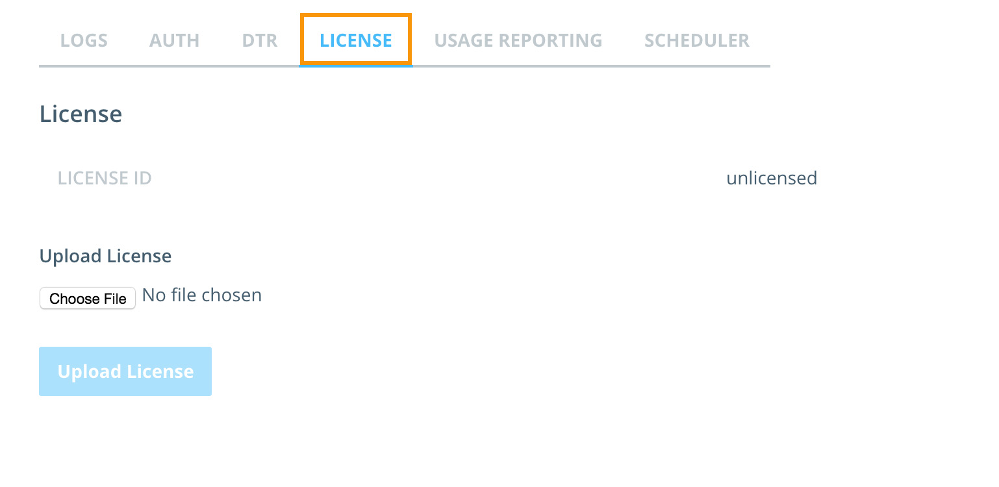

1. Navigate to where your license was downloaded, and double-click the `docker_subscription.lic` file.

1. Click `Upload License`. You should get a success notification in the lower right hand corner.  	

### Attach Nodes

Now that we have our controller-node installed with UCP.  We have to join other nodes to our controller node:

1. Log into your second VM (**v111node1**) 

		$ ssh <username>@<v111node1 hostname>

	> **Note**: If prompted answer `yes` to add the node to the list of known hosts.

2. Use the join command, to join the node to the cluster:

    ```bash
    $ docker run --rm -it --name ucp \
      -v /var/run/docker.sock:/var/run/docker.sock \
      docker/ucp join -i --kv-timeout "20000"
    ```

	Enter the following values:
	- **URL for the UCP Server**: `https://<v111node0 hostname>` (Enter `y` at the prompt)
	- **UCP Admin**: admin
	- **UCP Password**: Password you chose initially
	- **Additional Aliases**: v111node1 hostname

3. Repeat steps 1 & 2 on the other node (**v111node2**) you want to add to your UCP cluster.

	Enter the following values when prompted:
	- **URL for the UCP Server**: `https://<v111node0 hostname>` (Enter `y` at the prompt)
	- **UCP Admin**: admin
	- **UCP Password**: Password you chose initially
	- **Additional Aliases**: v111node2 hostname

4. Check the cluster state by returning to the UCP Dashboard in our browser and choosing the `nodes` option from the left hand menu.

    The node's page of UCP should list all your nodes.

   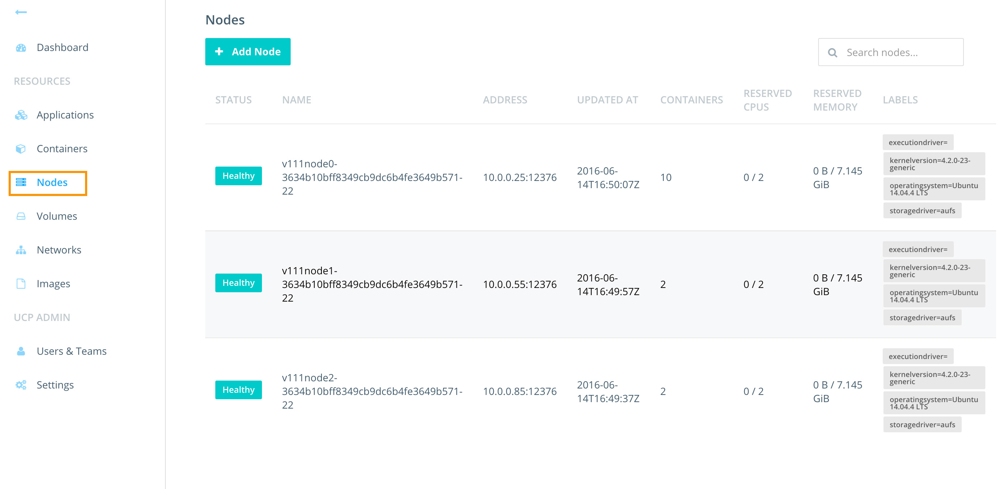

Congratulations! You've just deployed a UCP cluster, and added two worker nodes to your cluster.

## <a name="deploy-a-container"></a>Deploy a container

In this task you will use UCP to deploy a web server from the official NGINX image.

### Deploy a container

In this step you will launch a new container based on the NGINX image using the UCP web UI.

- If you have not already done so, log in to UCP with the built-in **admin** account.
- Click the **Containers** link on left navigation bar.
- Click on **+ Deploy Container** button.
- Fill out the Basic Settings as shown below:

   

- Scroll down the page, and expand the **Network** section on the same page and configure the following port mappings:

   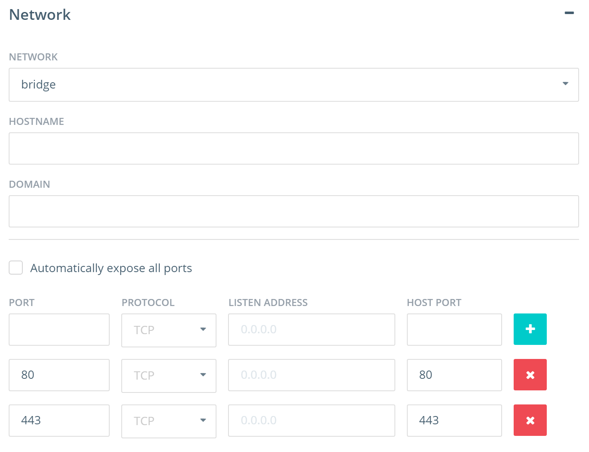

- Click **Run Container** button on the right side panel.

When the operation completes you will see your container listed as shown below. The green circle to the left of the container indicates that the container is in the **running** state.

   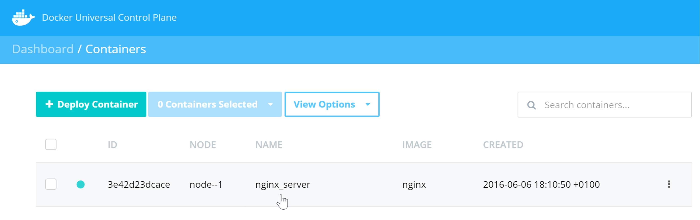

- Click on the row where the container is listed to see the full container details. Then scroll down to the **Ports** section of the page to check the port mappings.

   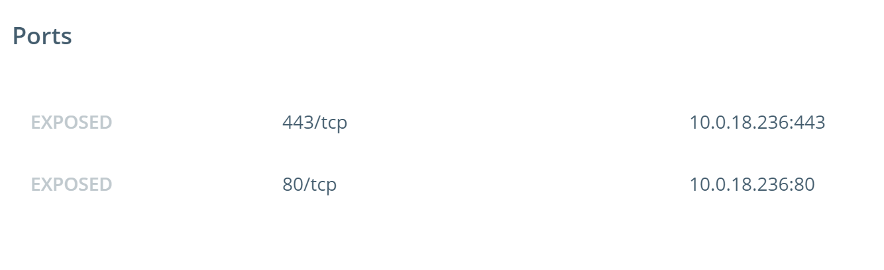

### Quick Test

In this step you will use your web browser to access the home page of the **nginx_server** container started in the previous step.

In order to access the NGINX container from your web browser you will need the DNS hostname of the node that the container is running on.

- First, let's take a look at the node our **nginx_server** container is running on. In the container details, you can find the node information.

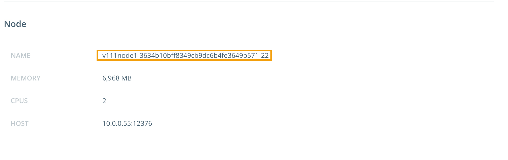

In this particular example, the **nginx_server** container is running on the **v111node1** node with an IP of 10.0.0.55 - However, this is the private IP address of the node and you will not be able to use this address to connect to the web server. Locate the hostname of the node from the lab details you received.

- Go to your web browser and enter the hostname of the node that the **nginx_server** container is running on.

You will see the NGINX welcome page.


You have successfully launched a web container using the Docker UCP web UI

## <a name="deploy-ucp-interface"></a>Deploy an Application using the UCP Web Interface

### Deploy FoodTruck Application

In this step you'll deploy a multi-container application (`FoodTrucks`) using the UCP web interface, and work out how to connect to it with your web browser.

Docker Compose files are used to describe applications in UCP. They can specify services, networks, and volumes. In our case, we'll be deploying two services:

- `es` using the official Elasticsearch image
- `Web` which is a python application based on Flask that shows the location of food trucks around San Francisco

Below is the Docker compose file for `FoodTrucks`

```
es:
  image: elasticsearch
web:
  image: prakhar1989/foodtrucks-web
  command: python app.py
  ports:
    - "5000:5000"
  volumes:
    - .:/code
  links:
    - es
```

1. In the UCP web-interface click on the **Compose Application** button on the **Applications** page


2. In the Create Application window, give your application a name. i.e. "FoodTrucks".

   Copy and paste the Docker Compose file from above, and paste it into the compose window in UCP

   Then click on **Create**


	A pop up will detail the progress of the application deployment, and indicate when it's successfully completed. When it has, click **Done**

   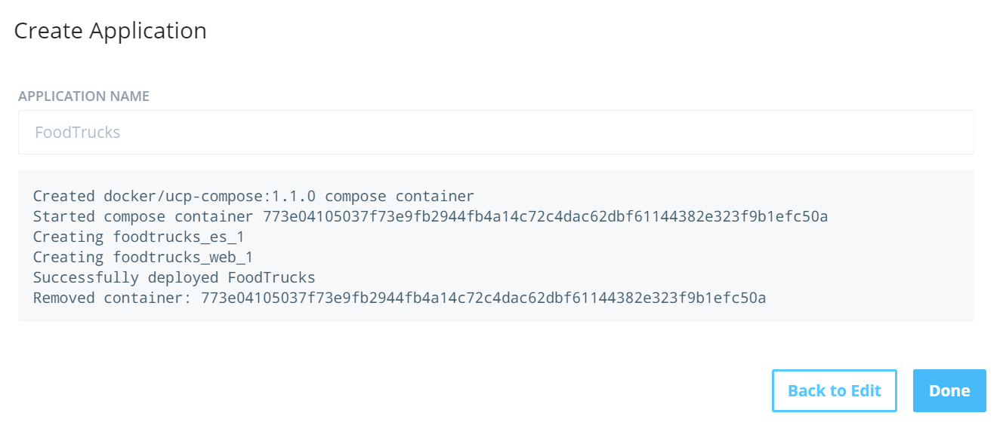

   >**Note**: If the application returns an error and fails to deploy, repeat the steps again and it should deploy.

- Click on **Applications** from the left hand menu, and you should now see your FoodTrucks application listed.

###View the FoodTruck App in Your Browser


1. Click on the `foodtrucks` app in UCP.

   This displays the two containers that comprise the app.
   - `foodtrucks_web_1` (the Python app that powers the website)
   - `foodtrucks_es_1` (Elasticsearch backend that powers the search function on the site)

2. Click the `foodtrucks_web_1` web container.

3. Make note of the node. Then scroll down and note the port that it's running on.   

  

  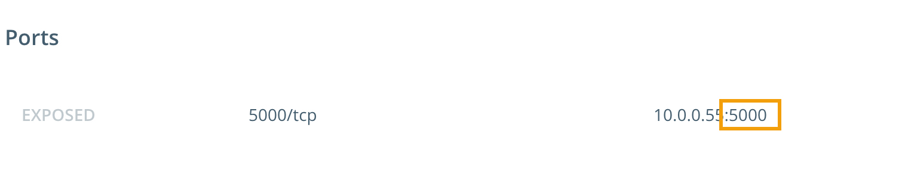

   The screenshot above shows the container running on `v111node1` and port `5000`.

   > **Note**: The IP address that is shown in the screenshot above is the nodes private IP. You cannot reach this IP address from the internet.

4. Now that you know the node and port the application's web front-end is operating on, make a note of the node's hostname from your lab details.

5. Point your browser to the application.

  To do this, combine the node's hostname with port 5000 as follows:

  - `<hostname>:5000`

  For example: `http://v111node1-3634b10bff8349cb9dc6b4fe3649b571-22.cloudapp.net:5000`.

  If you completed all the steps correctly, you will see a very cool application that allows you to search for food trucks in San Francisco.

  > **Note**: It can sometimes take a minute or two for the webapp to display. This is due to the application pulling in data to display.

  

  Congratulations. You've successfully deployed application to Docker UCP using the UCP Web Interface.


## <a name="create-users-teams"></a>Create Users and Teams (Optional)

In this task you will complete the following four steps.

- Create new users
- Create a team and add users
- Assign permissions to team
- Deploy containers

### Create new users

In this step you will create the 4 new users shown below.

| Username   | Full Name         | Default Permissions |
| :--------- | :---------------- | :------------------ |
| johnfull   | John Full         | Full Control        |
| kerryres   | Kerry Restricted  | Restricted Control  |
| barryview  | Barry View        | View Only           |
| traceyno   | Tracey No         | No Access           |

- Click **Users & Teams** from the left navigation pane.

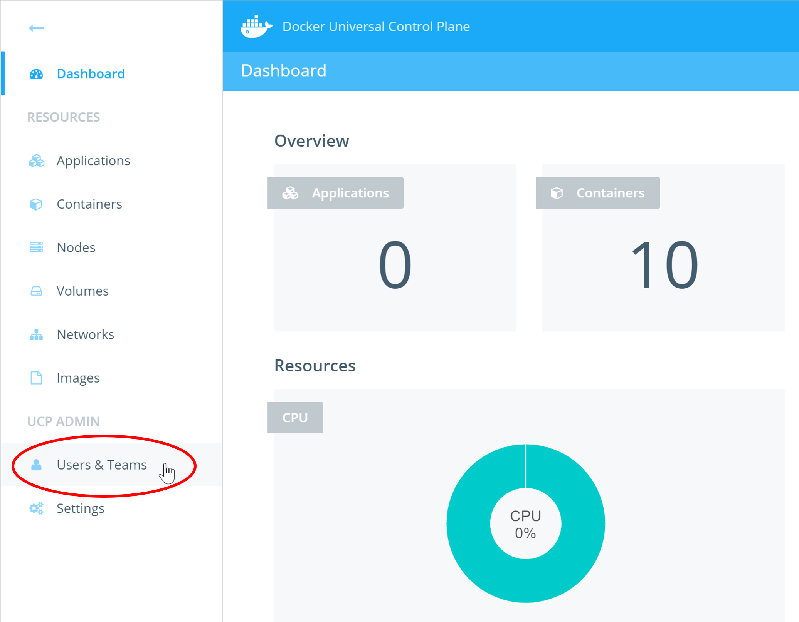

- Click **Create User**.


- Fill out the **Create User** form with the details provided in the table above. The screenshot below shows the form filled out with the details for the *John Full* user.


> Be sure to make a note of the password that you set for each user. You will need this in future labs.

- Click **Create User**.

Repeat for all users in the table above. Be sure to select the appropriate permissions from the **Default Permissions** drop-down.

> **Note:** The *Default Permissions* configured in the above step are not the same as the permissions you will set in Step - *Default Permissions* apply to non-labelled resources. The permissions you will set in Step 3 will only apply to resources that are labelled appropriately.

### Create a team and add users

Users can be grouped into teams for simpler management.

This step will walk you through the process of creating a team and adding users to the team.

- Create a team called **Engineering** by clicking the **+ Create** button shown in the image below.

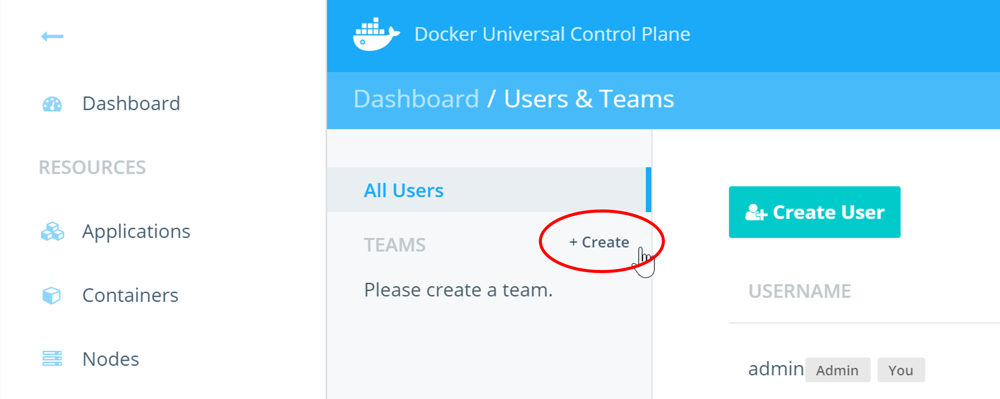

- Set the **TEAM NAME** to "Engineering" and make sure **TYPE** is "Managed".

> **Managed** teams have their accounts and passwords managed by UCP rather than an external LDAP service.

- Make sure the Engineering team is selected and click the **Add User to Team** button form the **Members** tab.

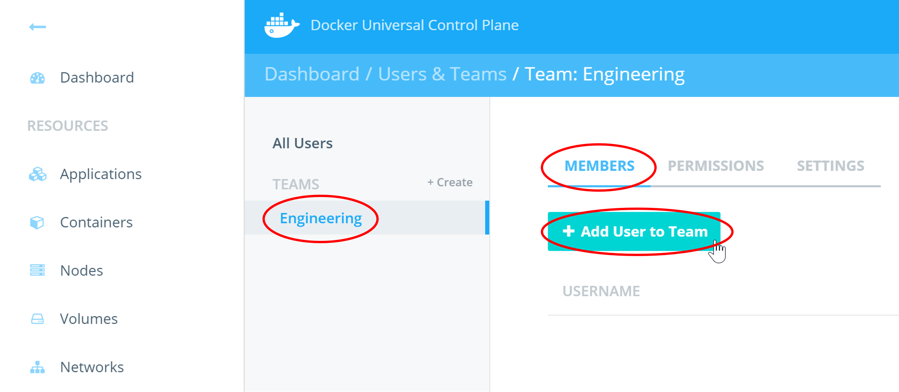

- Add all four new users to the team by clicking the **Add to Team** button next to each of them and then click **Done**. Do not add yourself (usually "admin") to the team.

All four users are now members of the Engineering team.

### Assign permissions to team

Labels are central to permissions in Docker UCP.

In this step you will create a new label and assign the Engineering team "View Only" access to that label. In a later step you will start a new container and apply that same label to the container. As a result, members of the Engineering team will have "View Only" access to the container.

- With the **Engineering** team selected, go to the **Permissions** tab and click **+ Add Label**.


- Create the following three labels and click **Add Label**.

| LABEL            |   PERMISSION         |
| :-------------   |   :------------------|
| view             |   View Only          |
| restricted       |   Restricted Control |
| run              |   Full Control       |

The labels will now be listed on the **Permissions** tab of the Engineering team.

### Deploy containers

In this step you will start a new container with the "view" label. You will also start one or more container without any label.

- Select **Containers** from the left hand pane, and click **+ Deploy Container**.


- Fill out the Deploy form with the following details and then click **Run Container**.


Repeat the above steps to deploy one or more containers without any label. Be sure to give each container a unique name.

In the next exercise you will explore the implications of running containers with labels.

## <a name="test-user-access"></a>Test User Access

In this task you will complete the following steps:

- Test permission labels
- Test container access from the web UI
- Test container access from the command line
- Test admin access form the command line
- Test default permissions

### Test permission labels

Docker UCP uses labels to implement permissions and access control. You have just deployed the "nginx1" container with the "view" label. You also assigned the Engineering team "View Only" access to all resources tagged with the "view" label. In this step you will log back in to UCP as "johnfull" and verify that you only have view access to the "nginx1" container.

- Logout of UCP and log back in as user **johnfull**
- Click on the **Containers** link in the left pane.
- Confirm that you can only see the "nginx1" container (with the "view" label). The other containers that you deployed with no labels will not be visible.
- Click the controls button to the right of the container (three dots) and attempt to **Stop** the container. The action will fail and you will see an error message like the one shown below.


- Click on the container to view its details.
- Scroll down to the **Labels** section and verify the presence of the **view** label.

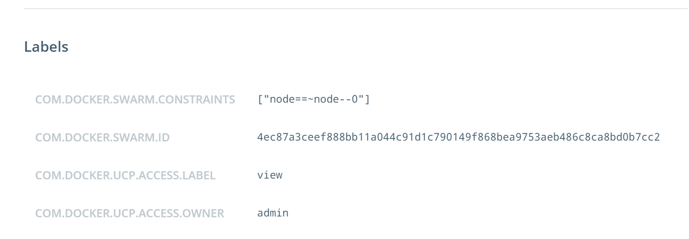

- Click the **Containers** link in the left pane.
- Click the **+ Deploy Container** button to deploy a new container with the following basic options.


  When you click the **Run Container** button, the deployment will fail. This is because members of the Engineering team only have *View Only* access to resources with the **view** label. They cannot create containers with the **view** label.

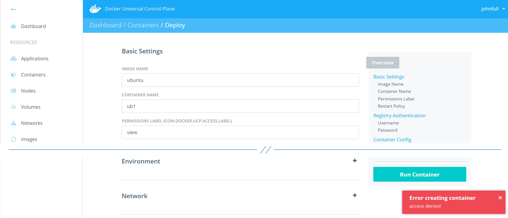

- Repeat the previous action two more times, but configure the containers as shown in the table below:

| Image Name | Container Name  | Permissions Label |
| :--------- | :---------------| :---------------- |
| ubuntu     | ub1             | restricted        |
| ubuntu     | ub2             | run               |

Deploying with either of these two labels will work. This is because members of the Engineering team have *Restricted Control* on the **restricted** label, and *Full Control* on the **run** label. Both of these permissions allow for the deployment of new containers.

### Test container access from the web UI

In this step you will attempt to perform certain actions while logged in as the **johnfull** user. Depending on which permissions labels are in force will determine whether these actions succeed or fail.

- Click on the container **ub1**. Then click the **Console** tab.

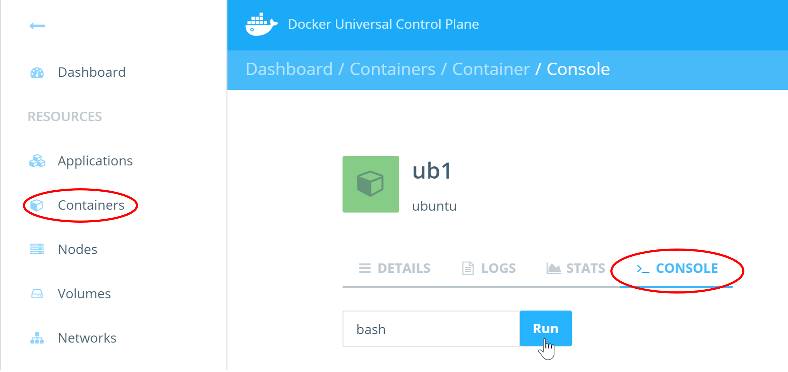

- Click on the **Run** button with "bash" specified in the field.

This action is the GUI equivalent of running a `docker exec` command. In this case, you are trying to execute a `bash` terminal inside the **ub1** container.

You will get an error message saying *Error attempting to open exec session*. This is because the you are logged in as **johnfull** who is a member of the **Engineering** team, and the **Engineering** team only have *Restricted Control* to the **ub1** container via the **restricted** label. *Restricted Control* does not allow you to open exec sessions to a container.

- Now try the same thing with the **ub2** container.

This time the bash terminal will launch successfully. This is because the user **johnfull** is a member of the **Engineering** team which has *Full Control* over the **ub2** container via the **run** label.


### Test default permissions

In this step you will test access to UCP resources that are not tagged with permissions labels.

- Logout of UCP as the **admin** user and log back in as **johnfull**.
- Click on the **Images** link and click **Pull Image**.
- Pull the "hello-world" image.


The image pull operation will be successful.

- Click on the **Networks** link and click **+ Create Network** to create a new network called "johns-net". Set the driver to **bridge**

Just give the network a name and click **Create**.

The network will be successfully created.

From the previous 4 steps we can see that the user **johnfull** has full access to create networks, pull images, and perform other UCP tasks. This is because **johnfull** has the *Full Access* default permission, giving him full access to all non-tagged UCP resources. His access is only restricted to resources tagged with permissions labels.

- Logout of UCP as **johnfull** and log back in as **kerryres**.
- Click on the **Images** link and pull the "alpine" image.
- Click on the **Networks** link and create a network called "kerry-net" with the **bridge** driver.

Similar  to **johnfull**, **kerryres** can also pull images and create networks despite only having the **Restricted Control** default permission. However, there are actions that users with Full Control can do, that users with Restricted Control cannot do such as `docker exec` into containers and lauch **privileged** containers.

- Logout of UCP as **kerryres** and log back in as **barryview**.
- Click on the **Images** link.

Notice that Barry does not even have a **Pull Image** button. This is because **barryview** has the **View Only** default permission. This permission does not allow operations such as pulling images.

- Click the **Networks** link and create a network called "barry-net" with the **bridge** driver.

You will get an **Error creating network: access denied** error message because of insufficient permissions.

- Logout of UCP as **barryview** and login as **traceyno**.
- Notice that Tracey only has links to the following three resource types:
  - Applications
  - Containers
  - Nodes

This is because Tracey has the **No Access** default permission. However, because Tracey is a members of the Engineering team, she gets access to all of the tagged resources that the Engineering team has access to.

- Click the **Containers** link and notice that Tracey can see the three containers that have the **view** label attached to them.

Thank you for taking the time to complete this lab! Feel free to try any of the other labs. I
