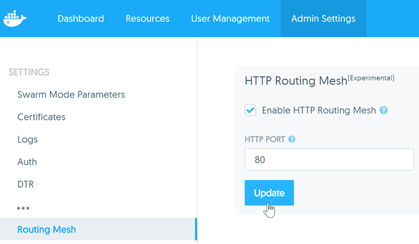
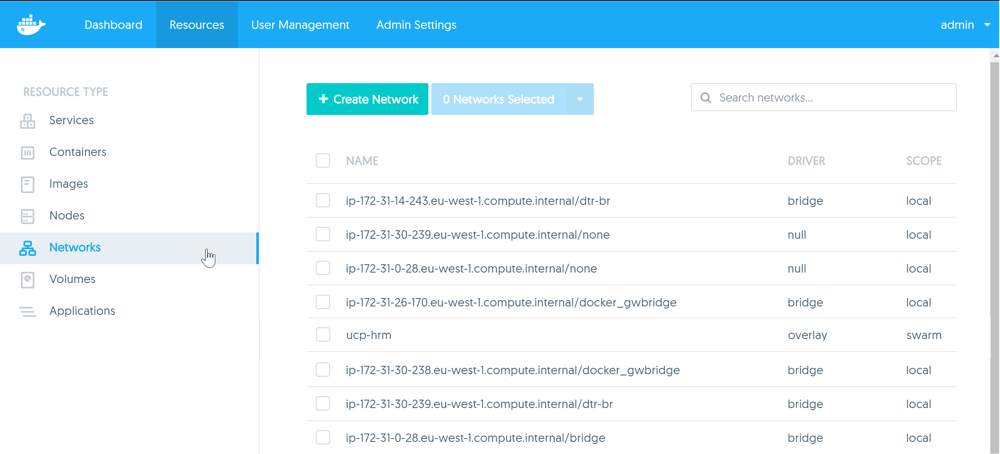
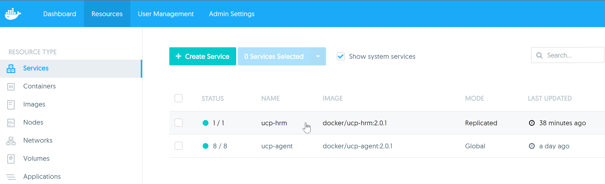
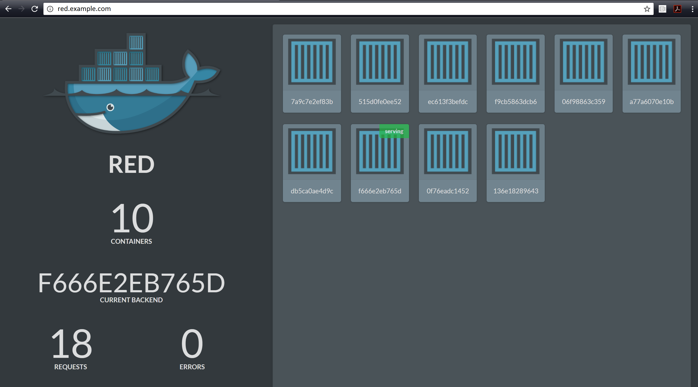
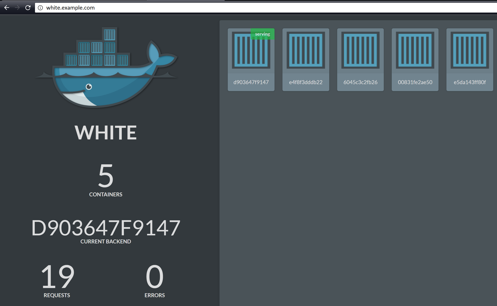

# HTTP Routing Mesh (HRM)

> **NOTE:** This lab assumes two things.
    >1. You have configured DNS name resolution for red.example.com and white.example.com to point to a load balancer. This name resolution is required for your laptop/desktop and not the Docker nodes that will make up your UCP cluster. Therefore, it can be as simple as a couple of entries in the local `hosts` file of your laptop or desktop. As long as your web browser can resolve red.example.com and white.example.com to a load balancer in front of your Swarm this lab will work.
    >2. You have configured an external load balancer to accept connections for the two DNS names above and to load balance across all nodes in a UCP cluster.

# Lab Meta

> **Difficulty**: Intermediate

> **Time**: Approximately 15 minutes

In this lab you'll learn how to configure and use the *HTTP Routing Mesh* with *Docker Datacenter*.

You will complete the following steps as part of this lab.

- [Step 1 - Enable the HTTP Routing Mesh (HRM)](#enable_hrm)
- [Step 2 - Verify the HRM](#verify_hrm)
- [Step 3 - Create the RED service](#create_red)
- [Step 4 - Create the WHITE service](#create_white)
- [Step 5 - Test the configuration](#test)

# Prerequisites

You will need all of the following to complete this lab:

- A UCP Cluster running **Docker 1.12** or higher
- Credentials to log in to UCP, create services, and enable the HRM
- Name resolution configured for two DNS names (your lab instructor will give you these)

Your instructor will provide you with the details you require.

> **NOTE:** Throughout this guide we will use *red.example.com* and *white.example.com*. As per the note above, you will need to configure this yourself. You can also substitute other names if you like.That would mean that any time you see *red.example.com* and *white.example.com* you will need to substitute these for *red.* and *white.<your-domain-goes-here>*.

# Step 1: Enable the HTTP Routing Mesh (HRM)

1. Use a web browser to connect to the Login page of your UCP cluster

2. Enter your credentials as supplied by your lab instructor

3. Navigate to `Admin Settings` > `Routing Mesh` and enable the HTTP Routing Mesh (HRM) on port 80.

   

The HRM is now configured and ready to use.

# Step 2: Verify the HRM

Enabling the HRM creates a new *service* called `ucp-hrm` and a new network called `ucp-hrm`. In this step we'll confirm that both of these constructs have been created correctly.

Execute the following steps in the UCP web UI.

1. Navigate to `Resources` > `Networks` and check for the presence of the `ucp-hrm` network. You may have to `search` for it.

    

    The network shows as an overlay network scoped to the entire Swarm cluster.

2. Navigate to `Resources` > `Services` and click the checkbox to `Show system services`.

    

  The image above shows the `ucp-hrm` service up and running.

You have now verified that the HRM was configured successfully.

In the next two steps you'll create two services. Each service will based off the same `ehazlett/docker-demo:latest` image, and runs a web server that counts containers and requests. You will configure each service with a different number of tasks and each with a different value in the `TITLE` variable.

# Step 3: Create the RED service

In this step you'll create a new service called **RED**, and configure it to use the HRM.

1. In `DDC` click `Resources` > `Services` and then `+Create Service`.

2. Configure the service as follows (leave all other options as default and remember to substitute "red.example.com" with the DNS name from your environment):
  - Name: `RED`
  - Image: `ehazlett/docker-demo:latest`
  - Scale: `10`
  - Arguments: `-close-conn`
  - Published port: Port = `8080/tcp`, Public Port = `5000`
  - Attached Networks: `ucp-hrm`
  - Labels: `com.docker.ucp.mesh.http` = `8080=http://red.example.com`
  - Environment Variables: `TITLE` = `RED`

  It will take a few minutes for this service to pull down the image and start.  Continue with the next step to create the **WHITE** service.

# Step 4: Create the WHITE service

In this step you'll create a new service called **WHITE**. The service will be very similar to the **RED** service created in the previous step.

1. In `DDC` click `Resources` > `Services` and then `+Create Service`.

2. Configure the service as follows (leave all other options as default and remember to substitute "red.example.com" with the DNS name from your environment):
  - Name: `RWHITE`
  - Image: `ehazlett/docker-demo:latest`
  - Scale: `5`
  - Arguments: `-close-conn`
  - Published port: Port = `8080/tcp`, Public Port = `5001`
  - Attached Networks: `ucp-hrm`
  - Labels: `com.docker.ucp.mesh.http` = `8080=http://white.example.com`
  - Environment Variables: `TITLE` = `WHITE`

  This service will start instantaneously as the image is already pulled on every host in your UCP cluster.

3. Verify that both services are up and running by clicking `Resources` > `Services` and checking that both services are running as shown below.

  

You now have two services running. Both are connected to the `ucp-hrm` network and both have the `com.docker.ucp.mesh.http` label. The **RED** service is associated with HTTP requests for `red.example.com` and the **WHITE** service is associated with HTTP requests for `white.example.com`. This mapping of labels to URLs is leveraged by the `ucp-hrm` service which is published on port 80.

# Step 5: Test the configuration

> **NOTE: DNS name resolution is required for this step. This can obviously be via the local hosts file, but this step will not work unless the URLs specified in the `com.docker.ucp.mesh.http` labels resolve to the UCP cluster nodes (probably via a load balancer).**

In this step you will use your web browser to issue HTTP requests to `red.example.com` and `white.example.com`. DNS name resolution is configured so that these URLs resolve to a load balancer which in turn balances requests across all nodes in the UCP cluster.

> Remember to substitute `example.com` with the domain supplied by your lab instructor.

1. Open a web browser tab and point it to `red.example.com`.

  

  The text below the whale saying "RED" indicates that this request was answered by the **RED** service. This is because the `TITLE` environment variable for the **RED** service was configured to display "RED" here. You also know it is the **RED** service as this was the service configured with 10 replicas (containers).

2. Open another tab to `white.example.com`.

  

  The output above shows that this request was routed to the **WHITE** service as it displays "WHITE" below the whale and only has 5 replicas (containers).

Congratulations. You configured two services in the same Swarm (UCP cluster) to respond to requests on port 80. Traffic to each service is routed based on the URL included in the `host` field of the HTTP header.

Requests arrive to the Swarm on port 80 and are forwarded to the `ucp-hrm` system service. The `ucp-hrm` service inspects the HTTP headers of requests and routes them to the service with the matching `com.docker.ucp.mesh.http` label.
