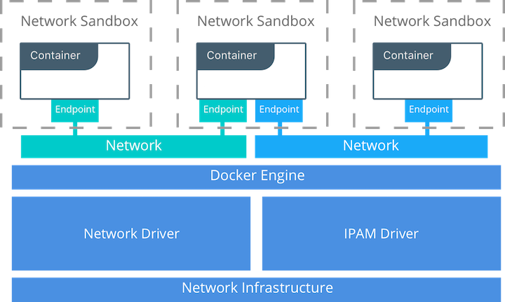

## The Container Networking Model
The Docker networking architecture is built on a set of interfaces called the _Container Networking Model_ (CNM). The philosophy of CNM is to provide application portability across diverse infrastructures. This model strikes a balance to achieve application portability and also takes advantage of special features and capabilities of the infrastructure. 

### CNM Constructs
There are several high-level constructs in the CNM. They are all OS and infrastructure agnostic so that applications can have a uniform experience no matter the infrastructure stack.

 - __Sandbox__ — A Sandbox contains the configuration of a container's network stack. This includes management of the container's interfaces, routing table, and DNS settings. An implementation of a Sandbox could be a Linux Network Namespace, a FreeBSD Jail, or other similar concept. A Sandbox may contain many endpoints from multiple networks.
 - __Endpoint__ — An Endpoint joins a Sandbox to a Network. The Endpoint construct exists so the actual connection to the network can be abstracted away from the application. This helps maintain portability so that a service can use different types of network drivers without being concerned with how it's connected to that network.
 - __Network__ — The CNM does not specify a Network in terms of the OSI model. An implementation of a Network could be a Linux bridge, a VLAN, etc. A Network is a collection of endpoints that have connectivity between them. Endpoints that are not connected to a network will not have connectivity on a Network.

Next: **[Drivers](02-drivers.md)**