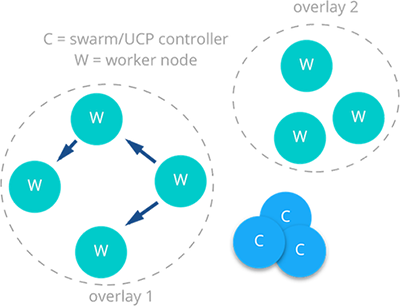

## Docker Network Control Plane
The Docker-distributed network control plane manages the state of Swarm-scoped Docker networks in addition to propagating control plane data. It is a built-in capability of Docker Swarm clusters and does not require any extra components such as an external KV store. The control plane uses a [Gossip](https://en.wikipedia.org/wiki/Gossip_protocol) protocol based on [SWIM](https://www.cs.cornell.edu/~asdas/research/dsn02-swim.pdf) to propagate network state information and topology across Docker container clusters. The Gossip protocol is highly efficient at reaching eventual consistency within the cluster while maintaining constant rates of message size, failure detection times, and convergence time across very large scale clusters. This ensures that the network is able to scale across many nodes without introducing scaling issues such as slow convergence or false positive node failures. 

The control plane is highly secure, providing confidentiality, integrity, and authentication through encrypted channels. It is also scoped per network which greatly reduces the updates that any given host will receive. 

It is composed of several components that work together to achieve fast convergence across large scale networks. The distributed nature of the control plane ensures that cluster controller failures don't affect network performance. 

The Docker network control plane components are as follows:

- **Message Dissemination** updates nodes in a peer-to-peer fashion fanning out the information in each exchange to a larger group of nodes. Fixed intervals and size of peer groups ensures that network usage is constant even as the size of the cluster scales. Exponential information propagation across peers ensures that convergence is fast and bounded across any cluster size.
- **Failure Detection** utilizes direct and indirect hello messages to rule out network congestion and specific paths from causing false positive node failures. 
- **Full State Syncs** occur periodically to achieve consistency faster and resolve network partitions.
- **Topology Aware** algorithms understand the relative latency between themselves and other peers. This is used to optimize the peer groups which makes convergence faster and more efficient. 
- **Control Plane Encryption** protects against man in the middle and other attacks that could compromise network security.

> The Docker Network Control Plane is a component of [Swarm](https://docs.docker.com/engine/swarm/) and requires a Swarm cluster to operate.

Next: **[Docker Bridge Network Driver Architecture](05-bridge-networks.md)**
