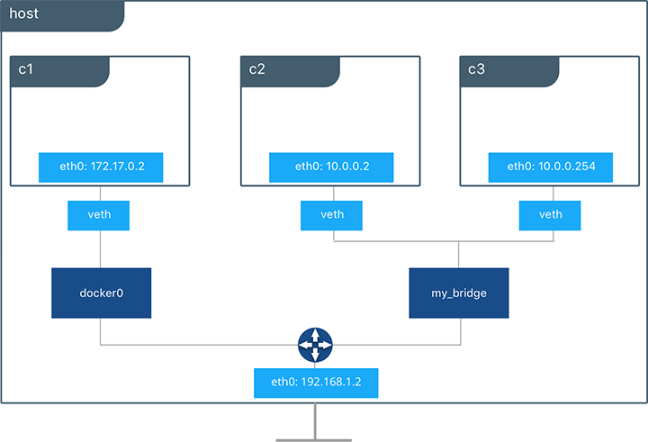
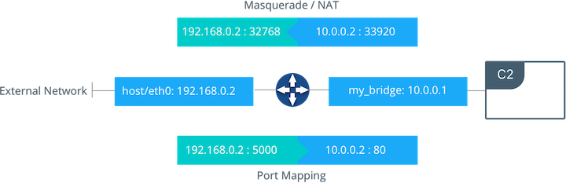

## <a name="drivers"></a>Docker Bridge Network Driver Architecture

This section explains the default Docker bridge network as well as user-defined bridge networks.

### Default Docker Bridge Network
On any host running Docker Engine, there will, by default, be a local Docker network named `bridge`. This network is created using a `bridge` network driver which instantiates a Linux bridge called `docker0`. This may sound confusing. 

- `bridge` is the name of the Docker network
- `bridge` is the network driver, or template, from which this network is created
- `docker0` is the name of the Linux bridge that is the kernel building block used to implement this network

On a standalone Docker host, `bridge` is the default network that containers will connect to if no other network is specified. In the following example a container is created with no network parameters. Docker Engine connects it to the `bridge` network by default. Inside the container we can see `eth0` which is created by the `bridge` driver and given an address by the Docker built-in IPAM driver.


```bash
#Create a busybox container named "c1" and show its IP addresses
host$ docker run -it --name c1 busybox sh
c1 # ip address
4: eth0@if5: <BROADCAST,MULTICAST,UP,LOWER_UP,M-DOWN> mtu 1500 qdisc noqueue
    link/ether 02:42:ac:11:00:02 brd ff:ff:ff:ff:ff:ff
    inet 172.17.0.2/16 scope global eth0
...
```
> A container interface's MAC address is dynamically generated and embeds the IP address to avoid collision. Here `ac:11:00:02` corresponds to `172.17.0.2`.

By using the tool `brctl` on the host, we show the Linux bridges that exist in the host network namespace. It shows a single bridge called `docker0`. `docker0` has one interface, `vetha3788c4`, which provides connectivity from the bridge to the `eth0` interface inside container `c1`.

```
host$ brctl show
bridge name		 bridge id			  STP enabled    interfaces
docker0		     8000.0242504b5200	  no       		 vethb64e8b8
```

Inside container `c1` we can see the container routing table that directs traffic to `eth0` of the container and thus the `docker0` bridge.

```bash
c1# ip route
default via 172.17.0.1 dev eth0
172.17.0.0/16 dev eth0  src 172.17.0.2
```
A container can have zero to many interfaces depending on how many networks it is connected to. Each Docker network can only have a single interface per container.


When we peek into the host routing table we can see the IP interfaces in the global network namespace that now includes `docker0`. The host routing table provides connectivity between `docker0` and `eth0` on the external network, completing the path from inside the container to the external network.

```bash
host$ ip route
default via 172.31.16.1 dev eth0
172.17.0.0/16 dev docker0  proto kernel  scope link  src 172.17.42.1
172.31.16.0/20 dev eth0  proto kernel  scope link  src 172.31.16.102
```

By default `bridge` will be assigned one subnet from the ranges 172.[17-31].0.0/16 or 192.168.[0-240].0/20 which does not overlap with any existing host interface. The default `bridge` network can be also be configured to use user-supplied address ranges. Also, an existing Linux bridge can be used for the `bridge` network rather than Docker creating one. Go to the [Docker Engine docs](https://docs.docker.com/engine/userguide/networking/default_network/custom-docker0/) for more information about customizing `bridge`. 

>  The default `bridge` network is the only network that supports legacy [links](https://docs.docker.com/engine/userguide/networking/default_network/dockerlinks/). Name-based service discovery and user-provided IP addresses are __not__ supported by the default `bridge` network.


### <a name="userdefined"></a>User-Defined Bridge Networks
In addition to the default networks, users can create their own networks called **user-defined networks** of any network driver type. In the case of user-defined `bridge` networks, Docker will create a new Linux bridge on the host. Unlike the default `bridge` network, user-defined networks supports manual IP address and subnet assignment. If an assignment isn't given, then Docker's default IPAM driver will assign the next subnet available in the private IP space. 



Below we are creating a user-defined `bridge` network and attaching two containers to it. We specify a subnet and call the network `my_bridge`. One container is not given IP parameters, so the IPAM driver assigns it the next available IP in the subnet. The other container has its IP specified.

```
$ docker network create -d bridge my_bridge
$ docker run -itd --name c2 --net my_bridge busybox sh
$ docker run -itd --name c3 --net my_bridge --ip 10.0.0.254 busybox sh
```

`brctl` now shows a second Linux bridge on the host. The name of the Linux bridge, `br-4bcc22f5e5b9`, matches the Network ID of the `my_bridge` network. `my_bridge` also has two `veth` interfaces connected to containers `c2` and `c3`. 

```
$ brctl show
bridge name		 bridge id			  STP enabled    interfaces
br-b5db4578d8c9	 8000.02428d936bb1	  no		     vethc9b3282
							                         vethf3ba8b5
docker0		     8000.0242504b5200	  no		     vethb64e8b8

$ docker network ls
NETWORK ID          NAME                DRIVER              SCOPE
b5db4578d8c9        my_bridge           bridge              local
e1cac9da3116        bridge              bridge              local
...
```

Listing the global network namespace interfaces shows the Linux networking circuitry that's been instantiated by Docker Engine. Each `veth` and Linux bridge interface appears as a link between one of the Linux bridges and the container network namespaces.

```bash
$ ip link

1: lo: <LOOPBACK,UP,LOWER_UP> mtu 65536 
2: eth0: <BROADCAST,MULTICAST,UP,LOWER_UP> mtu 9001 
3: docker0: <BROADCAST,MULTICAST,UP,LOWER_UP> mtu 1500 
5: vethb64e8b8@if4: <BROADCAST,MULTICAST,UP,LOWER_UP> mtu 1500 
6: br-b5db4578d8c9: <BROADCAST,MULTICAST,UP,LOWER_UP> mtu 1500 
8: vethc9b3282@if7: <BROADCAST,MULTICAST,UP,LOWER_UP> mtu 1500 
10: vethf3ba8b5@if9: <BROADCAST,MULTICAST,UP,LOWER_UP> mtu 1500 
...
```

### External and Internal Connectivity
By default all containers on the same `bridge` driver network will have connectivity with each other without extra configuration. This is an aspect of most types of Docker networks. By virtue of the Docker network the containers are able to communicate across their network namespaces and (for multi-host drivers) across external networks as well. **Communication between different Docker networks is firewalled by default.** This is a fundamental security aspect that allows us to provide network policy using Docker networks. For example, in the figure above containers `c2` and `c3` have reachability but they cannot reach `c1`.

Docker `bridge` networks are not exposed on the external (underlay) host network by default. Container interfaces are given IPs on the private subnets of the bridge network. Containers communicating with the external network are port mapped or masqueraded so that their traffic uses an IP address of the host. The example below shows outbound and inbound container traffic passing between the host interface and a user-defined `bridge` network.



Outbound (egress) container traffic is allowed by default. Egress connections initiated by containers are masqueraded/SNATed to an ephemeral port (_typically in the range of 32768 to 60999_). Return traffic on this connection is allowed, and thus the container uses the best routable IP address of the host on the ephemeral port.

Ingress container access is provided by explicitly exposing ports. This port mapping is done by Docker Engine and can be controlled through UCP or the Engine CLI. A specific or randomly chosen port can be configured to expose a service or container. The port can be set to listen on a specific (or all) host interfaces, and all traffic will be mapped from this port to a port and interface inside the container.

This previous diagram shows how port mapping and masquerading takes place on a host. Container `C2` is connected to the `my_bridge` network and has an IP address of `10.0.0.2`. When it initiates outbound traffic the traffic will be masqueraded so that it is sourced from ephemeral port `32768` on the host interface `192.168.0.2`. Return traffic will use the same IP address and port for its destination and will be masqueraded internally back to the container address:port `10.0.0.2:33920`. 

Exposed ports can be configured using `--publish` in the Docker CLI or UCP. The diagram shows an exposed port with the container port `80` mapped to the host interface on port `5000`. The exposed container would be advertised at `192.168.0.2:5000`, and all traffic going to this interface:port would be sent to the container at `10.0.0.2:80`.


Next: **[Overlay Driver Network Architecture](06-overlay-networks.md)**
