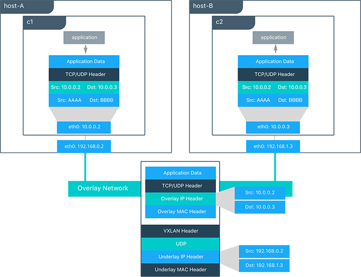
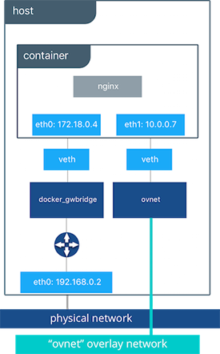

## <a name="overlaydriver"></a>Overlay Driver Network Architecture

The built-in Docker `overlay` network driver radically simplifies many of the challenges in multi-host networking. With the `overlay` driver, multi-host networks are first-class citizens inside Docker without external provisioning or components. `overlay` uses the Swarm-distributed control plane to provide centralized management, stability, and security across very large scale clusters.

### VXLAN Data Plane
The `overlay` driver utilizes an industry-standard VXLAN data plane that decouples the container network from the underlying physical network (the _underlay_). The Docker overlay network encapsulates container traffic in a VXLAN header which allows the traffic to traverse the physical Layer 2 or Layer 3 network. The overlay makes network segmentation dynamic and easy to control no matter what the underlying physical topology. Use of the standard IETF VXLAN header promotes standard tooling to inspect and analyze network traffic.

> VXLAN has been a part of the Linux kernel since version 3.7, and Docker uses the native VXLAN features of the kernel to create overlay networks. The Docker overlay datapath is entirely in kernel space. This results in fewer context switches, less CPU overhead, and a low-latency, direct traffic path between applications and the physical NIC. 

IETF VXLAN ([RFC 7348](https://datatracker.ietf.org/doc/rfc7348/)) is a data-layer encapsulation format that overlays Layer 2 segments over Layer 3 networks. VXLAN is designed to be used in standard IP networks and can support large-scale, multi-tenant designs on shared physical network infrastructure. Existing on-premises and cloud-based networks can support VXLAN transparently. 

VXLAN is defined as a MAC-in-UDP encapsulation that places container Layer 2 frames inside an underlay IP/UDP header. The underlay IP/UDP header provides the transport between hosts on the underlay network. The overlay is the stateless VXLAN tunnel that exists as point-to-multipoint connections between each host participating in a given overlay network. Because the overlay is independent of the underlay topology, applications become more portable. Thus, network policy and connectivity can be transported with the application whether it is on-premises, on a developer desktop, or in a public cloud.



In this diagram we see the packet flow on an overlay network. Here are the steps that take place when `c1` sends `c2` packets across their shared overlay network:

- `c1` does a DNS lookup for `c2`. Since both containers are on the same overlay network the Docker Engine local DNS server resolves `c2` to its overlay IP address `10.0.0.3`.
- An overlay network is a L2 segment so `c1` generates an L2 frame destined for the MAC address of `c2`.
- The frame is encapsulated with a VXLAN header by the `overlay` network driver. The distributed overlay control plane manages the locations and state of each VXLAN tunnel endpoint so it knows that `c2` resides on `host-B` at the physical address of `192.168.1.3`. That address becomes the destination address of the underlay IP header.
- Once encapsulated the packet is sent. The physical network is responsible of routing or bridging the VXLAN packet to the correct host.
- The packet arrives at the `eth0` interface of `host-B` and is decapsulated by the `overlay` network driver. The original L2 frame from `c1` is passed to the `c2`'s `eth0` interface and up to the listening application.


### Overlay Driver Internal Architecture
The Docker Swarm control plane automates all of the provisioning for an overlay network. No VXLAN configuration or Linux networking configuration is required. Data-plane encryption, an optional feature of overlays, is also automatically configured by the overlay driver as networks are created. The user or network operator only has to define the network (`docker network create -d overlay ...`) and attach containers to that network.
 


During overlay network creation, Docker Engine creates the network infrastructure required for overlays on each host. A Linux bridge is created per overlay along with its associated VXLAN interfaces. The Docker Engine intelligently instantiates overlay networks on hosts only when a container attached to that network is scheduled on the host. This prevents sprawl of overlay networks where connected containers do not exist.

In the following example we create an overlay network and attach a container to that network. We'll then see that Docker Swarm/UCP automatically creates the overlay network.

```bash
#Create an overlay named "ovnet" with the overlay driver
$ docker network create -d overlay ovnet

#Create a service from an nginx image and connect it to the "ovnet" overlay network
$ docker service create --network ovnet --name container nginx
```

When the overlay network is created, you will notice that several interfaces and bridges are created inside the host.

```bash
# Run the "ifconfig" command inside the nginx container
$ docker exec -it container ifconfig

#docker_gwbridge network
eth1      Link encap:Ethernet  HWaddr 02:42:AC:12:00:04
          inet addr:172.18.0.4  Bcast:0.0.0.0  Mask:255.255.0.0
          inet6 addr: fe80::42:acff:fe12:4/64 Scope:Link
          UP BROADCAST RUNNING MULTICAST  MTU:1500  Metric:1
          RX packets:8 errors:0 dropped:0 overruns:0 frame:0
          TX packets:8 errors:0 dropped:0 overruns:0 carrier:0
          collisions:0 txqueuelen:0
          RX bytes:648 (648.0 B)  TX bytes:648 (648.0 B)

#overlay network
eth2      Link encap:Ethernet  HWaddr 02:42:0A:00:00:07
          inet addr:10.0.0.7  Bcast:0.0.0.0  Mask:255.255.255.0
          inet6 addr: fe80::42:aff:fe00:7/64 Scope:Link
          UP BROADCAST RUNNING MULTICAST  MTU:1450  Metric:1
          RX packets:8 errors:0 dropped:0 overruns:0 frame:0
          TX packets:8 errors:0 dropped:0 overruns:0 carrier:0
          collisions:0 txqueuelen:0
          RX bytes:648 (648.0 B)  TX bytes:648 (648.0 B)
     
#container loopback
lo        Link encap:Local Loopback
          inet addr:127.0.0.1  Mask:255.0.0.0
          inet6 addr: ::1/128 Scope:Host
          UP LOOPBACK RUNNING  MTU:65536  Metric:1
          RX packets:48 errors:0 dropped:0 overruns:0 frame:0
          TX packets:48 errors:0 dropped:0 overruns:0 carrier:0
          collisions:0 txqueuelen:0
          RX bytes:4032 (3.9 KiB)  TX bytes:4032 (3.9 KiB)
```

Two interfaces have been created inside the container that correspond to two bridges that now exist on the host. On overlay networks, each container will have at least two interfaces that connect it to the `overlay` and the `docker_gwbridge`.

| Bridge | Purpose  |
|:------:|------|
| **overlay** | The ingress and egress point to the overlay network that VXLAN encapsulates and (optionally) encrypts traffic going between containers on the same overlay network. It extends the overlay across all hosts participating in this particular overlay. One will exist per overlay subnet on a host, and it will have the same name that a particular overlay network is given.    |
| **docker_gwbridge** |   The egress bridge for traffic leaving the cluster. Only one `docker_gwbridge` will exist per host. Container-to-Container traffic is blocked on this bridge allowing ingress/egress traffic flows only.      |


> The Docker Overlay driver has existed since Docker Engine 1.9, and an external K/V store was required to manage state for the network. Docker 1.12 integrated the control plane state into Docker Engine so that an external store is no longer required. 1.12 also introduced several new features including encryption and service load balancing. Networking features that are introduced require a Docker Engine version that supports them, and using these features with older versions of Docker Engine is not supported.

Next: **[MACVLAN](07-macvlan.md)**
