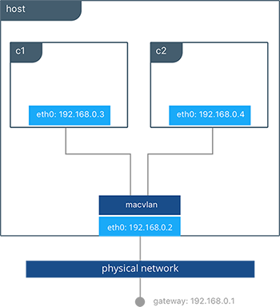
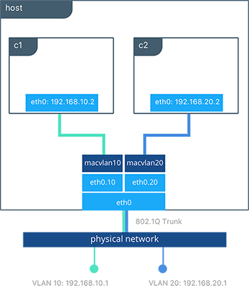

## <a name="macvlandriver"></a>MACVLAN 

The `macvlan` driver is a new implementation of the tried and true network virtualization technique. The Linux implementations are extremely lightweight because rather than using a Linux bridge for isolation, they are simply associated with a Linux Ethernet interface or sub-interface to enforce separation between networks and connectivity to the physical network.

MACVLAN offers a number of unique features and capabilities. It has positive performance implications by virtue of having a very simple and lightweight architecture. Rather than port mapping, the MACVLAN driver provides direct access between containers and the physical network. It also allows containers to receive routable IP addresses that are on the subnet of the physical network.

The `macvlan` driver uses the concept of a parent interface. This interface can be a physical interface such as `eth0`, a sub-interface for 802.1q VLAN tagging like `eth0.10` (`.10` representing `VLAN 10`), or even a bonded host adaptor which bundle two Ethernet interfaces into a single logical interface.

A gateway address is required during MACVLAN network configuration. The gateway must be external to the host provided by the network infrastructure. MACVLAN networks allow access between container on the same network. Access between different MACVLAN networks on the same host is not possible without routing outside the host.



In this example, we bind a MACVLAN network to `eth0` on the host. We attach two containers to the `mvnet` MACVLAN network and show that they can ping between themselves. Each container has an address on the `192.168.0.0/24` physical network subnet and their default gateway is an interface in the physical network.

```bash
#Creation of MACVLAN network "mvnet" bound to eth0 on the host 
$ docker network create -d macvlan --subnet 192.168.0.0/24 --gateway 192.168.0.1 -o parent=eth0 mvnet

#Creation of containers on the "mvnet" network
$ docker run -itd --name c1 --net mvnet --ip 192.168.0.3 busybox sh
$ docker run -it --name c2 --net mvnet --ip 192.168.0.4 busybox sh
/ # ping 192.168.0.3
PING 127.0.0.1 (127.0.0.1): 56 data bytes
64 bytes from 127.0.0.1: icmp_seq=0 ttl=64 time=0.052 ms
```

As you can see in this diagram, `c1` and `c2` are attached via the MACVLAN network called `macvlan` attached to `eth0` on the host.

### VLAN Trunking with MACVLAN

Trunking 802.1q to a Linux host is notoriously painful for many in operations. It requires configuration file changes in order to be persistent through a reboot. If a bridge is involved, a physical NIC needs to be moved into the bridge, and the bridge then gets the IP address. The `macvlan` driver completely manages sub-interfaces and other components of the MACVLAN network through creation, destruction, and host reboots.



When the `macvlan` driver is instantiated with sub-interfaces it allows VLAN trunking to the host and segments containers at L2. The `macvlan` driver automatically creates the sub-interfaces and connects them to the container interfaces. As a result each container will be in a different VLAN, and communication will not be possible between them unless traffic is routed in the physical network. 


```bash
#Creation of  macvlan10 network that will be in VLAN 10
$ docker network create -d macvlan --subnet 192.168.10.0/24 --gateway 192.168.10.1 -o parent=eth0.10macvlan10

#Creation of  macvlan20 network that will be in VLAN 20
$ docker network create -d macvlan --subnet 192.168.20.0/24 --gateway 192.168.20.1 -o parent=eth0.20 macvlan20

#Creation of containers on separate MACVLAN networks
$ docker run -itd --name c1--net macvlan10 --ip 192.168.10.2 busybox sh
$ docker run -it --name c2--net macvlan20 --ip 192.168.20.2 busybox sh
```

In the preceding configuration we've created two separate networks using the `macvlan` driver that are configured to use a sub-interface as their parent interface. The `macvlan` driver creates the sub-interfaces and connects them between the host's `eth0` and the container interfaces. The host interface and upstream switch must be set to `switchport mode trunk` so that VLANs are tagged going across the interface. One or more containers can be connected to a given MACVLAN network to create complex network policies that are segmented via L2.

> Because multiple MAC addresses are living behind a single host interface you might need to enable promiscuous mode on the interface depending on the NIC's support for MAC filtering.  

Next: **[Host (Native) Network Driver](08-host-networking.md)**
