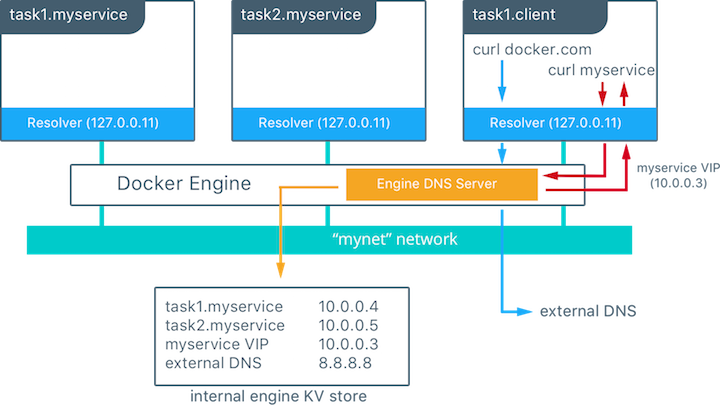

## Physical Network Design Requirements
Docker Datacenter and Docker networking are designed to run over common data center network infrastructure and topologies. Its centralized controller and fault-tolerant cluster guarantee compatibility across a wide range of network environments. The components that provide networking functionality (network provisioning, MAC learning, overlay encryption) are either a part of Docker Engine, UCP, or the Linux kernel itself. No extra components or special networking features are required to run any of the built-in Docker networking drivers.

More specifically, the Docker built-in network drivers have NO requirements for:

- Multicast
- External key-value stores
- Specific routing protocols 
- Layer 2 adjacencies between hosts
- Specific topologies such as spine & leaf, traditional 3-tier, and PoD designs. Any of these topologies are supported.

This is in line with the Container Networking Model which promotes application portability across all environments while still achieving the performance and policy required of applications.

## Service Discovery Design Considerations

Docker uses embedded DNS to provide service discovery for containers running on a single Docker Engine and `tasks` running in a Docker Swarm. Docker Engine has an internal DNS server that provides name resolution to all of the containers on the host in user-defined bridge, overlay, and MACVLAN networks. Each Docker container ( or `task` in Swarm mode) has a DNS resolver that forwards DNS queries to Docker Engine, which acts as a DNS server. Docker Engine then checks if the DNS query belongs to a container or `service` on network(s) that the requesting container belongs to. If it does, then Docker Engine looks up the IP address that matches a container, `task`, or`service`'s **name** in its key-value store and returns that IP or `service` Virtual IP (VIP) back to the requester. 

Service discovery is _network-scoped_, meaning only containers or tasks that are on the same network can use the embedded DNS functionality. Containers not on the same network cannot resolve each other's addresses. Additionally, only the nodes that have containers or tasks on a particular network store that network's DNS entries. This promotes security and performance.

If the destination container or `service` does not belong on same network(s) as source container, then Docker Engine forwards the DNS query to the configured default DNS server. 

In this example there is a service of two containers called `myservice`. A second service (`client`) exists on the same network. The `client` executes two `curl` operations for `docker.com` and `myservice`. These are the resulting actions:

 - DNS queries are initiated by `client` for `docker.com` and `myservice`.
 - The container's built in resolver intercepts the DNS queries on `127.0.0.11:53` and sends them to Docker Engine's DNS server.
 - `myservice` resolves to the Virtual IP (VIP) of that service which is internally load balanced to the individual task IP addresses. Container names will be resolved as well, albeit directly to their IP address.
 - `docker.com` does not exist as a service name in the `mynet` network and so the request is forwarded to the configured default DNS server.
 
 Next: **[Load Balancing Design Considerations](10-load-balancing.md)**
