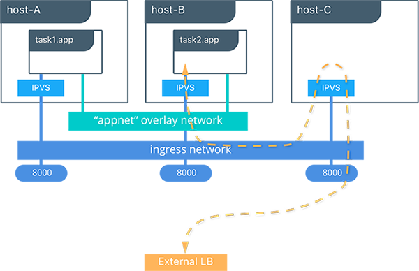

## <a name="lb"></a>Load Balancing Design Considerations

Load balancing is a major requirement in modern, distributed applications. Docker Swarm mode introduced in 1.12 comes with a native internal and external load balancing functionalities that utilize both `iptables` and `ipvs`, a transport-layer load balancing inside the Linux kernel.

### Internal Load Balancing
When services are created in a Docker Swarm cluster, they are automatically assigned a Virtual IP (VIP) that is part of the service's network. The VIP is returned when resolving the service's name. Traffic to that VIP will be automatically sent to all healthy tasks of that service across the overlay network. This approach avoids any client-side load balancing because only a single IP is returned to the client. Docker takes care of routing and equally distributing the traffic across the healthy service tasks.


To see the VIP, run a `docker service inspect my_service` as follows:

```
# Create an overlay network called mynet
$ docker network create -d overlay mynet
a59umzkdj2r0ua7x8jxd84dhr

# Create myservice with 2 replicas as part of that network
$ docker service create --network mynet --name myservice --replicas 2 busybox ping localhost
8t5r8cr0f0h6k2c3k7ih4l6f5

# See the VIP that was created for that service
$ docker service inspect myservice
...

"VirtualIPs": [
                {
                    "NetworkID": "a59umzkdj2r0ua7x8jxd84dhr",
                    "Addr": "10.0.0.3/24"
                },
]
              
``` 

> DNS round robin (DNS RR) load balancing is another load balancing option for services (configured with `--endpoint-mode`). In DNS RR mode a VIP is not created for each service. The Docker DNS server resolves a service name to individual container IPs in round robin fashion.


###External Load Balancing (Docker Routing Mesh) 
You can expose services externally by using the `--publish` flag when creating or updating the service. Publishing ports in Docker Swarm mode means that every node in your cluster will be listening on that port. But what happens if the service's task isn't on the node that is listening on that port?

This is where routing mesh comes into play. Routing mesh is a feature introduced in Docker 1.12 that combines `ipvs` and `iptables` to create a powerful cluster-wide transport-layer (L4) load balancer. It allows all the Swarm nodes to accept connections on the services' published ports. When any Swarm node receives traffic destined to the published TCP/UDP port of a running `service`, it forwards it to service's VIP using a pre-defined overlay network called `ingress`. The `ingress` network behaves similarly to other overlay networks but its sole purpose is to transport mesh routing traffic from external clients to cluster services. It uses the same VIP-based internal load balancing as described in the previous section.

Once you launch services, you can create an external DNS record for your applications and map it to any or all Docker Swarm nodes. You do not need to worry about where your container is running as all nodes in your cluster look as one with the routing mesh routing feature.  

```
#Create a service with two replicas and export port 8000 on the cluster
$ docker service create --name app --replicas 2 --network appnet -p 8000:80 nginx
```


 

This diagram illustrates how the Routing Mesh works.

- A service is created with two replicas, and it is port mapped externally to port `8000`.
- The routing mesh exposes port `8000` on each host in the cluster.
- Traffic destined for the `app` can enter on any host. In this case the external LB sends the traffic to a host without a service replica.
- The kernel's IPVS load balancer redirects traffic on the `ingress` overlay network to a healthy service replica.

Next: **[Network Security and Encryption Design Considerations](11-security.md)**
