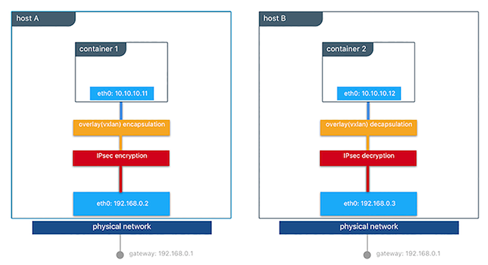

## Network Security and Encryption Design Considerations

Network security is a top-of-mind consideration when designing and implementing containerized workloads with Docker. In this section, we will go over three key design considerations that are typically raised around Docker network security and how you can utilize Docker features and best practices to address them. 

### Container Networking Segmentation

Docker allows you to create an isolated network per application using the `overlay` driver. By default different Docker networks are firewalled from eachother. This approach provides a true network isolation at Layer 3. No malicious container can communicate with your application's container unless it's on the same network or your applications' containers expose services on the host port. Therefore, creating networks for each applications adds another layer of security. The principles of "Defense in Depth" still recommends application-level security to protect at L3 and L7.

### Securing the Control Plane

Docker Swarm comes with integrated PKI. All managers and nodes in the Swarm have a cryptographically signed identify in the form of a signed certificate. All manager-to-manager and manager-to-node control communication is secured out of the box with TLS. No need to generate certs externally or set up any CAs manually to get end-to-end control plane traffic secured in Docker Swarm mode. Certificates are periodically and automatically rotated.

### Securing the Data Plane

In Docker Swarm mode the data path (e.g. application traffic) can be encrypted out-of-the-box. This feature uses IPSec tunnels to encrypt network traffic as it leaves the source container and decrypts it as it enters the destination container.  This ensure that your application traffic is highly secure when it's in transit regardless of the underlying networks. In a hybrid, multi-tenant, or multi-cloud environment, it is crucial to ensure data is secure as it traverses networks you might not have control over. 

This diagram illustrates how to secure communication between two containers running on different hosts in a Docker Swarm. 

This feature works with the `overlay` driver in Swarm mode only and can be enabled per network at the time of creation by adding the `--opt encrypted=true` option (e.g `docker network create -d overlay --opt encrypted=true <NETWORK_NAME>`). After the network gets created, you can launch services on that network (e.g `docker service create --network <NETWORK_NAME> <IMAGE> <COMMAND>`). When two tasks of the same services are created on two different hosts, an IPsec tunnel is created between them and traffic gets encrypted as it leaves the source host and gets decrypted as it enters the destination host. 

The Swarm leader periodically regenerates a symmetrical key and distributes it securely to all cluster nodes. This key is used by IPsec to encrypt and decrypt data plane traffic. The encryption is implemented via IPSec in host-to-host transport mode using AES-GCM.

Next: **[IP Address Management](12-ipaddress-management.md)**
