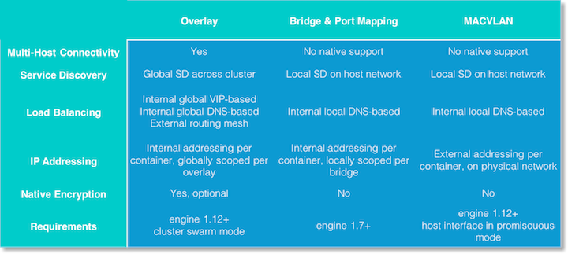

## Network Deployment Models
Docker Engine and community provide multiple drivers to use. These drivers can be configured in multiple ways, and the physical network design and configuration will also affect network behavior. This section looks at different configurations and how they interoperate with the application and the physical network. This is not an exhaustive list but a description of common methods of deployment.

Back to [Concepts](README.md)
or
On to [Tutorials](../tutorials.md)
