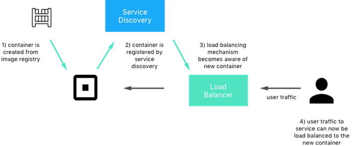

##Service Discovery & Load Balancing
Service discovery is increasingly important in a containerized world. To scale apps developers have broken them in to smaller pieces that can be distributed across different machines to provide load balancing and fault tolerance. This presents challenges from a networking perspective. The challenge is mapping a container to its location (the container's IP address). Containers may be created and destroyed frequently and scheduled across different hosts dynamically. Containers must be able to register themsevles with a mapping authority and other services must be able to query this authority to find the location of those services.

When a new service (container) is created it should be able register itself with a service discovery authority. The ```IP address:port``` of the container will then be registered to that service. The mapping of services to containers should dynamically be updated when containers are added or removed from a service. This diagram shows an example of the service discovery process. A container is created, it is registered to a specific service, and then a load balancer is updated with the containers location and service. Converseley when a container is stopped or becomes unhealthy then it should be removed from the service and load balancer. 


<br>
<p align="center">

</p>


The mechanisms that provide service discovery and load balancing can take many forms. They can be external service or provided natively within Docker without extra infrastructure. In Docker Swarm Mode automatic service discovery and load balancing is provided right out of the box. A service can be defined and traffic is load balanced via DNS to containers. DNS load balancing is covered later in this guide.

External solutions for service discovery and/or load balancing is also possible and may be desired to levarage existing infrastructure or to take advantage of special features. Common external service discovery mechanisms include Consul, etcd, and Zookeeper. Common external load balancers include HAproxy, Nginx, F5, and many more. 
<br>
<br>
<br>
<br>
<br>
<br>
<br>
<br>


#####Underlay and Overlay Networks
The default behavior of the Docker bridge and overlay driver is to provide an internal subnet for each bridge or overlay network. Bridge networks only have local significance on each host and they provide port mapping to allow containers to reach outside of the host. Overlay networks span across hosts and use VXLAN tunneling to keep its IP namespace separate from other networks.

In this context we call the physical network (comprised of the host network adapters and upstream switches & routers) the underlay network. Between port mapping and overlay tunneling, containers only receive private IP addresses and are not part of the underlay network. This has many advantages.

* Portability is increased because applications are not tied to the design of the physical network
* Agility is improved because new networks can be created and destroyed without having to reconfigure physical infrastrture

There are scenarios where it may be more desirable to place containers directly on the underlay network so that they receive an IP address that is on the underlay subnet. These scenarios include:

- Legacy Applications - Some legacy applications may use hard-coded IP addresses or ports. Applications that require themselves to be advertised on a certain port can cause difficulties with port-contention and may not be suitable to exist on a private bridge or overlay network.
- Protocol & Application Incompatibilities - Some protocols and applications are incompatible with NAT and port mapping.

#####Attaching Containers Directly to Underlay Networks
Docker networking also has the ability to place containers directly on the underlay network with the overlay and bridge drivers. To achieve this port-mapping and NAT are turned out and containers are given IP addresses that are on the physical network subnet.


<br>
<br>


#####Policy with Docker Networks
Docker networks can easily be created dynamically to define the policies defined by applications. In this example we use a combination of overlay and bridge networks to connect multiple containers. We deploy three networks: 

 - `backnet` for communication between the `web` and `db` containers. It is an overlay network that can span multiple hosts. Purposefully, we will not provide any connectivity between 'backnet' and the outside world. It is purely an internal network.
 - `monitor-net` for communication between the `monitor` container and all other containers on a given host. It is a bridge network as the monitoring communications are only local to each host.
 - `docker0` is the default bridge network. In this case it's not used for container to container communication. It's purely a network created to provide outside access to the `web` containers. 

<p align="center">

</p>


##Docker Network Deployment Models
#####Default Bridge Mode (Bridge + NAT/Port Mapping)
This is the default deployment of the Docker bridge driver. Each bridge network `br0` is local to the host. Traffic leaving or entering the host is NAT/port-mapped to the IP address of the network interface of the host. 

```
$ docker network create -d bridge --subnet 10.0.0.0/24 --gateway 10.0.0.1 br0
```

<p align="center">

</p>

#####Bridge Mapped to Underlay
In the case that a container needs to have an ip address on the subnet of the physical/underlay network then this option can be used. 

```
host A
$ docker network create -d bridge --subnet 192.168.1.0/24 --ip-range 192.168.1.0/28 --gateway 192.168.1.100 --aux-address DefaultGatewayIPv4=192.168.1.1 -o com.docker.network.bridge.name=brnet brnet

host B
$ docker network create -d bridge --subnet 192.168.1.0/24 --ip-range 192.168.1.32/28 --gateway 192.168.1.101 --aux-address DefaultGatewayIPv4=192.168.1.1 -o com.docker.network.bridge.name=brnet brnet

```

<p align="center">

</p>

#####Default Overlay Mode (Overlay + NAT/Port Mapping)
The default mode of the overlay network is to use the overlay network for container to container communication and `gw_bridge`  NAT/Port-Mapping for external communication. 


<p align="center">

</p>


#####MACVLAN


 
##Docker Network Troubleshooting and Tools
#####docker network 
#####ip route/address
#####brctl
#####nsenter


---------------
####My Questions
- Possible to connect container to two networks in swarm mode?
- How does DNS work when a container is connectected to two different networks?
- Possible to connect both bridge and overlay network to container at same time?


####Questions to Ask your Application
- What segmentation and access is required of the applications?
- How granular does the segmentation need to be?
- What are the different tiers or environments that exist?

####Management Network
- What Docker engine/swarm/ucp/dtr traffic constitutes as management traffic?
- What are the network policies for docker management traffic?

####Best Practices for IP Address Management
- How are addresses reserved and released?
- How does the IPAM driver work?
- What 3rd party IPAM drivers exist?
- How to align host subnet layout with swarm labels/host environments?

####Network Security
- Should the underlay network be subnetted to provide application isolation? Pros/cons
- Should the docker cluster be one flat IP space with use of overlay networks to provide segmentation? Pros/cons
- Map container IPs to underlay? Pros/cons
- Port forwarding/NAt to reach underlay? Pros/cons
- Methods to connect separate interal overlay networks (different app tiers)
  - attach multiple overlay networks to intermediary containers
  - send traffic outside of overlay to gateway router
  
  

  
####Swarm/UCP Network Architecture
- Can a UCP or swarm instance stretch across multiple AZ/data centers?
- Ports and network access required for UCP and swarm infrastructure?

  
Notes
No more than 1 bridge when plumbing directly to underlay
Discuss docker events -> service discovery
Mention port mapping with port IP, not insecure because port is only expose on that IP

Networking Challenges


