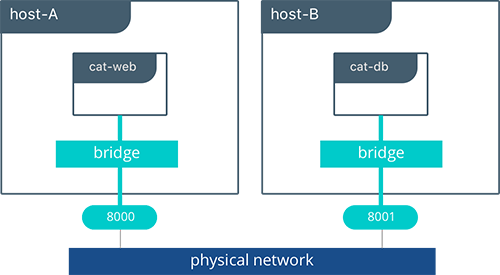

### <a name="pets"></a>Tutorial Application: The Pets App

In the following example, we will use a fictional app called **[Pets](https://github.com/mark-church/pets)** to illustrate the __Network Deployment Models__.  It serves up images of pets on a web page while counting the number of hits to the page in a backend database. It is configurable via two environment variables, `DB` and `ROLE`.

- `DB` specifies the hostname:port or IP:port of the `db` container for the web front end to use.
- `ROLE` specifies the "tenant" of the application and whether it serves pictures of dogs or cat.

It consists of `web`, a Python flask container, and `db`, a  redis container. Its architecture and required network policy is described below.


We will run this application on different network deployment models to show how we can instantiate connectivity and network policy. Each deployment model exhibits different characteristics that may be advantageous to your application and environment.

We will explore the following network deployment models in this section:

- Bridge Driver
- Overlay Driver 
- MACVLAN Bridge Mode Driver

### <a name="bridgemodel"></a>Tutorial App: Bridge Driver
This model is the default behavior of the built-in Docker `bridge` network driver. The `bridge` driver creates a private network internal to the host and provides an external port mapping on a host interface for external connectivity.

```bash
#Create a user-defined bridge network for our application
$ docker network create -d bridge catnet

#Instantiate the backend DB on the catnet network
$ docker run -d --net catnet --name cat-db redis

#Instantiate the web frontend on the catnet network and configure it to connect to a container named `cat-db`
$ docker run -d --net catnet -p 8000:5000 -e 'DB=cat-db' -e 'ROLE=cat' chrch/web 
```

> When an IP address is not specified, port mapping will be exposed on all interfaces of a host. In this case the container's application is exposed on `0.0.0.0:8000`. We can specify a specific IP address to advertise on only a single IP interface with the flag `-p IP:host_port:container_port`. More options to expose ports can be found in the [Docker docs](https://docs.docker.com/engine/reference/run/#/expose-incoming-ports).


The `web` container takes some environment variables to determine which backend it needs to connect to. Above we supply it with `cat-db` which is the name of our `redis` service. The Docker Engine's built-in DNS will resolve a container's name to its location in any user-defined network. Thus, on a network, a container or service can always be referenced by its name. 

With the above commands we have deployed our application on a single host. The Docker bridge network provides connectivity and name resolution amongst the containers on the same bridge while exposing our frontend container externally.  

```
$ docker network inspect catnet
[
    {
        "Name": "catnet",
        "Id": "81e45d3e3bf4f989abe87c42c8db63273f9bf30c1f5a593bae4667d5f0e33145",
        "Scope": "local",
        "Driver": "bridge",
        "EnableIPv6": false,
        "IPAM": {
            "Driver": "default",
            "Options": {},
            "Config": [
                {
                    "Subnet": "172.19.0.0/16",
                    "Gateway": "172.19.0.1/16"
                }
            ]
        },
        "Internal": false,
        "Attachable": false,
        "Containers": {
            "2a23faa18fb33b5d07eb4e0affb5da36449a78eeb196c944a5af3aaffe1ada37": {
                "Name": "backstabbing_pike",
                "EndpointID": "9039dae3218c47739ae327a30c9d9b219159deb1c0a6274c6d994d37baf2f7e3",
                "MacAddress": "02:42:ac:13:00:03",
                "IPv4Address": "172.19.0.3/16",
                "IPv6Address": ""
            },
            "dbf7f59187801e1bcd2b0a7d4731ca5f0a95236dbc4b4157af01697f295d4528": {
                "Name": "cat-db",
                "EndpointID": "7f7c51a0468acd849fd575adeadbcb5310c5987195555620d60ee3ffad37c680",
                "MacAddress": "02:42:ac:13:00:02",
                "IPv4Address": "172.19.0.2/16",
                "IPv6Address": ""
            }
        },
        "Options": {},
        "Labels": {}
    }
]
```
In this output, we can see that our two containers have automatically been given ip addresses from the `172.19.0.0/16` subnet. This is the subnet of the local `catnet` bridge, and it will provide all connected containers a subnet from this range unless they are statically configured.

### Tutorial App: Multi-Host Bridge Driver Deployment

Deploying a multi-host application requires some additional configuration so that distributed components can connect with each other. In the following example we explicitly tell the `web` container the location of `redis` with the environment variable `DB=hostB:8001`. Another change is that we are port mapping port `6379` inside the`redis` container to port `8001` on the `hostB`. Without the port mapping, `redis` would only be accessible on its connected networks (the default `bridge` in this case).

```
host-A $ docker run -d -p 8000:5000 -e 'DB=host-B:8001' -e 'ROLE=cat' --name cat-web chrch/web 
host-B $ docker run -d -p 8001:6379 redis
```



> In this example we don't specify a network to use, so the default Docker `bridge` network will exist on every host. 

When we configure the location of `redis` at `host-B:8001`, we are creating a form of **service discovery**. We are configuring one service to be able to discover another service. In the single host example, this was done automatically because Docker Engine provided built-in DNS resolution for the container names. In this multi-host example we are doing this manually. 

- `cat-web` makes a request to the `redis` service at `host-B:8001`
- On `host-A` the `host-B` hostname is resolved to `host-B`'s IP address by the infrastructure's DNS
- The request from `cat-web` is masqueraded to use the `host-A` IP address. 
- Traffic is routed or bridged by the external network to `host-B` where port `8001` is exposed.
- Traffic to port `8001` is NATed and routed on `host-B` to port `6379` on the `cat-db` container.

The hardcoding of application location is not typically recommended. Service discovery tools exist that provide these mappings dynamically as containers are created and destroyed in a cluster. The `overlay` driver provides global service discovery across a cluster. External tools such as [Consul](https://www.consul.io/) and [etcd](https://coreos.com/etcd/) also provide service discovery as an external service. 

In the overlay driver example we will see that multi-host service discovery is provided out of the box, which is a major advantage of the overlay deployment model.


#### Bridge Driver Benefits and Use-Cases

- Very simple architecture promotes easy understanding and troubleshooting
- Widely deployed in current production environments
- Simple to deploy in any environment from developer laptops to production data center


### <a name="overlaymodel"></a>Tutorial App: Overlay Driver 

This model utilizes the built-in `overlay` driver to provide multi-host connectivity out of the box. The default settings of the overlay driver will provide external connectivity to the outside world as well as internal connectivity and service discovery within a container application. The [Overlay Driver Architecture](#overlayarch) section reviews the internals of the Overlay driver which you should review before reading this section.

In this example we are re-using the previous Pets application. Prior to this example we already set up a Docker Swarm. For instructions on how to set up a Swarm read the [Docker docs](https://docs.docker.com/engine/swarm/swarm-tutorial/create-swarm/). When the Swarm is set up, we can use the `docker service create` command to create containers and networks that will be managed by the Swarm.

The following shows how to inspect your Swarm, create an overlay network, and then provision some services on that overlay network. All of these commands are run on a UCP/swarm controller node.


```bash
#Display the nodes participating in this swarm cluster
$ docker node ls
ID                           HOSTNAME          STATUS  AVAILABILITY  MANAGER STATUS
a8dwuh6gy5898z3yeuvxaetjo    host-B  Ready   Active
elgt0bfuikjrntv3c33hr0752 *  host-A  Ready   Active        Leader

#Create the dognet overlay network
$ docker network create -d overlay --subnet 10.1.0.0/24 --gateway 10.1.0.1 dognet

#Create the backend service and place it on the dognet network
$ docker service create --network dognet --name dog-db redis

#Create the frontend service and expose it on port 8000 externally
$ docker service create --network dognet -p 8000:5000 -e 'DB=dog-db' -e 'ROLE=dog' --name dog-web chrch/web
```   


We pass in `DB=dog-db` as an environment variable to the web container. The overlay driver will resolve the service name `dog-db` and load balance it to containers in that service. It is not required to expose the `redis` container on an external port because the overlay network will resolve and provide connectivity within the network. 

> Inside overlay and bridge networks, all TCP and UDP ports to containers are open and accessible to all other containers attached to the overlay network.


The `dog-web` service is exposed on port `8000`, but in this case the __routing mesh__ will expose port `8000` on every host in the Swarm. We can test to see if the application is working by going to `<host-A>:8000` or `<host-B>:8000` in the browser. 

Complex network policies can easily be achieved with overlay networks. In the following configuration, we add the `cat` tenant to our existing application. This will represent two applications using the same cluster but requirE network micro-segmentation. We add a second overlay network with a second pair of `web` and `redis` containers. We also add an `admin` container that needs to have access to _both_ tenants.

To accomplish this policy we create a second overlay network, `catnet`, and attach the new containers to it. We also create the `admin` service and attach it to both networks.

```
$ docker network create -d overlay --subnet 10.2.0.0/24 --gateway 10.2.0.1 catnet
$ docker service create --network catnet --name cat-db redis
$ docker service create --network catnet -p 9000:5000 -e 'DB=cat-db' -e 'ROLE=cat' --name cat-web chrch/web
$ docker service create --network dognet --network catnet -p 7000:5000 -e 'DB1=dog-db' -e 'DB2=cat-db' --name admin chrch/admin 
```

This example uses the following logical topology:

- `dog-web` and `dog-db` can communicate with each other, but not with the `cat` service.
- `cat-web` and `cat-db` can communicate with each other, but not with the `dog` service.
- `admin` is connected to both networks and has reachability to all containers.


#### Overlay Benefits and Use Cases

- Very simple multi-host connectivity for small and large deployments
- Provides service discovery and load balancing with no extra configuration or components
- Useful for east-west micro-segmentation via encrypted overlays
- Routing mesh can be used to advertise a service across an entire cluster


### <a name="macvlanmodel"></a>Tutorial App: MACVLAN Bridge Mode

There may be cases where the application or network environment requires containers to have routable IP addresses that are a part of the underlay subnets. The MACVLAN driver provides an implementation that makes this possible. As described in the [MACVLAN Architecture section](#macvlan), a MACVLAN network binds itself to a host interface. This can be a physical interface, a logical sub-interface, or a bonded logical interface. It acts as a virtual switch and provides communication between containers on the same MACVLAN network. Each container receives a unique MAC address and an IP address of the physical network that the node is attached to.


In this example, the Pets application is deployed on to `host-A` and `host-B`. 

```bash
#Creation of local macvlan network on both hosts
host-A $ docker network create -d macvlan --subnet 192.168.0.0/24 --gateway 192.168.0.1 -o parent=eth0 macvlan
host-B $ docker network create -d macvlan --subnet 192.168.0.0/24 --gateway 192.168.0.1 -o parent=eth0 macvlan

#Creation of web container on host-A
host-A $ docker run -it --net macvlan --ip 192.168.0.4 -e 'DB=dog-db' -e 'ROLE=dog' --name dog-web chrch/web

#Creation of db container on host-B
host-B $ docker run -it --net macvlan --ip 192.168.0.5 --name dog-db redis
```

When `dog-web` communicates with `dog-db`, the physical network will route or switch the packet using the source and destination addresses of the containers. This can simplify network visibility as the packet headers can be linked directly to specific containers. At the same time application portability is decreased as container IPAM is tied to the physical network. Container addressing must adhere to the physical location of container placement in addition to preventing overlapping address assignment. Because of this, care must be taken to manage IPAM externally to a MACVLAN network. Overlapping IP addressing or incorrect subnets can lead to loss of container connectivity.

#### MACVLAN Benefits and Use Cases

- Very low latency applications can benefit from the `macvlan` driver because it does not utilize NAT.
- MACVLAN can provide an IP per container, which may be a requirement in some environments.
- More careful consideration for IPAM must be taken in to account.

## Conclusion

Docker is a quickly evolving technology, and the networking options are growing to satisfy more and more use cases every day. Incumbent networking vendors, pure-play SDN vendors, and Docker itself are all contributors to this space. Tighter integration with the physical network, network monitoring, and encryption are all areas of much interest and innovation.  

This document detailed some but not all of the possible deployments and CNM network drivers that exist. While there are many individual drivers and even more ways to configure those drivers, we hope you can see that there are only a few common models routinely deployed. Understanding the tradeoffs with each model is key to long term success.
