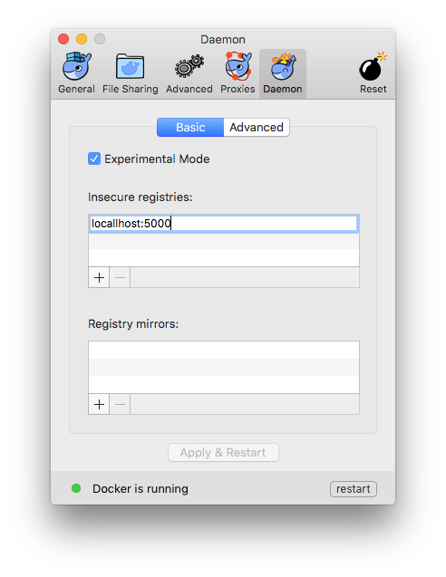
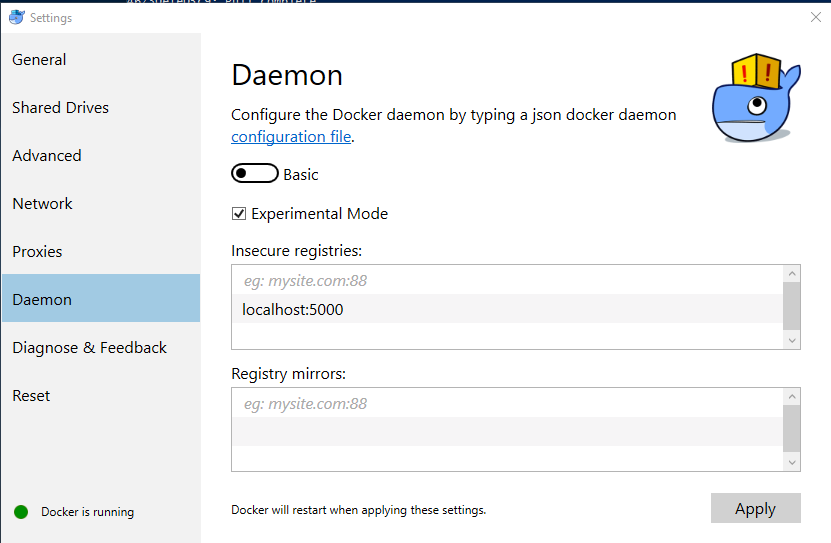

# Part 1 - Running a Registry Container in Linux

There are several ways to run a registry container. The simplest is to run an insecure registry over HTTP, but for that we need to configure Docker to explicitly allow insecure access to the registry. 

Docker expects all registries to run on HTTPS. The next section of this lab will introduce a secure version of our registry container, but for this part of the tutorial we will run a version on HTTP. When registering a image, Docker returns an error message like this:
```
http: server gave HTTP response to HTTPS client
```
The Docker Engine needs to be explicitly setup to use HTTP for the insecure registry. Edit or create `/etc/docker/docker` file: 
```
$ sudo vi /etc/docker/docker

# add this line
DOCKER_OPTS="--insecure-registry localhost:5000"
```
Close and save the file, then restart the docker daemon.
```
$ sudo service docker restart
```
In Docker for Mac, the `Preferences` menu lets you set the address for an insecure registry under the `Daemon` panel:


In Docker for Windows, the `Settings` menu lets you set the address for an insecure registry under the `Daemon` panel:

## Testing the Registry Image
First we'll test that the registry image is working correctly, by running it without any special configuration:
```
$ sudo docker run -d -p 5000:5000 --name registry registry:2
```
## Understanding Image Names
Typically we work with images from the Docker Store, which is the default registry for the Docker Engine. Commands using just the image repository name work fine, like this:
```
$ sudo docker pull hello-world
```
`hello-world` is the repository name, which we are using as a short form of the full image name. The full name is `docker.io/hello-world:latest`. That breaks down into three parts:

- `docker.io` - the hostname of the registry which stores the image;
- `hello-world` - the repository name, in this case in `{imageName}` format;
- `latest` - the image tag.

If a tag isn't specified, then the default `latest` is used. If a registry hostname isn't specified then the default `docker.io` for Docker Store is used. If you want to use images with any other registry, you need to explicitly specify the hostname - the default is always Docker Store, you can't change to a different default registry.

With a local registry, the hostname and the custom port used by the registry is the full registry address, e.g. `localhost:5000`. 
```
$ hostname
```

## Pushing and Pulling from the Local Registry

Docker uses the hostname from the full image name to determine which registry to use. We can build images and include the local registry hostname in the image tag, or use the `docker tag` command to add a new tag to an existing image.

These commands pull a public image from Docker Store, tag it for use in the private registry with the full name `localhost:5000/hello-world`, and then push it to the registry:

```
$ sudo docker tag hello-world localhost:5000/hello-world
$ sudo docker push localhost:5000/hello-world
```

When you push the image to your local registry, you'll see similar output to when you push a public image to the Hub:

```
The push refers to a repository [localhost:5000/hello-world]
a55ad2cda2bf: Pushed
cfbe7916c207: Pushed
fe4c16cbf7a4: Pushed
latest: digest: sha256:79e028398829da5ce98799e733bf04ac2ee39979b238e4b358e321ec549da5d6 size: 948
```
On the local machine, you can remove the new image tag and the original image, and pull it again from the local registry to verify it was correctly stored:
```
$ sudo docker rmi localhost:5000/hello-world
$ sudo docker rmi hello-world
$ sudo docker pull localhost:5000/hello-world
```
That exercise shows the registry works correctly, but at the moment it's not very useful because all the image data is stored in the container's writable storage area, which will be lost when the container is removed. To store the data outside of the container, we need to mount a host directory when we start the container.

## Running a Registry Container with External Storage
Remove the existing registry container by removing the container which holds the storage layer. Any images pushed will be deleted:
```
$  sudo docker kill registry
$  sudo docker rm registry
```
In this example, the new container will use a host-mounted Docker volume. When the registry server in the container writes image layer data, it appears to be writing to a local directory in the container but it will be writing to a directory on the host.

Create the registry:
```
$ mkdir registry-data
$  sudo docker run -d -p 5000:5000 \ 
--name registry \
-v `pwd`/registry-data:/var/lib/registry \ 
registry:2
```
Tag and push the container with the new IP address of the registry.
```
docker tag hello-world localhost:5000/hello-world
docker push localhost:5000/hello-world
```
Repeating the previous `docker push` command uploads an image to the registry container, and the layers will be stored in the container's `/var/lib/registry` directory, which is actually mapped to the `$(pwd)/registry-data` directory on you local machine. The `tree` command will show the directory structure the registry server uses:

```
$ tree registry-data
.
|____docker
| |____registry
| | |____v2
| | | |____blobs
| | | | |____sha256
| | | | | |____1f
| | | | | | |____1fad42e8a0d9781677d366b1100defcadbe653280300cf62a23e07eb5e9d3a41

...
```
Storing data outside of the container means we can build a new version of the registry image and replace the old container with a new one using the same host mapping - so the new registry container has all the images stored by the previous container.

Using an insecure registry also isn't practical in multi-user scenarios. Effectively there's no security so anyone can push and pull images if they know the registry hostname. The registry server supports authentication, but only over a secure SSL connection. We'll run a secure version of the registry server in a container next.

## Next

- [Part 2 - Running a Secured Registry Container](part-2.md)