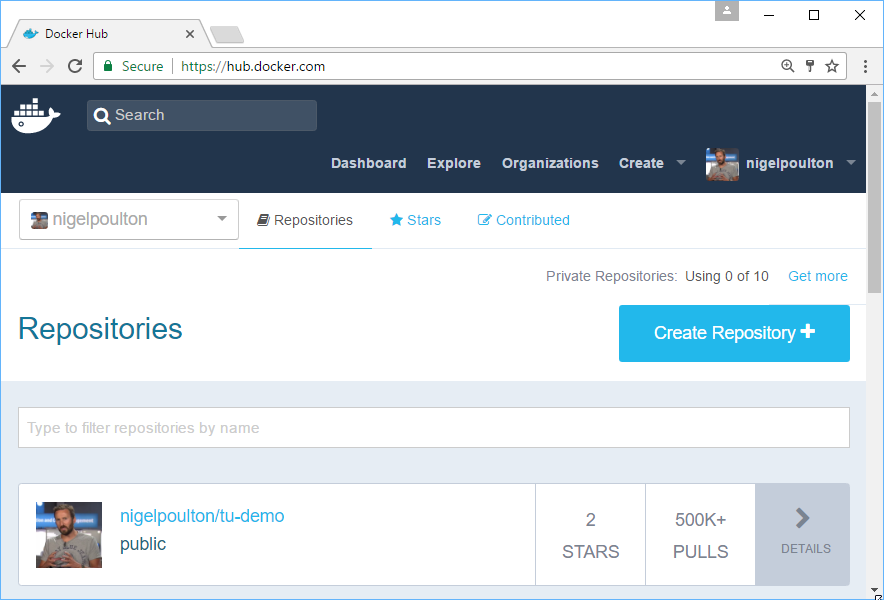
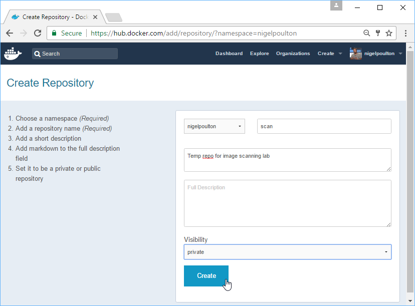

# Security Scanning with Docker Hub

# Lab Meta

> **Difficulty**: Beginner

> **Time**: Approximately 10 minutes

In this lab you'll learn how to use Docker Security Scanning with Docker Hub
*private repositories*.

You will complete the following steps as part of this lab.

- [Step 1 - Create a private Hub repo](#repo)
- [Step 2 - Pull an image](#pull)
- [Step 3 - Tag and push an image](#tag_push)
- [Step 4 - View scan results](#results)
- [Step 4 - Clean-up](#clean)

# Prerequisites

You will need all of the following to complete this lab:

- A Docker host running **Docker 1.13** or higher
- A **Docker ID** with at least one spare private repository on Docker Hub

# <a name="pull"></a>Step 1: Create a private Hub repo

Docker Security Scanning is a service currently offered for images stored in
Docker Hub private repositories. In this step you will create a new private
repository within your Docker Hub namespace.

>NOTE: This step assumes that you have a DockerHub account that will allow you
to create a new private repo. If you have used all of the private repos on your
account you will need to re-use one of them. If you do this you will need to
take care not to interfere with images you already have stored in the repo. The
only alternative is to upgrade to a plan that offers more private repos.

1. Log in to Docker Hub with your Docker ID.

2. Click the `Create Repository +` button.

  

3. Give the repo a `name`, `short description`, and make sure that
`Visibility=private` then click `Create`.

  

Now that you have created a new **private** Docker Hub repo, you can proceed to
the next step.

# <a name="pull"></a>Step 2: Pull an image

In this step you'll pull an image that you will use in Step 3.

1. Use the `docker pull` command to pull a copy of the `alpine:edge` image.

  ```
  node1$ docker image pull alpine:edge
  edge: Pulling from library/alpine
  71c5a0cc58e4: Pull complete
  Digest: sha256:99588bc8883c955c157...0c223e6c7cabca5f600a3e9f8d5cd
  Status: Downloaded newer image for alpine:edge
  ```

2. Confirm that the image was pulled successfully.

  ```
  node1$ docker image ls
  REPOSITORY   TAG         IMAGE ID         CREATED         SIZE
  alpine       edge        8914de95a28d     2 weeks ago     4 MB
  ```

You will use this image in the next step.


# <a name="tag_push"></a>Step 3: Tag and push an image

In this step you'll `tag` the image that you pulled in the previous step so
that it is associated with the **private** Docker Hub repo you created in Step 1.

Be sure to substitute `nigelpoulton` with your own Docker ID in the steps below.

1. Tag the image so that it can be pushed to your newly created repo.

  ```
  node1$ docker image tag alpine:edge nigelpoulton/scan:v1
  ```

  This command has tagged the `alpine:edge` image so that it can be pushed to
  the `nigelpoulton/scan` repo (remember to replace `nigelpoulton` with your
  own Docker ID). It has also given it the `v1` tag.

2. Verify that the new tag exists.

   ```
   node1$ docker image ls
   REPOSITORY          TAG       IMAGE ID         CREATED         SIZE
   alpine              edge      8914de95a28d     2 weeks ago     4 MB
   nigelpoulton/scan   v1        8914de95a28d     2 weeks ago     4 MB
   ```

  Notice that both lines show the same `IMAGE ID` but have different values for
  `REPOSITORY` and `TAG`. This is because the exact same image has been tagged
  twice.

3. From the CLI of your Docker host, login to Docker Hub with your Docker ID.

  Be sure to use your own Docker ID.

  ```
  node1$ docker login
  Username: nigelpoulton
  Password:
  Login Succeeded
  ```

4. Push the newly tagged image.

  Be sure to substitute the image tag below with the correct image from your
  own environment.

  ```
  node1$ docker image push nigelpoulton/scan:v1
  The push refers to a repository [docker.io/nigelpoulton/scan]
  ff7d0c6cd736: Mounted from library/alpine
  v1: digest: sha256:99588bc8883c9...5f600a3e9f8d5cd size: 528
  ```

Congratualtions. In this step you tagged and pushed an image to your newly
created *private repo* on Docker Hub.

# <a name="results"></a>Step 4: View scan results

In this step you'll log back in to Docker Hub and view the scan results of the
image you pushed in Step 3.

If you followed the exercise and used the `alpine:edge` image, the scanning
may have completed by the time you log back in to Docker Hub. If you used a
different image, especially a larger image, it might take longer for the image
scan to complete.

1. Log back in to Docker Hub from your web browser.

2. Navigate to the repo you created in Step 1 and click the `Tags` tab.

3. View the high-level scan results and feel free to click into them for more
details.

  If the scan is still in progress you may want to grab a coffee and refresh
  the page in a couple of minutes. There are occasions when scan jobs can get
  queued and take a while to complete. If your scan is taking a long time to
  complete it might be worth searching Docker Hub for the `alpine:edge` image
  and exploring the scan results of that image.

**Congratulations**, you have completed this lab Security Scanning with Docker
Hub.

# <a name="clean"></a>Step 5: Clean-up

In this step you will remove all images and containers on the host and clean up any other artifacts created in this lab.


1. Remove all images on the host.

   This command will remove **all** images on your Docker host. Only perform this step if you know you will not use these images again.

   ```
   $ docker image rm $(docker image ls -aq)
   <Snip>
   ```
2. Remove all containers on the host.

   This command will remove **all** containers on your Docker host. Only perform this step if you know you know you do not need any of the containers running on your system.

   ```
   $ docker container rm $(docker container ls -q) -f
   <Snip>
   ```

3. Log on to Docker Hub and delete the repository that you created for this demo.

   `click on the repo` > `click on the Settings tabe of the repo` > `click Delete` and follow the instructions.
