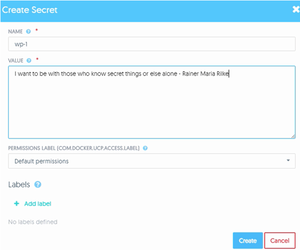
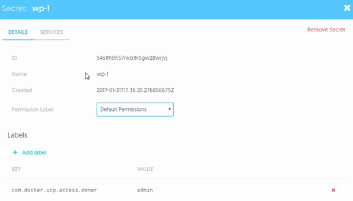
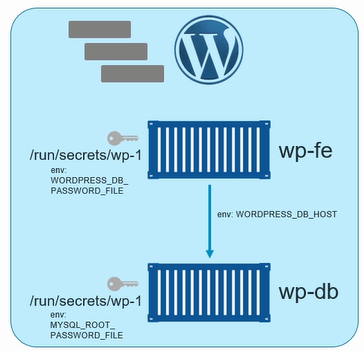
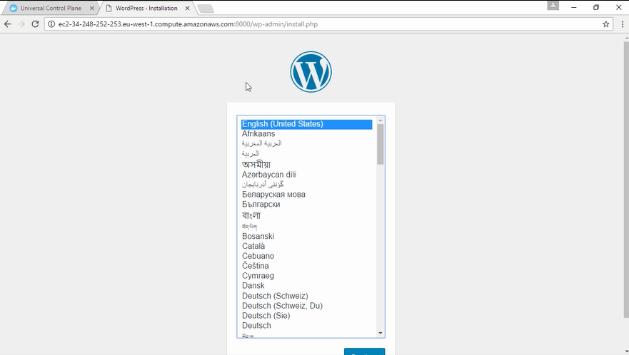

# Secrets

# Lab Meta

> **Difficulty**: Intermediate

> **Time**: Approximately 15 minutes

In this lab you'll learn how to use Docker Universal Control Plane (UCP) to
create a *secret* and use it with an application.

You will complete the following steps as part of this lab.

- [Step 1 - Create a Secret](#secret)
- [Step 2 - Deploy an App](#deploy)
- [Step 3 - Test the App](#test)
- [Step 4 - View the Secret](#view)

# Prerequisites

You will need all of the following to complete this lab:

- A UCP cluster comprising nodes running **Docker 1.13** or higher
- The public IP or public DNS name of at least one of your UCP cluster nodes
- An account in UCP with permission to create secrets and deploy applications


# <a name="secret"></a>Step 1: Create a Secret

In this step you'll use the UCP web UI to create a new *secret*.

1. Login in to UCP (your lab instructor will provide you with account details).

2. From within UCP click `Resources` > `Secrets` > `+ Create Secret`.

3. In the **NAME** field give the secret a name. The name is arbitrary but must
be unique.

4. Enter a text string as the **VALUE** of the secret.

5. Leave all other options as their default values.

  The screenshot below shows a secret called **wp-1** with some plain text as
  the value of the secret.

  

The screenshot below shows the **DETAILS** of the secret including its `ID`,
`Name`, and `Permissions Label`. Notice that you cannot view the value of the
secret from with in the UCP UI. This is because it is stored securely in the
cluster store. You can also click on the **SERVICES** tab to see any
services/applications that are using the secret. Right now there will be no
services using the secret.



Congratulations, you've created a secret. The next step will show you how to
deploy an application that will use it.


# <a name="deploy"></a>Step 2: Deploy the App

In this step we'll deploy a simple WordPress app. To do that we'll complete the
following high level tasks:

- Create a network for application
- Create a service for the front-end portion of the application
- Create a service for the back-end portion of the application

Perform all of the following actions from the UCP web UI.

1. Click the `Resources` tab > `Networks` > `+ Create Network`.

2. Name the network **wp-net** and leave everything else as defaults.

3. Click `Create` to create the network.

  The `wp-net` is now created and ready to be used by the app.

4. Click `Services` from within the `Resources` tab and then click `Create a
Service`.

5. Give the service the following values and leave all others as default:

  - **Details tab\SERVICE NAME**: wp-db
  - **Details tab\IMAGE NAME**: mysql:5.7
  - **Resources tab\NETWORKS**: wp-net
  - **Environment tab\SECRET NAME**: wp-1
  - **Environment tab\ENVIRONMENT VARIABLE NAME**: MYSQL_ROOT_PASSWORD_FILE
  - **Environment tab\ENVIRONMENT VARIABLE VALUE**: /run/secrets/wp-1  

  Let's quickly cover the 6 values we've configured as per above. The service
  name is arbitrary, but `wp-db` suggests it will be our WordPress database. We
  are using the `mysql:5.7` image because we know this works with the demo. We
  are attaching the service to the `wp-net` network and we are telling it to use
  the `wp-1` secret we created in Step 1.

  The application also needs to know where to find the secret that will give it
  access to the database. It expects this value in an environment variable
  called `MYSQL_ROOT_PASSWORD_FILE`. By default, Docker will mount secrets into
  the container filesystem at `/run/secrets/<secret-name>`, so we tell the
  application to expect the secret in the `/run/secrets/wp-1` file. This is
  mounted as an in-memory read-only filesystem.

6. Click `Deploy Now` to deploy the service.

7. Deploy the front-end service by clicking `Services` from within the
`Resources` tab and then click `Create a Service`.

8. Give the service the following values and leave all others as default:

  - **Details tab\SERVICE NAME**: wp-fe
  - **Details tab\IMAGE NAME**: wordpress:latest
  - **Resources tab\Ports\INTERNAL PORT**: 80
  - **Resources tab\Ports\PUBLIC PORT**: 8000
  - **Resources tab\NETWORKS**: wp-net
  - **Environment tab\SECRET NAME**: wp-1
  - **Environment tab\ENVIRONMENT VARIABLE NAME**: WORDPRESS_DB_PASSWORD_FILE
  - **Environment tab\ENVIRONMENT VARIABLE VALUE**: /run/secrets/wp-1
  - **Environment tab\ENVIRONMENT VARIABLE NAME**: WORDPRESS_DB_HOST
  - **Environment tab\ENVIRONMENT VARIABLE VALUE**: wp-db:3306

  We are calling this service `wp-fe` indicating it is the WorPress front-end.
  We're telling it to use the `wordpress:latest` image and expose port `80` from
  the service/container on port `8000` on the host - this will allow us to
  connect to the service on port `8000` in a later step. We're attaching it to
  the same `wp-net` network and mounting the same secret. This time we're
  adding an additional environment variable `WORDPRESS_DB_HOST=wp-db:3306`.
  This is telling the service that it can talk to the database backend via a
  service called `wp-db` on port `3306`.

9. Click `Deploy Now` to deploy the service

The application is now deployed!

As shown in the diagram below you have deployed two services. `wp-fe` is the
application's web front end, and `wp-db` is the application's database back-end.
Both services are deployed on the `wp-net` network and both have the `wp-1`
secret mounted to a file called `wp-1` in the `/run/secrets` in-memory
filesystem. You also inserted environment variables into each service telling
them things like where to find the database service and where to find the
secret.



You also published the web front end portion of the application (the `wp-fe`
  service) on port `8000`. This means that you should be able to connect to the
  application on port `8000` of any of the nodes in your DDC/UCP cluster.


# <a name="test"></a>Step 3: Test the Application

In this step you will use a web browser to connect to the application. You will
know the application is working correctly if the web page renders correctly and
there are no database related errors displayed.

1. Open a web browser and point it to the public IP or DNS name of any of the
nodes in your UCP cluster on port `8000`

  > NOTE: Your lab instructor will be able to give you details of the public IP
or public DNS of your UCP nodes.

  


# <a name="view"></a>Step 3: View the Secret

In this step you'll log on to the terminal of the container in the `web-fe`
service and verify that the secret is present.

Perform all of the following steps from within the UCP web UI.

1. Click the `Resources` tab > `Services` and click on the `web-fe` service.

2. Click the `Tasks` tab.

3. Click the running task (there will only be one).

4. Click the `Console` tab for the task.

5. Make sure that the command to run is showing as `sh` and then click `Run`.

  You are now on the terminal of the `web-fe` service's container.

6. Run the following command to verify that the secret file exists.

    ```
    # ls -l /run/secrets/
    total 4
    -r--r--r--  1  root  root  81 Mar 17 10:20   wp-1
    ```

  The `/run/secrets/` directory is mounted read-only as an in-memory
  filesystem that is only mounted into this container and using reserved
  memory on the Docker host. This ensures it's contents are secure.

7. View the contents of the secret.

    ```
    # cat /run/secrets/wp-1
    I want to be with those who know secret things or else alone - Rainer Maria Rilke
    ```

  The contents of the secret are visible as unencrypted plain text. This is so
  that applications can use them as passwords. However, they are issued to the
  container via a secure network and mounted as read-only in an in-memory
  filesystem that is not accessible to the Docker host or other containers
  (unless other containers have also been granted access to it).


**Congratulations**, you have completed this lab on Secrets management.
