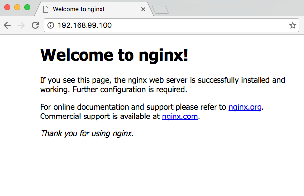
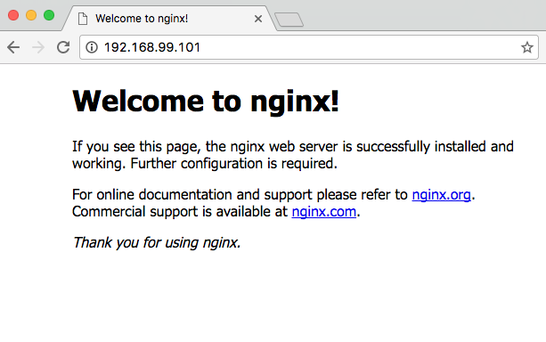

# Docker Swarm Tutorial
> **Note:** This tutorial uses Docker Machine to simulate multiple machines on your desktop. There's an easier way to learn swarm mode, and that is using [Play with Docker](http://training.play-with-docker.com/swarm-mode-intro/). This tutorial is preserved for legacy reasons, and also in case you really want to learn to do this on your own machine.

Docker includes swarm mode for natively managing a cluster of Docker Engines called a swarm. You can use the Docker CLI to create a swarm, deploy application services to a swarm, and manage swarm behavior. This tutorial uses [Docker Machine](https://docs.docker.com/machine/) to create multiple nodes on your desktop. If you prefer you can create those nodes in your own cloud or on multiple machines.

> **Important Note**
You don't need to use the Docker CLI to perform these operations. You can use `docker stack deploy --compose-file STACKNAME.yml STACKNAME` instead. For an introduction to using a stack file in a compose file format to deploy an app, check out [Deploying an app to a Swarm](https://github.com/docker/labs/blob/master/beginner/chapters/votingapp.md).

## Preparation
You need to have Docker and Docker Machine installed on your system. [Download Docker](https://docker.com/getdocker) for your platform and install it.

> **Tips:**
>
* If you are using Docker for Mac or Docker for Windows, you already have Docker Machine, as it is installed with those applications. See [Download Docker for Mac](https://docs.docker.com/docker-for-mac/#/download-docker-for-mac) and [Download Docker for Windows](https://docs.docker.com/docker-for-windows/#/download-docker-for-windows) for install options and details on what gets installed.
>
* If you are using Docker for Windows you will need to use the Hyper-V driver for Docker Machine. That will require a bit more set-up. See the [Microsoft Hyper-V driver documentation](https://docs.docker.com/machine/drivers/hyper-v/) for directions on setting it up.
>
* If you are using Docker directly on a Linux system, you will need to [install Docker Machine](https://docs.docker.com/machine/install-machine/) (after installing [Docker Engine](https://docs.docker.com/engine/installation/linux/)).

## Creating the nodes and Swarm
[Docker Machine](https://docs.docker.com/machine/overview/) can be used to:
* Install and run Docker on Mac or Windows
* Provision and manage multiple remote Docker hosts
* Provision Swarm clusters

But it can also be used to create multiple nodes on your local machine. There's a [bash script](https://github.com/docker/labs/blob/master/swarm-mode/beginner-tutorial/swarm-node-vbox-setup.sh) in this repository that does just that and creates a swarm. There's also [a powershell Hyper-V version](https://github.com/docker/labs/blob/master/swarm-mode/beginner-tutorial/swarm-node-hyperv-setup.ps1). On this page we're walking through the bash script, but the steps, aside from set-up, are a basically the same for the Hyper-V version.

This first step creates three machines, and names the machines manager1, manager2, and manager3
```
#!/bin/bash

# Swarm mode using Docker Machine

#This configures the number of workers and managers in the swarm
managers=3
workers=3

# This creates the manager machines
echo "======> Creating $managers manager machines ...";
for node in $(seq 1 $managers);
do
	echo "======> Creating manager$node machine ...";
	docker-machine create -d virtualbox manager$node;
done
```

This second step creates three more machines, and names them worker1, worker2, and worker3
```
# This create worker machines
echo "======> Creating $workers worker machines ...";
for node in $(seq 1 $workers);
do
	echo "======> Creating worker$node machine ...";
	docker-machine create -d virtualbox worker$node;
done

# This lists all machines created
docker-machine ls
```

Next you create a swarm by initializing it on the first manager. You do this by using `docker-machine ssh` to run `docker swarm init`
```
# initialize swarm mode and create a manager
echo "======> Initializing first swarm manager ..."
docker-machine ssh manager1 "docker swarm init --listen-addr $(docker-machine ip manager1) --advertise-addr $(docker-machine ip manager1)"
```
Next you get join tokens for managers and workers.

```
# get manager and worker tokens
export manager_token=`docker-machine ssh manager1 "docker swarm join-token manager -q"`
export worker_token=`docker-machine ssh manager1 "docker swarm join-token worker -q"`
```

Then join the other masters to the Swarm
```
for node in $(seq 2 $managers);
do
	echo "======> manager$node joining swarm as manager ..."
	docker-machine ssh manager$node \
		"docker swarm join \
		--token $manager_token \
		--listen-addr $(docker-machine ip manager$node) \
		--advertise-addr $(docker-machine ip manager$node) \
		$(docker-machine ip manager1)"
done
```

Finally, add the worker machines and join them to the swarm.
```
# workers join swarm
for node in $(seq 1 $workers);
do
	echo "======> worker$node joining swarm as worker ..."
	docker-machine ssh worker$node \
	"docker swarm join \
	--token $worker_token \
	--listen-addr $(docker-machine ip worker$node) \
	--advertise-addr $(docker-machine ip worker$node) \
	$(docker-machine ip manager1):2377"
done

# show members of swarm
docker-machine ssh manager1 "docker node ls"
```

That last line will show you a list of all the nodes, something like this:

```
ID                           HOSTNAME  STATUS  AVAILABILITY  MANAGER STATUS
3cq6idpysa53n6a21nqe0924h    manager3  Ready   Active        Reachable
64swze471iu5silg83ls0bdip *  manager1  Ready   Active        Leader
7eljvvg0icxlw20od5f51oq8t    manager2  Ready   Active        Reachable
8awcmkj3sd9nv1pi77i6mdb1i    worker1   Ready   Active        
avu80ol573rzepx8ov80ygzxz    worker2   Ready   Active        
bxn1iivy8w7faeugpep76w50j    worker3   Ready   Active        
```
You can also find all your machines by running
```
$ docker-machine ls
NAME       ACTIVE   DRIVER       STATE     URL                         SWARM   DOCKER      ERRORS
manager1   -        virtualbox   Running   tcp://192.168.99.100:2376           v17.03.0-ce   
manager2   -        virtualbox   Running   tcp://192.168.99.101:2376           v17.03.0-ce 
manager3   -        virtualbox   Running   tcp://192.168.99.102:2376           v17.03.0-ce
worker1    -        virtualbox   Running   tcp://192.168.99.103:2376           v17.03.0-ce
worker2    -        virtualbox   Running   tcp://192.168.99.104:2376           v17.03.0-ce
worker3    -        virtualbox   Running   tcp://192.168.99.105:2376           v17.03.0-ce
```

The next step is to create a service and list out the services. This creates a single service called `web` that runs the latest nginx:
```
$ docker-machine ssh manager1 "docker service create -p 80:80 --name web nginx:latest"
$ docker-machine ssh manager1 "docker service ls"
ID            NAME  REPLICAS  IMAGE         COMMAND
2x4jsk6313az  web   1/1       nginx:latest  
```
Now open the machine's IP address in your browser. You can see above manager1 had an IP address of 192.168.99.100


You can actually load any of the node ip addresses and get the same result because of [Swarm Mode's Routing Mesh](https://docs.docker.com/engine/swarm/ingress/).


Next let's inspect the service
```
$ docker-machine ssh manager1 "docker service inspect web"
[
    {
        "ID": "2x4jsk6313azr6g1dwoi47z8u",
        "Version": {
            "Index": 104
        },
        "CreatedAt": "2016-08-23T22:43:23.573253682Z",
        "UpdatedAt": "2016-08-23T22:43:23.576157266Z",
        "Spec": {
            "Name": "web",
            "TaskTemplate": {
                "ContainerSpec": {
                    "Image": "nginx:latest"
                },
                "Resources": {
                    "Limits": {},
                    "Reservations": {}
                },
                "RestartPolicy": {
                    "Condition": "any",
                    "MaxAttempts": 0
                },
                "Placement": {}
            },
            "Mode": {
                "Replicated": {
                    "Replicas": 1
                }
            },
            "UpdateConfig": {
                "Parallelism": 1,
                "FailureAction": "pause"
            },
            "EndpointSpec": {
                "Mode": "vip",
                "Ports": [
                    {
                        "Protocol": "tcp",
                        "TargetPort": 80,
                        "PublishedPort": 80
                    }
                ]
            }
        },
        "Endpoint": {
            "Spec": {
                "Mode": "vip",
                "Ports": [
                    {
                        "Protocol": "tcp",
                        "TargetPort": 80,
                        "PublishedPort": 80
                    }
                ]
            },
            "Ports": [
                {
                    "Protocol": "tcp",
                    "TargetPort": 80,
                    "PublishedPort": 80
                }
            ],
            "VirtualIPs": [
                {
                    "NetworkID": "24r1loluvdohuzltspkwbhsc8",
                    "Addr": "10.255.0.9/16"
                }
            ]
        },
        "UpdateStatus": {
            "StartedAt": "0001-01-01T00:00:00Z",
            "CompletedAt": "0001-01-01T00:00:00Z"
        }
    }
]
```

That's lots of info! Now, let's scale the service:
```
$ docker-machine ssh manager1 "docker service scale web=15"
web scaled to 15
$ docker-machine ssh manager1 "docker service ls"
ID            NAME  REPLICAS  IMAGE         COMMAND
2x4jsk6313az  web   15/15     nginx:latest  
```
Docker has spread the 15 services evenly over all of the nodes
```
$ docker-machine ssh manager1 "docker service ps web"
ID                         NAME    IMAGE         NODE      DESIRED STATE  CURRENT STATE           ERROR
61wjx0zaovwtzywwbomnvjo4q  web.1   nginx:latest  worker3   Running        Running 13 minutes ago  
bkkujhpbtqab8fyhah06apvca  web.2   nginx:latest  manager1  Running        Running 2 minutes ago   
09zkslrkgrvbscv0vfqn2j5dw  web.3   nginx:latest  manager1  Running        Running 2 minutes ago   
4dlmy8k72eoza9t4yp9c9pq0w  web.4   nginx:latest  manager2  Running        Running 2 minutes ago   
6yqabr8kajx5em2auvfzvi8wi  web.5   nginx:latest  manager3  Running        Running 2 minutes ago   
21x7sn82883e7oymz57j75q4q  web.6   nginx:latest  manager2  Running        Running 2 minutes ago   
14555mvu3zee6aek4dwonxz3f  web.7   nginx:latest  worker1   Running        Running 2 minutes ago   
1q8imt07i564bm90at3r2w198  web.8   nginx:latest  manager1  Running        Running 2 minutes ago   
encwziari9h78ue32v5pjq9jv  web.9   nginx:latest  worker3   Running        Running 2 minutes ago   
aivwszsjhhpky43t3x7o8ezz9  web.10  nginx:latest  worker2   Running        Running 2 minutes ago   
457fsqomatl1lgd9qbz2dcqsb  web.11  nginx:latest  worker1   Running        Running 2 minutes ago   
7chhofuj4shhqdkwu67512h1b  web.12  nginx:latest  worker2   Running        Running 2 minutes ago   
7dynic159wyouch05fyiskrd0  web.13  nginx:latest  worker1   Running        Running 2 minutes ago   
7zg9eki4610maigr1xwrx7zqk  web.14  nginx:latest  manager3  Running        Running 2 minutes ago   
4z2c9j20gwsasosvj7mkzlyhc  web.15  nginx:latest  manager2  Running        Running 2 minutes ago   
```

You can also drain a particular node, that is remove all services from that node. The services will automatically be rescheduled on other nodes.
```
$ docker-machine ssh manager1 "docker node update --availability drain worker1"
worker1
$ docker-machine ssh manager1 "docker service ps web"
ID                         NAME        IMAGE         NODE      DESIRED STATE  CURRENT STATE           ERROR
61wjx0zaovwtzywwbomnvjo4q  web.1       nginx:latest  worker3   Running        Running 15 minutes ago  
bkkujhpbtqab8fyhah06apvca  web.2       nginx:latest  manager1  Running        Running 4 minutes ago   
09zkslrkgrvbscv0vfqn2j5dw  web.3       nginx:latest  manager1  Running        Running 4 minutes ago   
4dlmy8k72eoza9t4yp9c9pq0w  web.4       nginx:latest  manager2  Running        Running 4 minutes ago   
6yqabr8kajx5em2auvfzvi8wi  web.5       nginx:latest  manager3  Running        Running 4 minutes ago   
21x7sn82883e7oymz57j75q4q  web.6       nginx:latest  manager2  Running        Running 4 minutes ago   
8so0xi55kqimch2jojfdr13qk  web.7       nginx:latest  worker3   Running        Running 3 seconds ago   
14555mvu3zee6aek4dwonxz3f   \_ web.7   nginx:latest  worker1   Shutdown       Shutdown 4 seconds ago  
1q8imt07i564bm90at3r2w198  web.8       nginx:latest  manager1  Running        Running 4 minutes ago   
encwziari9h78ue32v5pjq9jv  web.9       nginx:latest  worker3   Running        Running 4 minutes ago   
aivwszsjhhpky43t3x7o8ezz9  web.10      nginx:latest  worker2   Running        Running 4 minutes ago   
738jlmoo6tvrkxxar4gbdogzf  web.11      nginx:latest  worker2   Running        Running 3 seconds ago   
457fsqomatl1lgd9qbz2dcqsb   \_ web.11  nginx:latest  worker1   Shutdown       Shutdown 3 seconds ago  
7chhofuj4shhqdkwu67512h1b  web.12      nginx:latest  worker2   Running        Running 4 minutes ago   
4h7zcsktbku7peh4o32mw4948  web.13      nginx:latest  manager3  Running        Running 3 seconds ago   
7dynic159wyouch05fyiskrd0   \_ web.13  nginx:latest  worker1   Shutdown       Shutdown 4 seconds ago  
7zg9eki4610maigr1xwrx7zqk  web.14      nginx:latest  manager3  Running        Running 4 minutes ago   
4z2c9j20gwsasosvj7mkzlyhc  web.15      nginx:latest  manager2  Running        Running 4 minutes ago   
```

You can check out the nodes and see that `worker1` is still active but drained.
```
$ docker-machine ssh manager1 "docker node ls"
ID                           HOSTNAME  STATUS  AVAILABILITY  MANAGER STATUS
3cq6idpysa53n6a21nqe0924h    manager3  Ready   Active        Reachable
64swze471iu5silg83ls0bdip *  manager1  Ready   Active        Leader
7eljvvg0icxlw20od5f51oq8t    manager2  Ready   Active        Reachable
8awcmkj3sd9nv1pi77i6mdb1i    worker1   Ready   Drain         
avu80ol573rzepx8ov80ygzxz    worker2   Ready   Active        
bxn1iivy8w7faeugpep76w50j    worker3   Ready   Active
```

You can also scale down the service
```
$ docker-machine ssh manager1 "docker service scale web=10"
web scaled to 10
$ docker-machine ssh manager1 "docker service ps web"
ID                         NAME        IMAGE         NODE      DESIRED STATE  CURRENT STATE            ERROR
61wjx0zaovwtzywwbomnvjo4q  web.1       nginx:latest  worker3   Running        Running 22 minutes ago   
bkkujhpbtqab8fyhah06apvca  web.2       nginx:latest  manager1  Shutdown       Shutdown 54 seconds ago  
09zkslrkgrvbscv0vfqn2j5dw  web.3       nginx:latest  manager1  Running        Running 11 minutes ago   
4dlmy8k72eoza9t4yp9c9pq0w  web.4       nginx:latest  manager2  Running        Running 11 minutes ago   
6yqabr8kajx5em2auvfzvi8wi  web.5       nginx:latest  manager3  Running        Running 11 minutes ago   
21x7sn82883e7oymz57j75q4q  web.6       nginx:latest  manager2  Running        Running 11 minutes ago   
8so0xi55kqimch2jojfdr13qk  web.7       nginx:latest  worker3   Running        Running 7 minutes ago    
14555mvu3zee6aek4dwonxz3f   \_ web.7   nginx:latest  worker1   Shutdown       Shutdown 7 minutes ago   
1q8imt07i564bm90at3r2w198  web.8       nginx:latest  manager1  Running        Running 11 minutes ago   
encwziari9h78ue32v5pjq9jv  web.9       nginx:latest  worker3   Shutdown       Shutdown 54 seconds ago  
aivwszsjhhpky43t3x7o8ezz9  web.10      nginx:latest  worker2   Shutdown       Shutdown 54 seconds ago  
738jlmoo6tvrkxxar4gbdogzf  web.11      nginx:latest  worker2   Running        Running 7 minutes ago    
457fsqomatl1lgd9qbz2dcqsb   \_ web.11  nginx:latest  worker1   Shutdown       Shutdown 7 minutes ago   
7chhofuj4shhqdkwu67512h1b  web.12      nginx:latest  worker2   Running        Running 11 minutes ago   
4h7zcsktbku7peh4o32mw4948  web.13      nginx:latest  manager3  Running        Running 7 minutes ago    
7dynic159wyouch05fyiskrd0   \_ web.13  nginx:latest  worker1   Shutdown       Shutdown 7 minutes ago   
7zg9eki4610maigr1xwrx7zqk  web.14      nginx:latest  manager3  Shutdown       Shutdown 54 seconds ago  
4z2c9j20gwsasosvj7mkzlyhc  web.15      nginx:latest  manager2  Shutdown       Shutdown 54 seconds ago  
```

Now bring `worker1` back online and show it's new availability
```
$ docker-machine ssh manager1 "docker node update --availability active worker1"
worker1
$ docker-machine ssh manager1 "docker node inspect worker1 --pretty"
ID:			8awcmkj3sd9nv1pi77i6mdb1i
Hostname:		worker1
Joined at:		2016-08-23 22:30:15.556517377 +0000 utc
Status:
 State:			Ready
 Availability:		Active
Platform:
 Operating System:	linux
 Architecture:		x86_64
Resources:
 CPUs:			1
 Memory:		995.9 MiB
Plugins:
  Network:		bridge, host, null, overlay
  Volume:		local
Engine Version:		17.03.0-ce
Engine Labels:
 - provider = virtualbox
 ```

Now let's take the manager1 node, the leader, out of the Swarm
```
$ docker-machine ssh manager1 "docker swarm leave --force"
Node left the swarm.
```

Wait about 30 seconds just to be sure. The Swarm still functions, but must elect a new leader. This happens automatically.
```
$ docker-machine ssh manager2 "docker node ls"
ID                           HOSTNAME  STATUS  AVAILABILITY  MANAGER STATUS
3cq6idpysa53n6a21nqe0924h    manager3  Ready   Active        Reachable
64swze471iu5silg83ls0bdip    manager1  Down    Active        Unreachable
7eljvvg0icxlw20od5f51oq8t *  manager2  Ready   Active        Leader
8awcmkj3sd9nv1pi77i6mdb1i    worker1   Ready   Active        
avu80ol573rzepx8ov80ygzxz    worker2   Ready   Active        
bxn1iivy8w7faeugpep76w50j    worker3   Ready   Active
```
You see that `manager1` is Down and Unreachable and `manager2` has been elected leader. It's also easy to remove a service:
```
$ docker-machine ssh manager2 "docker service rm web"
web
```

## Cleanup
There's also a [bash script](https://github.com/ManoMarks/labs/blob/master/swarm-mode/beginner-tutorial/swarm-node-vbox-teardown.sh) that will clean up your machine by removing all the Docker Machines.

```
$ ./swarm-node-vbox-teardown.sh
Stopping "manager3"...
Stopping "manager2"...
Stopping "worker1"...
Stopping "manager1"...
Stopping "worker3"...
Stopping "worker2"...
Machine "manager3" was stopped.
Machine "manager1" was stopped.
Machine "manager2" was stopped.
Machine "worker2" was stopped.
Machine "worker1" was stopped.
Machine "worker3" was stopped.
About to remove worker1, worker2, worker3, manager1, manager2, manager3
Are you sure? (y/n): y
Successfully removed worker1
Successfully removed worker2
Successfully removed worker3
Successfully removed manager1
Successfully removed manager2
Successfully removed manager3
```  

## Next steps
Check out the documentation on [Docker Swarm Mode](https://docs.docker.com/engine/swarm/) for more information.
