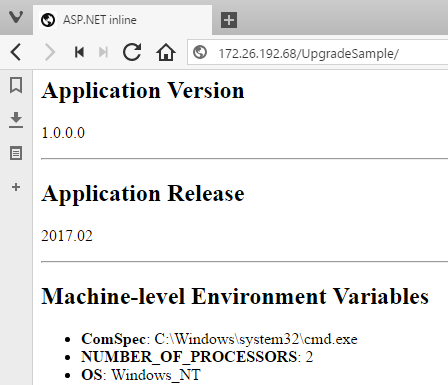

# Packaging ASP.NET Apps as Docker Images

A Docker image packages your application and all the dependencies it needs to run into one unit. Microsoft maintain the [microsoft/aspnet](https://store.docker.com/images/aspnet) image on Docker Store, which you can use as the basis for your own application images. It is based on [microsoft/windowsservercore](https://store.docker.com/images/windowsservercore/) and has IIS and ASP.NET already installed. 

In this lab I start with an MSI that deploys a web app onto a server and expects IIS and ASP.NET to be configured. If you already have a scripted build process then you may have MSIs or Web Deploy packages already being generated, and it's easy to package them into a Docker image.

## Installing MSIs in Docker images

Here's the whole Dockerfile for packaging my custom web application:

```
FROM microsoft/aspnet:windowsservercore-10.0.14393.576

COPY UpgradeSample-1.0.0.0.msi /

RUN msiexec /i c:\UpgradeSample-1.0.0.0.msi RELEASENAME=2017.02 /qn
```

It's just three lines of script in the simple [Dockerfile syntax](https://docs.docker.com/engine/reference/builder/):

- `FROM` specifies the base image to use as a starting point, in this case a specific version of the ASP.NET image
- `COPY` copies the existing v1.0 application MSI from the local machine into the Docker image
- `RUN` installs the MSI using `msiexec`, with the `qn` switch to install silently, and passing a value to the custom `RELEASENAME` variable that the MSI uses

> Building Docker images is an automated process, there's no support for user input during the build. If you have an MSI which doesn't support unattended installation you'll need a different approach. That's covered in [Part 4](part-4.md).

## Building the v1.0 Application Image

Every Docker image has a unique name, and you can also tag images with additional information like application version numbers. To build the image, switch to the directory containing the Dockerfile and MSI, and run `docker build`:

```
cd .\v1.0
docker build -t dockersamples/modernize-aspnet-ops:1.0 .
```

The output from `docker build` shows you the Docker engine executing all the steps in the Dockerfile. If you don't have a copy of Microsoft's ASP.NET image locally, then Docker starts by downloading it from Docker Store.

When the build completes you'll have a new image stored locally, with the name `dockersamples/modernize-aspnet-ops` and the tag `1.0` indicating that this is version 1.0 of the app.

## Running the Application in Docker

The sample application for the lab is a simple ASP.NET WebForms app, which the MSI installs to the default IIS website running on port 80. To start the application, use `docker run` and publish the port from the container onto the host, so the website is available externally:

```
docker run -d -p 80:80 --name v1.0 dockersamples/modernize-aspnet-ops:1.0
```

- `-d` starts the container in detached mode, so Docker keeps it running in the background
- `-p` publishes port 80 on the container to port 80 on the host, so Docker directs incoming traffic into the container
- `--name` gives the container the name `v1.0`, so you can refer to it in other Docker commands

`docker ps` will show you that the container is running, together with the port mapping and the command running inside the container:

```
> docker ps
CONTAINER ID        IMAGE                                    COMMAND                   CREATED             STATUS                    PORTS                NAMES
1ab0fa9228b8        dockersamples/modernize-aspnet-ops:1.0   "C:\\ServiceMonitor..."   17 seconds ago      Up 1 second               0.0.0.0:80->80/tcp   v1.0
```

You can get basic management information about the container with `docker top v1.0` to list the running processes, and `docker logs v1.0` to view application log entries. In this case, IIS doesn't write any logs to the console so there won't be any log entries surfaced to Docker.

## Accessing the Application 

On a separate machine, you can open a browser and point to the host running your Docker container. The request enters the machine on port 80 which is mapped to the container, so Docker redirects the traffic - the application in the container handles the request and sends the response:



On the machine that's running the container, you can't browse to `localhost` and see the website, because of a [limitation in Windows networking](https://blogs.technet.microsoft.com/virtualization/2016/05/25/windows-nat-winnat-capabilities-and-limitations/). Instead you need to get the internal IP address of the container and browse to that. The `docker inspect` command tells you all about a running container, and you can filter the output to show just the IP address:

```
> docker inspect --format '{{ .NetworkSettings.Networks.nat.IPAddress }}' v1.0
172.26.192.68
```

In my case the container's IP address is `172.26.192.68`, on your machine it will be different. From the local machine you can browse to that address and see the website.

## Summary

Dockerizing an application from an existing MSI is very simple. This exampls uses a 3-line Dockerfile, a `docker build` command to create the image and a `docker run` command to start the container. Any MSI which supports unattended installation can be packaged in a Dockerfile in the same way. 

In the next step you'll see how to manage application upgrades and OS patches, by building a new Docker image and tagging it with an updated release number.

- [Part 2 - Upgrading Application Images](part-2.md)


