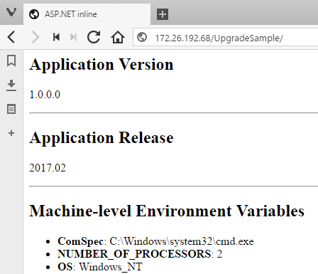
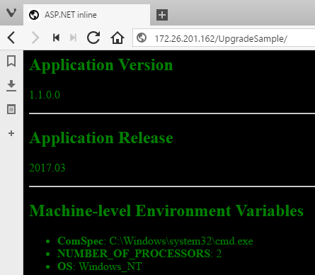

# Zero-Downtime Update and Rollback

I have two images packaging different versions of my application, and in a production Docker environment I can use the platform for automatic update and rollback between versions. To get zero-downtime deployment you need to run your application containers as a service in a Docker swarm - a cluster of machines all running Docker, which you can manage as a single unit.

You need to have Docker 1.13 running to create a swarm in Windows, and currently the networking stack which supports it is [only available in Windows 10](https://blogs.technet.microsoft.com/virtualization/2017/02/09/overlay-network-driver-with-support-for-docker-swarm-mode-now-available-to-windows-insiders-on-windows-10/). An update to Windows Server 2016 to support the functionality should be coming soon. Until then, you can test the update functionality with a single-node swarm on a Windows 10 machine.

## Initializing the swarm

[Swarm mode](https://docs.docker.com/engine/swarm/) is a clustering technology built into the Docker engine. You can join tens, hundreds or [thousands](https://sematext.com/blog/2016/10/18/docker-swarm-swarm3k/) of machines together in one swarm, and manage the whole cluster using the same `docker` CLI. Swarm mode gives you resilience and scale for your services - running them in multiple containers across many hosts. If a host goes down, Docker will recreate the lost containers on other nodes, ensuring quality of service for your applications.

In testing, you can create a swarm from a single node, using the `docker swarm init` command. On Windows, you need to specify the IP address of the host, in my case that's `192.168.1.50`:

```
> docker swarm init --listen-addr 192.168.1.50 --advertise-addr 192.168.1.50
Swarm initialized: current node (oq14rkz5hqys3nc7c0ylthwdy) is now a manager.

To add a worker to this swarm, run the following command:

    docker swarm join \
    --token SWMTKN-1-0bdfuotbv6esxq9h7eurwxz31zubncpmirruk86fvszcj6wvi2-8n7mifpyn507sdjomsmy7vyzj \
    192.168.1.50:2377

To add a manager to this swarm, run 'docker swarm join-token manager' and follow the instructions.
```

The output gives you a secret token you can use to join other nodes to the swarm. Any node with Docker running which has network access could join the swarm by running the `docker swarm join` command.

## Running v1.0 as a Service

In swarm mode, you don't run individual containers. Instead you create services and the swarm decides which engine to run the containers on. For services which run across many containers, Docker will spread them across as many hosts as possible, to maximise redundancy. To run the web app on my single-node swarm, I'll specify a replica level of 1, which means the service will run on a single container:

```
docker service create `
  --name sample `
  --publish mode=host,target=80,published=80 `
  --replicas=1 `
  dockersamples/modernize-aspnet-ops:1.0
```

- `name` - is the name of the service, this is how you refer to the service for management, and in other services that consume this one
- `publish` - maps the container port to the host port. Note that the syntax is differnt in swarm mode, but the functionality is the same
- `replicas` - the number of containers that run the service. Docker will maintain the service level by starting new containers when needed

You can check on the service with `docker service ls` and `docker service ps`. As I have a single node, the container is running on my Windows 10 machine, so I can use `docker ps` and `docker inspect` to get the IP address of the container. That shows the original version of the application:



Services in swarm mode are first-class citizens, and they can be updated using built-in platform functionality.


## Updating the App to v1.1

The update process runs against a service, and updates it to a specified image version. It does that by stopping the existing containers, and starting new ones. When you first [create a service](https://docs.docker.com/engine/reference/commandline/service_create/#/options), you can control the update behavior options - how many containers are upgraded concurrently, how long Docker should monitor new containers for errors, what action Docker should take if the new containers do error. 

In a highly-available swarm where you have a service running in many containers on many hosts, this is a zero-downtime deployment. Docker only sends traffic to active containers, so old containers won't get traffic when they're stopped, and new containers won't get traffic until they're online.

To update my service to version 1.1, I run:

```
docker service update --image dockersamples/modernize-aspnet-ops:1.1 sample
```

That tells Docker to update the `sample` service to version `1.1` of the image. On a single node there will be downtime if you request the site in the period when the old container has stopped and the new one is starting, but that should only be a couple of seconds. On an external machine, refresh the browser and you will see the new version. On the Docker host you will need to get the name and IP address of the new container, because the v1.0 container is no longer running:



Automated updates are a huge benefit of the Docker platform. Updating a distributed application in a safe, automated way takes all the risk out of deployments, and makes frequent releases possible.

## Rolling Back to v1.0

If I found an issue with version 1.1 of the application which wasn't caught in testing, I'll need to roll back to the previous version. This is also an automated feature in Docker - each service update records the details of the previous version, so you can automatically roll back.

Rollback is an option of the `docker service update` command:

```
docker service update --rollback sample
```

Rolling back is conceptually the same as updating. The existing containers are stopped, and new container created running the original image version. Browse to the site now and you will see version 1.0 running again. Automated rollback may be an even bigger benefit than automatic update. Knowing you can revert to the previous good version without any downtime and without a lengthy manual procedure gives you confidence in your deployment process, even if there are problems in the application itself.

> Rollback always returns to the previous version, and is cyclical. If you roll back from 1.1 to 1.0, and then roll back again - you'll go back to the previous running version, which was actually 1.1.


## Summary

In non-production environments you can run multiple application versions side-by-side, in different containers mapping different client ports. You can update applications on standalone Docker engines by stopping the old container and starting a new one from the updated image. There will be downtime in that approach, so it isn't suitable for production.

In this step you saw how a production-grade cluster of Docker engines, running in swarm mode, supports zero-downtime updates. That's all automated, which means a risk-free and fast deployment process. When you update you'll be deploying the exact Docker image which has been through the testing process, so there will be no envornmental configuration issues. If there is an application defect, Docker supports automatic rollback to the previous version.

So far the application package has used the MSI from an existing build process. That's a quick way to get started with Docker but it's not optimal. Next you'll learn how to package an application from source.

- [Part 4 - Packaging Applications From Source](part-4.md)