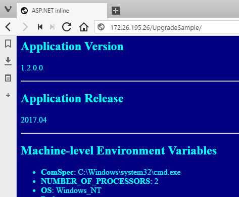

# Packaging Applications From Source

Packaging MSIs into Docker images lets you use your existing build process investment, and move easily to a modern application platform. That's fine to get started, but there are a couple of problems. 

Building MSIs is not simple, it involves a tool like [the WiX toolset](http://wixtoolset.org) which takes a lot of moving parts and has a steep learning curve. The Dockerfile syntax is clear and simple, but the hard work is done in the MSI, so if you look at the Dockerfile it's not clear what's happening:

```
FROM microsoft/aspnet:windowsservercore-10.0.14393.693
COPY UpgradeSample-1.1.0.0.msi /
RUN msiexec /i c:\UpgradeSample-1.1.0.0.msi RELEASENAME=2017.03 /qn
```

The Dockerfile should be the definitive source describing how to deploy the application. Putting all the deployment logic in the Dockerfile instead of an MSI makes the setup and structure of the application clear, and that's what we'll do in this step.

## ASP.NET Deployment Steps

In the [v1.1 Dockerfile](v1.1/Dockerfile) when Docker builds the image the bulk of the work is done in `msiexec`. What the MSI is doing isn't clear - to find that out you need to read the [Product.wxs](v1.2/src/UpgradeSample.Setup/Product.wxs) file, which is 150 lines of XML. In there you'll see that the MSI creates a new virtual directory and web application under the default IIS web site. Having that detail hidden in the MSI causes two problems.:

1. when you look at the Dockerfile you can't see that the app uses port 80 and creates a nested application, so you don't know that the application site is located at `http://[host]/UpgradeSample`
2. the MSI uses the default IIS website, but that isn't clear from the Dockerfile. If you insert a step to delete the default site without realising it's needed, will the MSI create it or will the build fail?

It's much better to have every step explicitly stated in the Dockerfile. That makes all the dependencies and the application setup clear. In the Dockerfile you can use PowerShell and run any cmdlets you need - you can even install modules during the build to make extra cmdlets available.

You may even want to return to the base Windows Server image, rather than use the pre-configured ASP.NET image, so you can control exactly what gets built into your application image. Taking that approach, the Dockerfile will need to:

- install IIS
- install ASP.NET
- copy in the compiled web application
- configure the application in IIS


## Dockerfile for the v1.2 Image

I'm upgrading the application version at the same time, so the new image will contain v1.2 and it will build out the whole application stack in the Dockerfile. Here's how it starts:

```
# escape=`
FROM microsoft/windowsservercore:10.0.14393.693
SHELL ["powershell", "-Command", "$ErrorActionPreference = 'Stop'; $ProgressPreference = 'SilentlyContinue';"]

RUN Add-WindowsFeature Web-server, NET-Framework-45-ASPNET, Web-Asp-Net45
```

That uses the latest version of Windows Server Core as the base image, and installs IIS and ASP.NET. The base image already has the .NET Framework installed, so at this point the image has everything set up to run ASP.NET applications. Next I create a directory for the website and set up the web app in IIS, using PowerShell:

```
RUN New-Item -Path 'C:\web-app' -Type Directory; `   
    New-WebApplication -Name UpgradeSample -Site 'Default Web Site' -PhysicalPath 'C:\web-app'

EXPOSE 80
```

That makes it clear that the app uses the default web site, and creates the `UpgradeSample` path underneath it, and that the image allows traffic to come in on port 80. 

The application MSI supported a parameter to set the version name for the release, which the user can set at install time. In Docker that release version will be baked into the built image, but I can support users setting the value at build time with the [ARG](https://docs.docker.com/engine/reference/builder/#arg) instruction. The value that gets passed is then used to update the config file, in the same way the MSI did:

```
ARG RELEASENAME

RUN $file = 'c:\web-app\Web.config'; `
    (Get-Content $file) | Foreach-Object { $_ -replace '\{RELEASENAME\}', "$($env:RELEASENAME)" } | Set-Content $file
```

The full [v1.2 Dockerfile](v1.2/docker/web/Dockerfile) also contains a [HEALTHCHECK](https://docs.docker.com/engine/reference/builder/#healthcheck) instruction, which tests the application is running correctly, so Docker knows if the container is healthy.

## Building the Docker Image from Source Code

There's no packaged application to copy into the image for version 1.2, instead there's the source code and a second [Dockerfile](v1.2/docker/builder/Dockerfile) which has all the components needed to build the application. I can compile the app in a Docker container, copy the output onto the host, and then build the application image using the compiled output. That's a clean workflow which has no dependencies on the host - you don't need Visual Studio or MSBuild installed, you just need Docker.

For v1.2 there's a [PowerShell build script](v1.2/build.ps1) which captures the full workflow. First the builder Docker image gets built and run to compile the application:

```
docker build `
 -t dockersamples/modernize-aspnet-ops-builder `
 $pwd\docker\builder

docker run --rm `
 -v $pwd\src:c:\src `
 -v $pwd\docker:c:\out `
 dockersamples/modernize-aspnet-ops-builder `
 C:\src\build.ps1 
```

Then the output gets copied to a sensible location and the application image gets built, packaging the compiled output:

```
Move-Item -Force $pwd\docker\web\UpgradeSample\_PublishedWebsites\UpgradeSample.Web $pwd\docker\web

docker build `
 -t dockersamples/modernize-aspnet-ops:1.2 `
 --build-arg RELEASENAME=2017.04 `
$pwd\docker\web
```

Anyone with Docker installed can run that script to build v1.2 of the application. The two Dockerfiles make it explicitly clear what is needed to compile the application, and to deploy the compiled app. In the `docker build` command, the user can pass a value for the `RELEASENAME` argument, which replicates the install functionality from the MSI.

## Updating to Version 1.2

The update process is exactly the same for the new version, even though the image is built in a completely different way. Run `docker service update` specifying the service name and the desired image version:

```
docker service update --image dockersamples/modernize-aspnet-ops:1.2 sample
```

When the rolling update is complete, browse to the host (or the container IP address), and you'll see the latest version of the app:




## Summary

The Dockerfile replaces the manual deployment guide for the application. It should explicitly state all the application dependencies and all the deployment steps needed to package the application. Earlier in the lab the Docker images were built by running existing MSIs, but what happens in the MSI is opaque and that means the Dockerfile is not a complete record of the application setup. In this step I moved all the packaging steps into the Dockerfile. The complete Dockerfile is only 20 lines, but it is a clear and correct set of deployment steps.

To compile the web application from source code there's another Docker image used as a builder. That image replaces any existing CI build agent, which would need Visual Studio or MSBuild installed. The Docker builder image can compile the ASP.NET application and publish it ready for packaging in the application image. The same builder image can be used by developers and by the build server, so the build is always consistent.

## Lab Summary

This lab has covered application modernization from an ops perspective, where you may want to take existing applications and run them as containers without changing the application code. You saw how to package an existing MSI into a Docker image, which is a single unit that contains the whole application stack. Just by doing that the application now runs on .NET 4.6 on top of Windows Server 2016 - which is a big security upgrade if you're currently running in .NET 2.0 on Windows Server 2008.

You saw how to run the application in a Docker swarm, which is a modern application platform. Docker swarm provides a clustered compute environment where you specify the service level for your applications, and the swarm deals with running containers and replacing them if nodes go down. Services in swarm mode can be automatically updated to new application versions, and rolled back to previous versions - so deployments become fast, automated and trouble-free.

Lastly the lab covered how OS patches work in the Docker platform. Containers are disposable units, so you don't connect to them and run Windows Update. Instead, Microsoft release a new version of the base image every month with the latest patches. That's your trigger for rebuilding all your application images using the latest version, and rolling out automatic updates. Patch Tuesday goes away in the Docker world and all updates are automated.