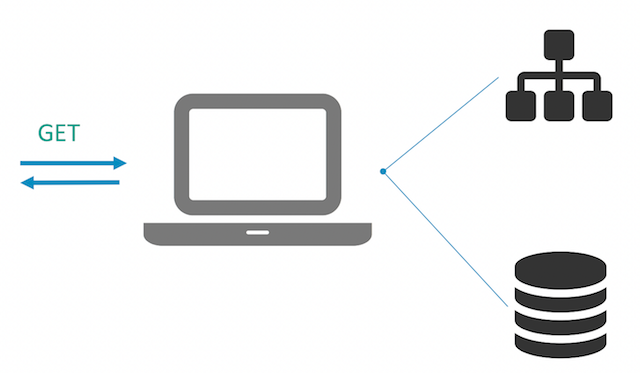

# Part 1 - Building ASP.NET Applications with Docker

The first hurdle when you join a project is getting your development environment set up so you can actually build the code and start working on it. The application for this lab is an ASP.NET WebForms app, which showcases a product launch website and lets users sign up to receive more details, storing data in SQL Server:



The application source code is in a [Visual Studio 2015 solution file](v1-src/ProductLaunch/ProductLaunch.sln), which is configured for an expected development environment. To run the app with an `F5` experience you need to have a machine set up with:

- Visual Studio 2015 + Web Tools
- IIS (Internet Information Services)
- SQL Server LocalDB

If you don't have the right tools or the right versions installed, you're facing 3-4 hours of downloading and installing before you can even build the application. In the .NET world we're used to installing Visual Studio on build servers too, which adds more management overhead, and means build servers can't be headless - they need to run on a version of Windows with a full UI.

Instead of that you can use Docker to create a packaged build agent, with all the dependencies installed for building ASP.NET applications without Visual Studio. The same build agent can be used on developer laptops and for the CI server, which means anyone can build the app as long as they have Docker installed - they don't need Visual Studio, IIS or even .NET on their Windows machine.


## Dockerfile for the ASP.NET App Builder

You'll start by putting together a Docker image which can be a generic ASP.NET app builder. It will be packaged with .NET, MSBuild, NuGet, WebDeploy and all the tools we need to publish a web application from source. The complete [Dockerfile is here](v1-src/docker/builder/Dockerfile) - you can walk through each part to see how it's built.

```
# escape=`
FROM microsoft/windowsservercore:10.0.14393.693
SHELL ["powershell", "-Command", "$ErrorActionPreference = 'Stop'; $ProgressPreference = 'SilentlyContinue';"]
```

You start `FROM` the `microsoft/windowsservercore` base image, which is managed by Microsoft and is publicly available on Docker Store. Using the tag `10.0.14393.693` tells Docker to use a specific version of the image, rather than the default `latest` version. That means the build is repeatable, so any time you build the image you should get the exact same output because the base image will always be the same. If you want to update to a newer base image (Microsoft release regular updates with security patches), you can change the tag and rebuild.

The `SHELL` instruction tells Docker to switch to using PowerShell, so for the rest of the Dockerfile any commands are run using PowerShell. The shell is configured to fail if there are any errors, and to switch off progress bars for better performance. With this and the `escape` instruction you can use normal PowerShell syntax in the Dockerfile.

Next you'll install the [Chocolatey](https://chocolatey.org/) package provider and use it to install MSBuild, the .NET 4.5 development pack, and the Web Deploy package:

```
RUN Install-PackageProvider -Name chocolatey -RequiredVersion 2.8.5.130 -Force; `
    Install-Package -Name microsoft-build-tools -RequiredVersion 14.0.25420.1 -Force; `
    Install-Package -Name netfx-4.5.2-devpack -RequiredVersion 4.5.5165101 -Force; `
    Install-Package -Name webdeploy -RequiredVersion 3.5.2 -Force
```

Chocolatey is a great resource for installing dependencies, even in a non-UI environment like Docker. Again you should use specific package versions so the build is repeatable. After this step you'll have the basics of the build agent installed so now you can go on to add NuGet and the MSBuild targets for Visual Studio Web projects:

```
RUN Install-Package -Name nuget.commandline -RequiredVersion 3.4.3 -Force; `
    & C:\Chocolatey\bin\nuget install MSBuild.Microsoft.VisualStudio.Web.targets -Version 14.0.0.3
```

That gives you the [NuGet](https://www.nuget.org/) command line so you can run package restores as part of the build process, and the additional MSBuild components needed to build Visual Studio web projects. To keep the image flexible, the entrypoint instruction is a simple command to run a PowerShell script:

```
ENTRYPOINT ["powershell"]
```

To build the application, you'll run a container from this image, using [Docker Volumes](https://docs.docker.com/engine/tutorials/dockervolumes/#/mount-a-host-directory-as-a-data-volume) to give the container access to the source files stored on the host. The output from MSBuild will be written to the host too, so the actual container running the build agent is disposable.


## Building and Running the Builder

From the `v1-src\docker\builder` directory, build the image using the normal `docker build` command:

```
docker build -t dockersamples/modernize-aspnet-builder .
```

> The image is already built and available on Docker Store as [dockersamples/modernize-aspnet-builder](https://store.docker.com/community/images/dockersamples/modernize-aspnet-builder) so you can run `docker pull dockersamples/modernize-aspnet-builder` to use that version rather than building it yourself.

With this image you can build any ASP.NET application, you just need to prepare a `docker run` command which mounts the host directories into the container and specifies the MSBuild script to run. The [build.ps1](v1-src/ProductLaunch/build.ps1) script for version 1 of the app is very simple, it just builds the web project from the expected source location, and publishes to the expected output location. Running from the `v1-src` directory, the command to build the ASP.NET project is:

```
docker run --rm `
 -v $pwd\ProductLaunch:c:\src `
 -v $pwd\docker:c:\out `
 dockersamples/modernize-aspnet-builder `
 C:\src\build.ps1 
```

That command runs a container from the generic ASP.NET builder image with the following configuration:

- the project source folder on the host is mounted as `C:\src` inside the container
- the `docker` folder on the host is mounted as `C:\out` inside the container
- the `build.ps1` script is executed, which publishes the web project to the output folder.

When the container completes, the published project is built and ready to be packaged into a Docker image.

## Part 1 - Recap

You built a Docker image with NuGet, MSBuild and all the target packages needed to publish a Visual Studio Web project. The builder image can be used on the Continuous Integration server and on developer laptops, so there's no longer a requirement to install full Visual Studio to work on the app.

Now you can move on to packaging the app itself to run in Docker, in [Part 2 - Packaging ASP.NET applications as Docker images](part-2.md).
