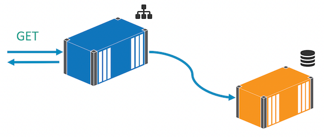
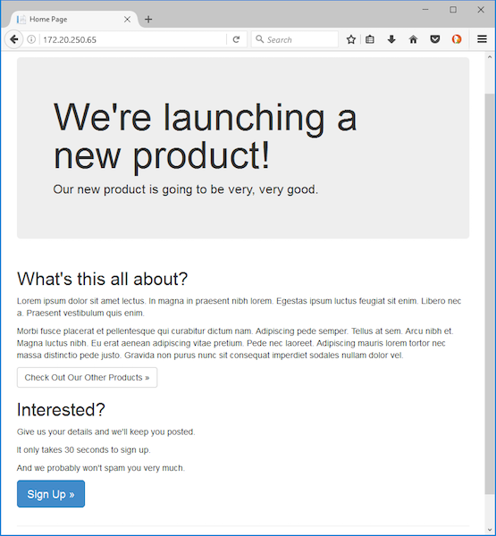
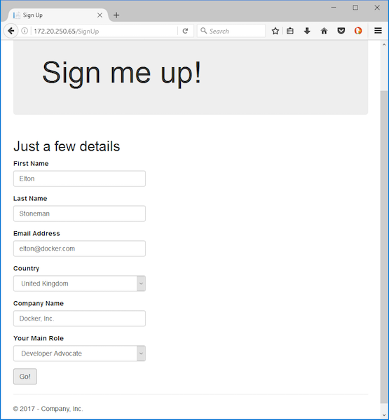

# Part 3 - Running ASP.NET applications as Docker containers

You have a Docker image from [Part 2](part-2.md) which contains the configured application with all its dependencies. To run the website you just need to start a container, but the application needs to connect to a database. The networking stack in Docker means you can use a remote SQL Server instance, not running on Docker, or you can run SQL Server in a Docker container:



For this lab, the sample application uses [Entity Framework Code-First](https://weblogs.asp.net/scottgu/code-first-development-with-entity-framework-4), so you don't need to deploy the database schema. When the app first runs, it will create the database if needed, so you can start an empty SQL Server container and let the app initialize the schema. There's an alternative approach in the [Windows SQL Server lab](https://github.com/docker/labs/blob/master/windows/sql-server/README.md), where the schema is packaged into an image using SQL Server Data Tools.

## Running App Dependencies

Microsoft provide a SQL Server Express image for Windows on Docker Store - [microsoft/mssql-server-windows-express](https://store.docker.com/images/mssql-server-windows-express). [Express Edition](https://www.microsoft.com/en-us/sql-server/sql-server-editions-express) is suitable for non-production and small-scale production environments (the current limitation is 10GB of storage), and with Docker it's easy to run separate databases in SQL Server instances, as separate containers.

To run SQL Server Express in Docker, you can start a container from Microsoft's image:

```
docker run --detach `
 --publish 1433:1433 `
 --env sa_password=d0ck3r_Labs! `
 --env ACCEPT_EULA=Y `
 --name sql-server `
 microsoft/mssql-server-windows-express
```

In the `docker run` command you start the container in the background with the `detached` option, and `publish` the standard SQL Server port 1433, so you can connect to SQL Server outside of Docker. The command uses environment variables to specify a password for the SA user account (which match the credentials in the Web.config file for the application), and accept the licence agreement. Lastly the container is given the name `sql-server` which means other containers in the same Docker network will be able to reach the database using that host name.

The database is the only dependency for version 1 of the app, so now you can run it.

## Running the ASP.NET WebForms App

Starting the website is as simple running a container from the application image we've built:

```
docker run -d -p 80:80 `
 --name web `
 dockersamples/modernize-aspnet-web:v1
```

If you run `docker ps` now, you'll see two containers - one running SQL Server and one running the WebForms app. To browse to the app, you need to get the IP address of the container (that's a temporary step for now, as [port mapping doesn't work in localhost](https://docs.microsoft.com/en-gb/virtualization/windowscontainers/manage-containers/container-networking)). The `docker inspect` command returns a whole lot of information about the container, and it also takes a format string which we can use to get just the IP address:

```
PS> docker inspect --format '{{ .NetworkSettings.Networks.nat.IPAddress }}' web
172.20.250.65
```

In this case the website is available at *http://172.20.250.65*, but your container's IP address will be different. Browse to the IP address and you'll see the website:



It will take a few moments to see the home page, because the container starts up cold - IIS is running, but it will spawn a worker process when it receives the first request, and then the app initializes the database. When you see the 'product launch' homepage, then all the startup tasks are done. The next hit to the website will return much more quickly.

## Verifying Functionality

Version 1 of the app only really has two features - a landing page to get you interested, and a sign-up page to record your details. You've seen the home page so that feature is working, and you can click through to the sign up page to check the second feature. The form collects basic information:



Once you submit it you see a sign-up page. You can connect to the SQL Server database running in Docker to check the data, or you can make use of another part of the Docker platform and execute a command inside a running container.

The SQL Server Express Docker image is packaged with the SQL Server PowerShell module, so even if you don't have a SQL client installed you can execute queries by running SQL commands inside the container. `docker exec` is the command for that, and this is how to run a SQL query and show the output:

```
docker exec sql-server `
 powershell -Command `
  "Invoke-SqlCmd -Query 'SELECT * FROM Prospects' -Database ProductLaunch"
```

You'll see a row for each time you submitted the form, something like this:

```
ProspectId          : 1
FirstName           : Elton
LastName            : Stoneman
CompanyName         : Docker, Inc.
EmailAddress        : elton@docker.com
Role_RoleCode       : DA
Country_CountryCode : GBR
```

That means the app is working correctly and storing the data in SQL Server.


## Part 3 - Recap

Now you've taken the .NET WebForms app and it's running in Docker. You have a version tag in the image name, and you could share the image on a public registry like [Docker Store](https://store.docker.com), or run your own [private registry in Docker](https://github.com/docker/labs/blob/master/windows/registry/README.md), or an enterprise-grade solution like [Docker Trusted Registry](https://docs.docker.com/datacenter/dtr/2.1/guides/). Anyone with access to the registry can pull the image and run the application, and it will behave in the exact same way.

At this stage you need to communicate a dependency on SQL Server for the application, and it's still a manual step to start both the database and application containers. Later in the lab you'll see how to capture all the dependencies for a distributed solution, and automate the startup using [Docker Compose](https://docs.docker.com/compose/overview/).

Already you've made a big improvement for managing and deploying the application. Automation and repeatability are baked into the process, which is consistent between environments. And now that you have the app running in Docker, you can easily make use of the platform to modernize the app and improve the features - which you'll do in [Part 4 - Improving performance with asynchronous messaging](part-4.md)
