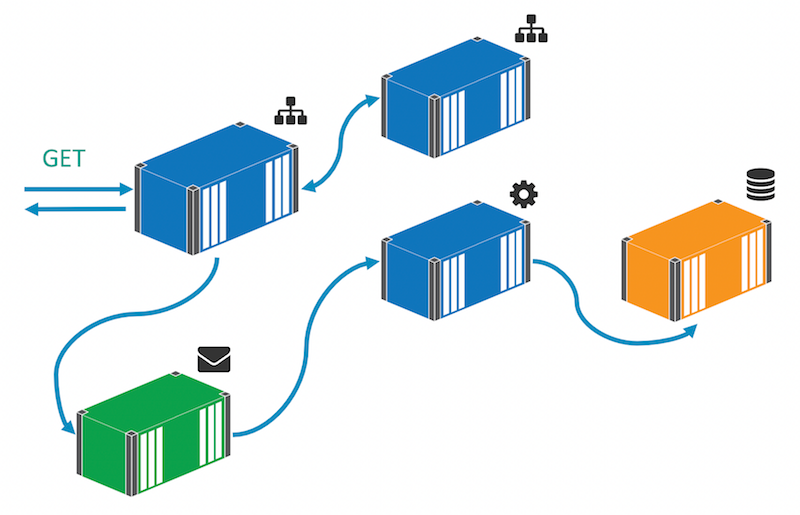
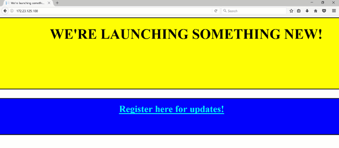

# Part 5 - Enabling Fast Prototyping with Separate UI Components

In [Part 4](part-4.md) you modernized one part of the sample application by making use of the Docker platform, and addressed a performance feature. That's an improvement which will benefit all the stakeholders of the app - ops folks now have an app which is easy to maintain, upgrade and scale; dev folks have the freedom to bring new technology into the app without a rewrite; business folks have an app which behaves correctly under pressure and continues to work for users.

You'll modernize one more feature in this lab, which will be similarly beneficial to all stakeholders. A major advantage of microservice architecture is that you can easily replace service implementations without significant work. You can replace a service with a new component without changing consumers, provided the service contract is honored.

That's a huge enabler for business product owners, which you'll see in this final part. You're going to spin out the homepage for the website into a new component, and decopuple it from the rest of the web app:



With that, product owners can iterate on new versions quickly without having to do a full regression test of the whole application. Users only need to test the homepage component, ops only need to release the homepage component, and devs can freely choose the technology stack for the new component.

## Extracting the Homepage from the Web app

In version 1 and version 2, the WebForms app renders the homepage itself from the [Default.aspx](v3-src/ProductLaunch/ProductLaunch.Web/Default.aspx.cs) page. In version 3, the `Page_Load` method has changed, to let you swap in a different component:

```
if (!string.IsNullOrEmpty(Config.HomePageUrl))
{
    Response.Clear();
    var request = HttpWebRequest.Create(Config.HomePageUrl);
    var response = request.GetResponse();
    using (var stream = response.GetResponseStream())
    using (var reader = new StreamReader(stream))
    {
        var html = reader.ReadToEnd();
        Response.Write(html);
    }
    Response.End();           
}
```

There are a few things to note here:

- the code checks a config value to see if the home page URL has been configured. You can use that as a feature switch to choose between the existing content or a new component;
- if a URL is specified, the page fetches the complete content of that URL, synchronously with an `HttpWebRequest` object;
- the page returns the content of the external URL using `Response.Write()` and then ends the response, so the content from the default page is not rendered.

This is a simplistic approach but it illustrates how you can extract one UI feature from the main web application without changing the routing of the app. Users will still land at the original location, and the new content component doesn't need to be publicly accessible, it can be private to the Docker network.

As before you now have an environment variable for the new home page location, `HOMEPAGE_URL` which you can set as a default value in the image, or as a specific value in a `docker run` command or a Docker Compose file.

## Building a Homepage Component

There's no contract between the main web app and the homepage component, other than the expectation that it will return valid HTML. For the new UI you could use ASP.NET MVC, or ASP.NET Core - or in fact any web framework. Decoupling a UI component like this gives the dev team a huge amount of freedom to evaluate new frameworks in a meaningful way. They can go to production quickly and safely, and they can be just as quickly and safely backed out.

In this lab there's a simple static HTML site for the new landing page, which will run in a Docker container alongside the rest of the solution. The [Dockerfile](v3-src/docker/homepage/Dockerfile) is extremely simple:

```
FROM microsoft/iis:windowsservercore-10.0.14393.693 
COPY index.html c:/inetpub/wwwroot/index.html
```

The image uses the [microsoft/iis](https://store.docker.com/images/iis) base image, which is itself based on Windows Server Core, with IIS installed and using the same ServiceMonitor tool. The only other instruction is to copy in the `index.html` file to a known location on the image, which is the content root for the default website in IIS.

> The integration between the web app and the new homepage component is simplified in this example. Dependencies for the new content (stylesheets, scripts and images) would need to be publicly accessible. A better approach would be to use a reverse proxy as the entrypoint to the app, and define the routings in the proxy.


## Running the Version 3 App with Docker Compose

The [compilation build script](v3-src/ProductLaunch/build.ps1) for version 3 is unchanged, because there are no new .NET projects to build. The [packaging build script](v3-src/build.ps1) has an extra step to package the homepage website into a new Docker image. In the [docker-compose.yml](v3-src/docker-compose.yml) file there's a new entry for the homepage service:

```
  product-launch-homepage:
    image: dockersamples/modernize-aspnet-homepage:v3 
    ports:
      - "81:80"
    networks:
      - app-net
```

And the defintion of the web app has changed to add the `HOMEPAGE_URL` value, and specify the homepage service as a dependency:

```
  product-launch-web:
    image: dockersamples/modernize-aspnet-web:v3
    ports:
      - "80:80"
    environment:
      - DB_CONNECTION_STRING=Server=product-launch-db;Database=ProductLaunch;User Id=sa;Password=d0ck3r_Labs!;
      - HOMEPAGE_URL=http://product-launch-homepage
    depends_on:
      - product-launch-db
      - message-queue
      - product-launch-homepage
    networks:
      - app-net
```

Because the source is in a different folder for version 3, Docker Compose sees it as a different application. You'll need to start in the `v2-src` folder and tear down the existing containers:

```
docker-compose kill
docker-compose rm -f
```

Now in the `v3-src` folder, run the build script to compile and package the images, and then use Docker Compose to run the application:

```
.\build.ps1
docker-compose up -d
```

In a real upgrade scenario, the source locations wouldn't change, and Docker Compose would see it as an upgrade rather than a different application. In that case Docker Compose checks the running containers and it will only upgrade containers where the definition in the Compose file has changed. 

> In this case the message handler code hasn't actually changed, so you could have continued to use the `v2` tag and Compose could have retained the previous container. In a distributed solution it can be useful to build all images and tag them with the same version number, so you know you can run the same version of all components and they will work togther. It's not required though, the Compose file explicitly states which versions to use and Docker Compose will only deploy the changed components.

## Testing the Final application

As before, you need to get the IP address of the web application container, and then you can browse to it and see the new homepage:

```
docker inspect --format '{{ .NetworkSettings.Networks.nat.IPAddress }}' v3src_product-launch-web_1
```

When you hit the web application, it will make a call to the homepage component and render the awesome new UI:



If you can hit the 'Register now' link in between the blinking, you'll see the original sign-up page. As before, when you submit the form the app publishes an event message, and the message handler saves the details to the database. The existing functionality is all preserved, but now you have a new homepage component and the ability to switch out the homepage service, or revert to the original hompeage will just a change to the Docker Compose file.

## Part 5 - Recap

This section completes the lab. You modified the original application to fetch the home page content from a separate service, and built a replacement landing page using a static HTML site running in IIS. The new landing page probably needs a little design work, but it illustrates the point that you can use any framework for the new UI component. The project team could experiment with [React](https://facebook.github.io/react/) or [Ember](http://emberjs.com/), or even Dockerize a CMS like [Umbraco](https://umbraco.com/umbraco-for-site-owners/) and give the business users self-service content.

In this lab you started with a monolothic ASP.NET WebForms app, and modernized it using the Docker platform:

- packaging a build agent as a Docker image, to build the app consistently on a laptop or a CI server without needing Visual Studio;
- packaging the WebForms app as a Docker image, so it runs in the same way on any Windows machine running Docker;
- extracting key features from the monolith into small services, encapsulated in separate Docker images;
- integrating enterprise-grade third party software from Docker Store into the solution;
- capturing the full solution configuration in a runnable format using Docker Compose.

Taking a feature-driven approach to modernization gives you fast and quantifiable return on investment when you move your application to Docker. In the lab you took steps towards an event-driven architecture, and made use of a microservice approach to the UI, without an extensive re-write of the application. You've seen that the Docker platform enables app modernization, with a focus on business value and without a full re-architecture of the application.


## Next steps

Moving your own .NET application to Docker is easy. You don't need to follow the full approach of this lab - if you already have a CI build for your app, you can package the current output into a Docker image, without needing to write a build agent. If you don't have a CI process, but you have the app running in a VM, you can use the [Image2Docker](https://blog.docker.com/2016/12/convert-asp-net-web-servers-docker-image2docker/) tool to extract a Dockerfile from the VM's disk for an ASP.NET app.

The Windows Server Core image is based on the full Windows Server 2016, and it should suitable for running any Windows app in Docker - provided the app and its dependencies can be installed and run without a Windows UI. ASP.NET 2.0 WebForms apps run fine in Docker, and you can use the [microsoft/aspnet:3.5](https://store.docker.com/images/aspnet) image as the base if you need the 3.5 framework. Java, Go, NodeJS and PHP apps all run in Docker, so the platform has the power to host your whole application stack, and underpin your modernization roadmap.