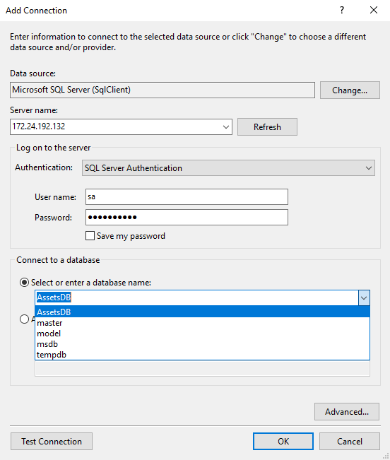

# Part 3 - Running the SQL Server Container

You now have a Docker image with a SQL schema and deployment script, packaged on top of SQL Server Express. The database image was built in [Part 2](part-2.md), compiling the Dacpac using the builder image from [Part 1](part-1.md). You can use that image to spin up a database container in different ways.

## In Development - Running a Disposable Database

The image can be used in development environments where a fresh database is needed for working on new app features, and you want to easily reset the data to an initial state. In this scenario you don't want to persist data between containers, you want the database container to be disposable:

```Docker
docker container run --detach --name assets-db --publish 1433 dockersamples/assets-db:v1
```

When the container starts it runs the deployment script, finds that there are no existing database files and creates a new database. You can check that by viewing the logs from the container - you'll see the output from the script:

```
> docker container logs assets-db
...
VERBOSE: Creating AssetsDB...
VERBOSE: Changed database context to 'AssetsDB'.
VERBOSE: Creating [dbo].[Assets]...
VERBOSE: Creating [dbo].[AssetTypes]...
VERBOSE: Creating [dbo].[Locations]...
VERBOSE: Creating [dbo].[FK_Assets_To_Locations]...
VERBOSE: Creating [dbo].[FK_Assets_To_AssetTypes]...
```

You can connect to the database container using SQL Server Management Studio or any other SQL client. From your Docker machine you need to get the IP address of the container with `docker container inspect`: 

```PowerShell
> docker container inspect --format '{{ .NetworkSettings.Networks.nat.IPAddress }}' assets-db
172.24.192.132
```

In my case the IP address is `172.24.192.132` - yours will be different. From your machine you can connect to the databse container with a SQL client, connecting to that IP address. You need to use SQL Server Authentication with the `sa` credentials, and you should see the `AssetsDB` database listed:



You can run some SQL to insert test data like this:

```SQL
INSERT INTO Assets (AssetTypeId, LocationId, PurchaseDate, PurchasePrice, AssetTag, AssetDescription)
VALUES (1, 1, '2016-11-14', '1999.99', 'SC0001', 'New MacBook with Emoji Bar');

INSERT INTO Assets (AssetTypeId, LocationId, PurchaseDate, PurchasePrice, AssetTag, AssetDescription)
VALUES (1, 1, '2016-11-14', '800', 'SC0002', 'Logitech Office Cam');
```

And when you `SELECT` from the `Assets` table you'll see the new rows there. 

The data is being stored in a volume, which means the `MDF` and `LDF` files are somewhere on the the host's disk. But if you forcibly remove the container, the volume will be removed when the container stops - so this is a disposable database container, the new data won't survive beyond the life of the container. 

You can see that when you remove the container, and start a new one with the same configuration as the original:

```PowerShell
docker container rm --force assets-db

docker container run --detach --publish 1433 --name assets-db dockersamples/assets-db:v1
```

Inspect this container with `docker container inspect` and you'll see it has a new IP address - this is a whole new container. Connect your SQL client, repeat the `SELECT * FROM Assets` query and you'll see the table is empty - the old data was lost when you removed the container, and its volume was removed. The new container starts with a new database.

## In Test - Running a Persistent Database

To store the data permanently, you can map the database volume to a location on the host. The first time you run a container, it will create the data and log files in the host directory. When you replace the container and use the same volume mount, the new container will attach the existing database and the data is preserved.  

The `docker container run` command is essentially the same, you just use the `--volume` option to mount a volume. [Mounting a host directory as a volume](https://docs.docker.com/engine/tutorials/dockervolumes/#/mount-a-host-directory-as-a-data-volume) means that when processes in a container think they're accessing files on the local filesystem, it's actually a symlink and the files are on the host. In this case, when SQL Server uses the `MDF` file in `C:\databases` in the container, it's actually using the file in `C:\mssql` on the host:

```PowerShell
docker container rm --force assets-db

mkdir C:\mssql

docker container run -d -p 1433 --name assets-db --volume C:\mssql:C:\database dockersamples/assets-db:v1
```

When the container has started, you can verify that the new database is created and the files are written to the host directory by listing the contents on the host:

```PowerShell
> ls C:\mssql

    Directory: C:\mssql

Mode                LastWriteTime         Length Name
----                -------------         ------ ----
-a----       25/09/2017     16:20        8388608 AssetsDB_Primary.ldf
-a----       25/09/2017     16:20        8388608 AssetsDB_Primary.mdf
```

Now you can inspect the container to get its IP address, connect and insert rows into the `Assets` table. The data will be stored outside of the container, in the directory on the host. You can replace the container without changing the schema - say you rebuild it with a new version of the base image to get the latest Windows updates. As long as you use the same volume mapping as the previous container, you'll retain all the data:

```PowerShell
docker container rm -f assets-db

docker container run -d -p 1433 --name assets-db --volume C:\mssql:C:\database dockersamples/assets-db:v1
```

This is a new container with a new file system, but the database location is mapped to the same host directory as the previous container. The setup script still runs, but it finds no differences in the current database schema and the schema definition in the Dacpac, so there's no diff script to apply.

When the new container starts it attaches the database so all the existing data is available. You can check that by executing a query in a SQL client, or by running one in the container directly:

```PowerShell
> docker container exec assets-db powershell -Command "Invoke-SqlCmd -Query 'SELECT * FROM Assets' -Database AssetsDB"

AssetId          : 1
AssetTypeId      : 1
LocationId       : 1
PurchaseDate     : 11/14/2016 12:00:00 AM
PurchasePrice    : 1999.99
AssetTag         : SC0001
AssetDescription : New MacBook with Emoji Bar

AssetId          : 2
AssetTypeId      : 1
LocationId       : 1
PurchaseDate     : 11/14/2016 12:00:00 AM
PurchasePrice    : 800.00
AssetTag         : SC0002
AssetDescription : Logitech Office Cam
```

## In Production - Using Shared Storage

For production databases you can use exactly the same image and the same principle as for test environments, but you may want to use a different type of volume mount. 

In small-scale single-host scenarios, you can mount your database volume from a RAID array on the local server. That gives you data redundancy but not process redundancy - if you lose a disk you won't lose data, but if the server goes down your database won't be accessible.

In high-availability scenarios, you'll need process redundancy too, so if the server hosting your database container goes down, you can spin up a new container on a different server, but retain all the committed data. That means using a shared storage driver, where the database directory is available from multiple servers, so you can map the same volume from any host.

Docker has a [volume plugin framework](https://docs.docker.com/engine/extend/plugins_volume/) which third parties can use to support Docker volumes on their shared storage solutions. The plugin you choose depends on your infrastructure, but the [volume plugin list](https://docs.docker.com/engine/extend/legacy_plugins/#/volume-plugins) has support for:
- [vSphere storage](https://github.com/vmware/docker-volume-vsphere)
- [NetApp](https://github.com/NetApp/netappdvp)
- [Azure File Storage](https://github.com/Azure/azurefile-dockervolumedriver)
- [Google Cloud](https://github.com/mcuadros/gce-docker)
- [HPE 3Par](https://github.com/hpe-storage/python-hpedockerplugin/) 

and lots more.

## Next

- [Part 4 - Upgrading the SQL Server Database](part-4.md)