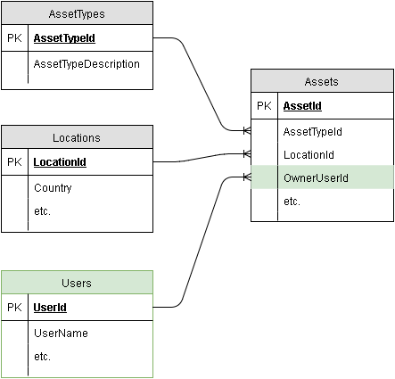

# Part 4 - Upgrading the SQL Server Database

In [Part 3](part-3.md) you saw different ways of running the image you built in [Part 2](part-2.md), which packaged the Dacpac generated with the builder from [Part 1](part-1.md). By using the Dacpac to deploy the database, you can support many scenarios using the same Docker image, and you also have a process to upgrade the database schema in a consistent and reliable way.

## Changing the Database schema

Databases evolve as the apps they support evolve - new tables are added, columns are dropped, column definitions change. You can use [change scripts](https://www.infoq.com/articles/db-versioning-scripts) to incrementally update a schema, but with static scripts the target database needs to be in the expected state. If the target database [drifts](https://www.simple-talk.com/blogs/tackling-the-problem-of-database-version-drift/), then the change scripts may fail or behave unexpectedly.

SQL Server's Dacpac approach is much cleaner. It contains a model of the desired state of the schema, and you use the SqlPackage tool to generate the change scripts for a target database immediately before you apply them, so the upgrade will always be from the current state to the desired state. 

In this lab you use the Dacpac to underly the fundamental components for a CI/CD pipeline for database upgrades. You just need to change the source code, rebuild and redeploy. In version 2 of the schema, there's a new `Users` table and some aditional columns in the `Assets` table:



The builder image from [Part 1](part-1.md) is fine for building version 2 of the schema, there are no changes that need different build tools. To package the new image, build [Dockerfile.v2](Dockerfile.v2). The Dockerfile is exactly the same, except that it builds V2 of the database schema.

> The v1 and v2 Dockerfiles are used to illustrate a schema change over time. In a real project, you would have a single Dockerfile in the source code along with your SQL Project.

You can build a new database image and tag it as version 2 of the schema:

```PowerShell
docker image build --tag dockersamples/assets-db:v2 --file Dockerfile.v2 .
```
...

## Upgrading the Database container

Now you have two images locally, each packaging a separate version of the database schema. The container is running `v1` of the schema. To upgrade the database, you replace the existing database container and spin up a new one from the `v2` image, using the same volume mount as the `v1` container. You can use the same commands from [Part 3](part-3.md), but using the new image tag:

```PowerShell
docker container rm -f assets-db

docker container run -d -p 1433 --name assets-db -v C:\mssql:C:\database dockersamples/assets-db:v2
```

When this new container starts, the init script attaches the existing data files and runs `SqlPackage`. Noe the schema is different from the Dacpac, so the tool generates a diff script to apply. Then it runs the script to update the schema - you can see the output in `docker container logs`:

```
> docker container logs assets-db
...
VERBOSE: Altering [dbo].[Assets]...
VERBOSE: Creating [dbo].[Users]...
VERBOSE: Creating [dbo].[FK_Assets_To_Users]...
```

The container retains the upgrade script which `SqlPackage` generates, and you can read it from the container to see the exact SQL statements that were used in the upgrade:

 ```PowerShell
 docker container exec assets-db powershell cat C:\init\create.sql
 ```

For the v2 upgrade the script is 150+ lines of SQL, containing the DDL to update the schema, and the DML post-deployment scripts. The DDL includes the table changes and the new table, as in this snippet:

 ```SQL 
ALTER TABLE [dbo].[Assets] ALTER COLUMN [AssetDescription] NVARCHAR (500) NULL;
GO

ALTER TABLE [dbo].[Assets]
    ADD [OwnerUserId] INT NULL;
GO

PRINT N'Creating [dbo].[Users]...';
GO

CREATE TABLE [dbo].[Users] (
    [UserId]     INT           IDENTITY (1, 1) NOT NULL,
    [FirstName]  NVARCHAR (50) NULL,
    [LastName]   NVARCHAR (50) NULL,
    [LocationId] INT           NULL,
    [UserName]   NVARCHAR (50) NOT NULL,
    PRIMARY KEY CLUSTERED ([UserId] ASC)
);
GO
```

If you repeat those steps to remove the existing database container and create a new one using the same Docker volume, the upgrade script won't have any DDL changes the next time round. The schema has already been upgraded, so it matches the model in the Dacpac.

## Conclusion

Docker containers are equally well suited to stateful workloads like databases, as they are to stateless workloads like Web servers. The Docker platform supports integration between the container and the host at the network level, so consumers can connect to your database as though it were running in a dedicated machine. And the platform supports integration at the data level with many different storage providers, so you can persist your database files outside the running container, in highly-available shared storage.

SQL Server's Dacpac model is a perfect mechanism for creating a packaged Docker image which contains the database schema and reference data scripts, but not the actual data files. In this lab we saw how to create a database image with a packaged Dacpac which can be used in dev, QA and production environments. We also saw how to use the builder pattern with MSBuild to create the database image. This is the foundation for a database CI/CD pipeline which you can use to build, deploy and run SQL Server databases using Docker on Windows - without needing Visual Studio, MSBuild or SQL Server installed on your machines.