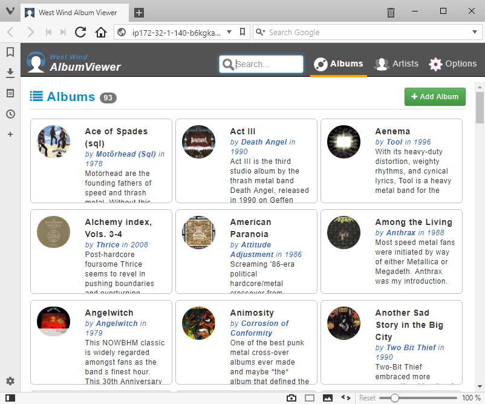

## Multi-Container Applications

This tutorial walks you through building and running the sample Album Viewer application with Windows containers. The [Album Viewer](https://github.com/RickStrahl/AlbumViewerVNext) app is an ASP.NET Core application, maintained by Microsoft MVP [Rick Strahl](https://weblog.west-wind.com). There is a fork at [dockersamples/dotnet-album-viewer](https://github.com/dockersamples/dotnet-album-viewer "link to forked version of Album Viewer") which uses Docker Windows containers.

> Docker isn't just for new apps built with .NET Core. You can run full .NET Framework apps in Docker Windows containers, with production support in [Docker Enterprise](https://www.docker.com/enterprise-edition). Check out the labs for [Modernizing .NET apps with Docker](https://github.com/docker/labs/tree/master/windows/modernize-traditional-apps).

## Using Docker Compose on Windows

[Docker Compose](https://docs.docker.com/compose/) is a great way develop distributed applications, where all the components run in their own containers. In this lab you'll use Docker Compose to run SQL Server in a container, as the data store for an ASP.NET Core web application running in another container.

Docker Compose is installed with [Docker Desktop on Windows 10](https://www.docker.com/docker-windows). If you've installed the Docker Engine as a Windows Service instead, you can download the compose command line using PowerShell:

```
Invoke-WebRequest https://github.com/docker/compose/releases/download/1.23.2/docker-compose-Windows-x86_64.exe -UseBasicParsing -OutFile $env:ProgramFiles\docker\docker-compose.exe
```

To run the sample application in multiple Docker Windows containers, start by cloning the GithUb [dockersamples/dotnet-album-viewer](https://github.com/dockersamples/dotnet-album-viewer/) repository:

```
git clone https://github.com/dockersamples/dotnet-album-viewer.git
```

The [Dockerfile for the application](https://github.com/dockersamples/dotnet-album-viewer/blob/master/docker/app/Dockerfile) uses [Docker multi-stage builds](https://docs.docker.com/engine/userguide/eng-image/multistage-build/), where the app is compiled inside a container and then packaged into a Docker image. That means you don't need .NET Core installed on your machine to build and run the app from source:

```
cd dotnet-album-viewer
docker-compose build
```

You'll see a lot of output here. Docker will pull the .NET Core images if you don't already have them, then it will run `dotnet restore` and `dotnet build` inside a container. You will see the usual NuGet and MSBuild output - you don't need to have the .NET Core SDK installed, because it is part of the Docker image.

When the build completes, run the app with:

```
docker-compose up -d
```

Docker starts a database container using [TiDB](https://github.com/pingcap/tidb), which is a modern distributed database system compatible with MySQL. When the database is running it starts the application container. The database and application containers are in the same Docker network, so they can reach each other.

The container for the web application publishes port 80 on the host, so you can browse to your http://localhost and see the site:




### Organizing Distributed Solutions with Docker Compose

Take a closer look at the [docker-compose.yml](https://github.com/dockersamples/dotnet-album-viewer/blob/master/docker-compose.yml) file. There are two [services](https://docs.docker.com/compose/compose-file/#service-configuration-reference) defined, which are the different components of the app that will run in Docker containers. The first is the MySQL-compatible database:

```
  db:
    image: dockersamples/tidb:nanoserver-1809
    ports:
      - "3306:4000"
```

The second service is the ASP.NET Core web application, which uses the custom image you built at the start of the lab:

```
  app:
    image: dockersamples/dotnet-album-viewer
    build:
      context: .
      dockerfile: docker/app/Dockerfile
    ports:
      - "80:80"
    environment:
      - "Data:Provider=MySQL"
      - "Data:ConnectionString=Server=db;Port=4000;Database=AlbumViewer;User=root;SslMode=None"      
    depends_on:
      - db
```

The [build](https://docs.docker.com/compose/compose-file/#build) details capture the path to the Dockerfile. The environment variables are used to configure the app - they override the settings in [appsettings.json](https://github.com/dockersamples/dotnet-album-viewer/blob/master/src/AlbumViewerNetCore/appsettings.json). This configuration uses MySQL rather than the default SQLite database, and sets the connection string to use the TiDB database container.

> The database container has a built-in user called `root` with no password, and this is the account used by the web application in the connection string.

The app definition also captures the [dependency](https://docs.docker.com/compose/compose-file/#depends_on) on the database server, and publishes port 80 so any traffic coming into the host gets directed by Docker into the container.

## Packaging ASP.NET Core apps in Docker

How can you compile and run this app without .NET Core installed? Docker compiles and runs the app using containers. The tasks are in the [Dockerfile](https://github.com/dockersamples/dotnet-album-viewer/blob/master/docker/app/Dockerfile), which captures the app dependencies so the only pre-requisite you need is Docker. The first stage in the Dockerfile publishes the app:

```
FROM microsoft/dotnet:2.1-sdk-nanoserver-1809 AS builder

WORKDIR /album-viewer
COPY AlbumViewerNetCore.sln .
COPY src/AlbumViewerNetCore/AlbumViewerNetCore.csproj src/AlbumViewerNetCore/AlbumViewerNetCore.csproj
COPY src/AlbumViewerBusiness/AlbumViewerBusiness.csproj src/AlbumViewerBusiness/AlbumViewerBusiness.csproj
COPY src/Westwind.Utilities/Westwind.Utilities.csproj src/Westwind.Utilities/Westwind.Utilities.csproj
RUN dotnet restore src/AlbumViewerNetCore/AlbumViewerNetCore.csproj

COPY src src
RUN dotnet publish .\src\AlbumViewerNetCore\AlbumViewerNetCore.csproj
```

This uses Microsoft's [.NET Core Docker image](https://hub.docker.com/r/microsoft/dotnet) as the base in the `FROM` instruction. It uses a specific version of the image, with the .NET Core 2.1 SDK installed, running on the 1809 release of Microsoft Nano Server. Then the `COPY` instructions copy the project files and solution files into the image, and the `RUN` instruction executes `dotnet restore` to restore packages.

Docker caches parts of the image as it build them, and this Dockerfile separates out the restore part to take advantage of that. Unless the solution or project files change, Docker will re-use the image layer with the dependencies already restored, saving time on the `dotnet restore` operation.

After the restore, the rest of the source code is copied into the image and Docker runs `dotnet publish` to compile and publish the app.

The final stage in the Dockerfile packages the published application:

```
# app image
FROM microsoft/dotnet:2.1-aspnetcore-runtime-nanoserver-1809

WORKDIR /album-viewer
COPY --from=builder /album-viewer/src/AlbumViewerNetCore/bin/Debug/netcoreapp2.0/publish/ .
CMD ["dotnet", "AlbumViewerNetCore.dll"]
```

This uses a different variant of the `dotnet` base image, which is optimized for running ASP.NET Core apps. It has the .NET Core runtime, but not the SDK, and the ASP.NET core packages are already installed. The `COPY` instruction copies the published .NET Core app from the previous stage in the Dockerfile (called `builder`), and the `CMD` instruction tells Docker how to start the app.

The Dockerfile syntax is simple. You only need to learn a handful of instructions to build production-grade Docker images. Inside the Dockerfile you can use PowerShell to deploy MSIs, update Windows Registry settings, set file permissions and do anything else you need.

## Next Steps

This lab walked you through building and running a simple .NET Core web application using Docker Windows containers. Take a look at some more Windows container labs to see how your existing apps can be moved into Docker:

* [SQL Server](https://github.com/docker/labs/blob/master/windows/sql-server/README.md)
* [Modernizing ASP.NET apps - for devs](https://github.com/docker/labs/tree/master/windows/modernize-traditional-apps/modernize-aspnet)
* [Modernizing ASP.NET apps - for IT Pros](https://github.com/docker/labs/tree/master/windows/modernize-traditional-apps/modernize-aspnet-ops)
