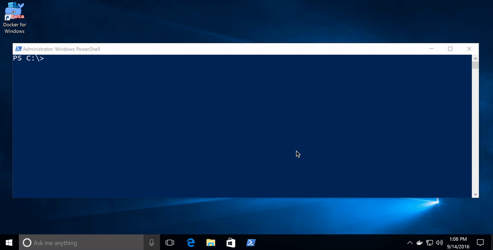

## Getting Started with Windows Containers

In September 2016, Microsoft announced the general availability of Windows Server 2016, and with it, Docker engine running containers natively on Windows. This tutorial describes how to get setup to run Docker Windows Containers on Windows 10 or using a Windows Server 2016 VM.

Before getting started, It’s important to understand that Windows Containers run Windows executables compiled for the Windows Server kernel and userland (either windowsservercore or nanoserver). To build and run Windows containers, a Windows system with container support is required. There are currently two options for that.

  * Windows 10 with Anniversary Update
  * Windows Server 2016

### Windows 10 with Anniversary Update

For developers, Windows 10 is a great place to run Docker Windows containers and containerization support was added to the the Windows 10 kernel with the [Anniversary Update](https://blogs.windows.com/windowsexperience/2016/08/02/how-to-get-the-windows-10-anniversary-update/) (note that container images can only be based on Windows Server Core and Nanoserver, not Windows 10). All that’s missing is the Windows-native Docker Engine and some image base layers.

The simplest way to get a Windows Docker Engine is by installing the [Docker for Windows](https://docs.docker.com/docker-for-windows/ "Docker for Windows") public beta ([direct download link](https://download.docker.com/win/beta/InstallDocker.msi)). Docker for Windows used to only setup a Linux-based Docker development environment, but the public beta version now sets up both Linux and Windows Docker development environments, and we’re working on improving Windows container support and Linux/Windows container interoperability.

With the public beta installed, the Docker for Windows tray icon has an option to switch between Linux and Windows container development.



Switch to Windows containers and skip the next section.

### Windows Server 2016

Windows Server 2016 is the where Docker Windows containers should be deployed for production. For developers planning to do lots of Docker Windows container development, it may also be worth setting up a Windows Server 2016 dev system (in a VM, for example), at least until Windows 10 and Docker for Windows support for Windows containers matures.

For Microsoft Ignite 2016 conference attendees, USB flash drives with Windows Server 2016 preloaded are available at the expo. Not at ignite? Download a [free evaluation version](https://www.microsoft.com/en-us/evalcenter/evaluate-windows-server-2016 "free evaluation version") and install it on bare metal or in a VM running on Hyper-V, VirtualBox or similar. Running a VM with Windows Server 2016 is also a great way to do Docker Windows container development on macOS and older Windows versions.

Once Windows Server 2016 is running, log in, run Windows Update to ensure you have all the latest updates and install the Windows-native Docker Engine directly (that is, not using “Docker for Windows”). Run the following in an Administrative PowerShell prompt:

```
# Add the containers feature and restart
Install-WindowsFeature containers
Restart-Computer -Force

# Download, install and configure Docker Engine
Invoke-WebRequest "https://download.docker.com/components/engine/windows-server/cs-1.12/docker-1.12.2.zip" -OutFile "$env:TEMP\docker.zip" -UseBasicParsing

Expand-Archive -Path "$env:TEMP\docker.zip" -DestinationPath $env:ProgramFiles

# For quick use, does not require shell to be restarted.
$env:path += ";c:\program files\docker"

# For persistent use, will apply even after a reboot. 
[Environment]::SetEnvironmentVariable("Path", $env:Path, [EnvironmentVariableTarget]::Machine)

# Start a new PowerShell prompt before proceeding
dockerd --register-service
Start-Service docker
```

Docker Engine is now running as a Windows service, listening on the default Docker named pipe. For development VMs running (for example) in a Hyper-V VM on Windows 10, it might be advantageous to make the Docker Engine running in the Windows Server 2016 VM available to the Windows 10 host:

```
# Open firewall port 2375
netsh advfirewall firewall add rule name="docker engine" dir=in action=allow protocol=TCP localport=2375

# Configure Docker daemon to listen on both pipe and TCP (replaces docker --register-service invocation above)
dockerd.exe -H npipe:// -H 0.0.0.0:2375 --register-service
```

The Windows Server 2016 Docker engine can now be used from the VM host by setting `DOCKER_HOST`:
`$env:DOCKER_HOST = "<ip-address-of-vm>:2375"`

See the [Microsoft documentation for more comprehensive instructions](https://msdn.microsoft.com/virtualization/windowscontainers/containers_welcome "Microsoft documentation").

##Running Windows containers

First, make sure the Docker installation is working:

```
> docker version
Client:
 Version:      1.12.2
 API version:  1.24
 Go version:   go1.6.3
 Git commit:   bb80604
 Built:        Tue Oct 11 05:27:08 2016
 OS/Arch:      windows/amd64
 Experimental: true

Server:
 Version:      1.12.2-cs2-ws-beta
 API version:  1.25
 Go version:   go1.7.1
 Git commit:   050b611
 Built:        Tue Oct 11 02:35:40 2016
 OS/Arch:      windows/amd64
```

Next, pull a base image that’s compatible with the evaluation build, re-tag it and to a test-run:

```
docker pull microsoft/windowsservercore:10.0.14393.321
docker tag microsoft/windowsservercore:10.0.14393.321 microsoft/windowsservercore
docker run microsoft/windowsservercore hostname
69c7de26ea48
```

## Building and pushing Windows container images

Pushing images to Docker Cloud requires a [free Docker ID](https://cloud.docker.com/ "Click to create a Docker ID"). Storing images on Docker Cloud is a great way to save build artifacts for later user, to share base images with co-workers or to create build-pipelines that move apps from development to production with Docker.

Docker images are typically built with [docker build](https://docs.docker.com/engine/reference/commandline/build/ "docker build reference") from a [Dockerfile](https://docs.docker.com/engine/reference/builder/ "Dockerfile reference") recipe, but for this example, we’re going to just create an image on the fly in PowerShell.

```
"FROM microsoft/windowsservercore `n CMD echo Hello World!" | docker build -t <docker-id>/windows-test-image -
```

Test the image:

```
docker run <docker-id>/windows-test-image
Hello World!
```

Login with `docker login` and then push the image:

```
docker push <docker-id>/windows-test-image
```

Images stored on Docker Cloud available in the web interface and public images can be pulled by other Docker users.

## Using docker-compose on Windows
Docker Compose is a great way develop complex multi-container consisting of databases, queues and web frontends. Compose support for Windows is still a little patchy and only works on Windows Server 2016 at the time of writing (i.e. not on Windows 10).

To develop with Docker Compose on a Windows Server 2016 system, install compose too (this is not required on Windows 10 with Docker for Windows installed):

```
Invoke-WebRequest https://dl.bintray.com/docker-compose/master/docker-compose-Windows-x86_64.exe -UseBasicParsing -OutFile $env:ProgramFiles\docker\docker-compose.exe
```

To try out Compose on Windows, clone a variant of the ASP.NET Core MVC MusicStore app, backed by a SQL Server Express 2016 database. A correctly tagged `microsoft/windowsservercore` image is required before starting.

```
git clone https://github.com/friism/Musicstore
...
cd Musicstore
docker-compose -f .\docker-compose.windows.yml build
...
docker-compose -f .\docker-compose.windows.yml up
...
```

To access the running app from the host running the containers (for example when running on Windows 10 or if opening browser on Windows Server 2016 system running Docker engine) use the container IP and port 5000. `localhost` will not work:

```
docker inspect -f "{{ .NetworkSettings.Networks.nat.IPAddress }}" musicstore_web_1
172.21.124.54
```

If using Windows Server 2016 and accessing from outside the VM or host, simply use the VM or host IP and port 5000.

## Next Steps
This post described how to get setup to build and run native Docker Windows containers on both Windows 10 and using the recently published Windows Server 2016 evaluation release. To find out more info, check out the [Microsoft documentation](https://msdn.microsoft.com/en-us/virtualization/windowscontainers/quick_start/quick_start_windows_server "Windows Containers on Windows Server")


