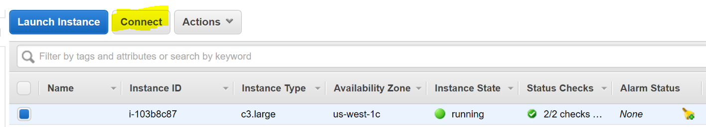

# Setup - AWS

This chapter explores setting up a Windows environment to properly use Windows containers on Amazon Web Services (AWS).

## Windows Server 2016 on AWS

AWS has a pre-baked AMI with Docker Engine already installed. To start an instance, do the following (requires AWS account):

1. Open the [EC2 launch-instance wizard](https://us-west-1.console.aws.amazon.com/ec2/v2/home#LaunchInstanceWizard)
2. Select the "Microsoft Windows Server 2016 Base with Containers" AMI
3. Input setup parameters
    - `c4.large` has good performance for development and testing
    - The default AWS security group settings will let you connect with Remote Desktop
4. Select "Review and Launch"
5. Once the VM is up, hit "Connect". If using macOS, get the free [Remote Desktop app in the Mac App Store](https://itunes.apple.com/us/app/microsoft-remote-desktop/id715768417?mt=12)
6. See details on [getting the initial Windows Administrator password for your AWS instance](https://docs.aws.amazon.com/AWSEC2/latest/WindowsGuide/connecting_to_windows_instance.html)
7. Start PowerShell
8. Check that Docker is running with `docker version`

# Next Steps
See the [Microsoft documentation for more comprehensive instructions](https://msdn.microsoft.com/virtualization/windowscontainers/containers_welcome "Microsoft documentation").

Continue to Step 2: [Getting Started with Windows Containers](WindowsContainers.md "Getting Started with Windows Containers")
