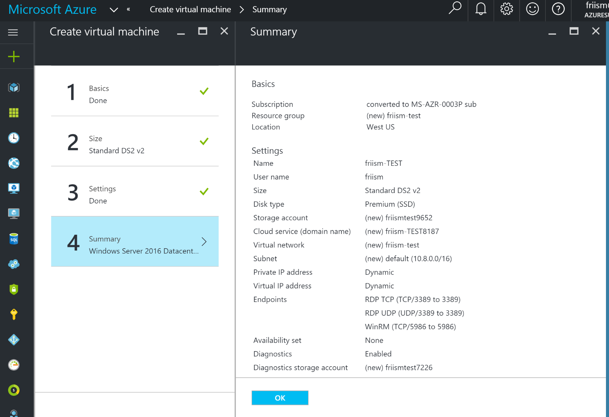
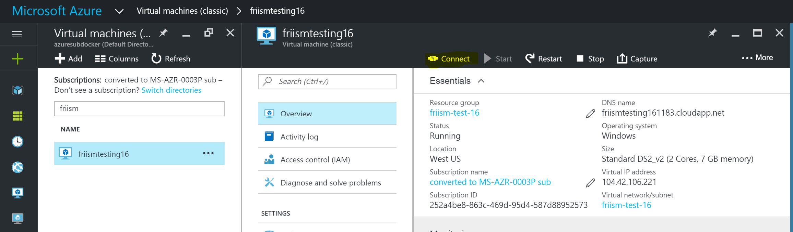

# Setup - Azure

This chapter explores setting up a Windows environment to properly use Windows containers on Microsoft Azure.

## Windows Server 2016 on Azure

Microsoft Azure has a pre-baked VM image with Docker engine and base images pre-loaded. To get started (requires Azure account):

 1. Create a [Windows Server 2016 Datacenter - with Containers](https://azure.microsoft.com/en-us/marketplace/partners/microsoft/windowsserver2016datacenterwithcontainers/) VM. This VM image has Docker pre-installed and the Windows base layers pre-loaded.
 2. Select "Classic" deployment model and hit "Create"
 3. Input setup parameters
    - Default settings are good
    - Creating a new resource group is fine
    - `DS2_V2` instance type has good performance for development and testing
 4. Check the Summary and hit "OK". Setup will take a couple of minutes
 5. Once the VM is running, select "Connect" to open a remote desktop connection. If using macOS, get the free [Remote Desktop app in the Mac App Store](https://itunes.apple.com/us/app/microsoft-remote-desktop/id715768417?mt=12)
 6. Login with the username and password configured during setup
 7. Start PowerShell
 8. `Start-Service docker`
 9. Check that Docker is running with `docker version`

# Next Steps
See the [Microsoft documentation for more comprehensive instructions](https://msdn.microsoft.com/virtualization/windowscontainers/containers_welcome "Microsoft documentation").

Continue to Step 2: [Getting Started with Windows Containers](WindowsContainers.md "Getting Started with Windows Containers")
