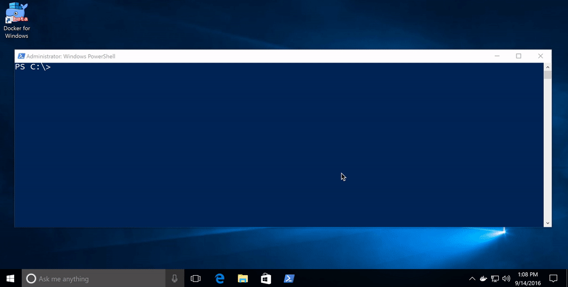

# Setup - Windows 10

This chapter explores setting up a Windows environment to properly use Windows containers on Windows 10.

## Windows 10 with Anniversary Update

For developers, Windows 10 is a great place to run Docker Windows containers and containerization support was added to the Windows 10 kernel with the [Anniversary Update](https://blogs.windows.com/windowsexperience/2016/08/02/how-to-get-the-windows-10-anniversary-update/) (note that container images can only be based on Windows Server Core and Nanoserver, not Windows 10). All that’s missing is the Windows-native Docker Engine and some image base layers.

The simplest way to get a Windows Docker Engine is by installing the [Docker for Windows](https://docs.docker.com/docker-for-windows/ "Docker for Windows") public beta ([direct download link](https://download.docker.com/win/beta/InstallDocker.msi)). Docker for Windows used to only setup a Linux-based Docker development environment, but the public beta version now sets up both Linux and Windows Docker development environments, and we’re working on improving Windows container support and Linux/Windows container interoperability.

With the public beta installed, the Docker for Windows tray icon has an option to switch between Linux and Windows container development.

# Next Steps
See the [Microsoft documentation for more comprehensive instructions](https://msdn.microsoft.com/virtualization/windowscontainers/containers_welcome "Microsoft documentation").

Continue to Step 2: [Getting Started with Windows Containers](WindowsContainers.md "Getting Started with Windows Containers")
